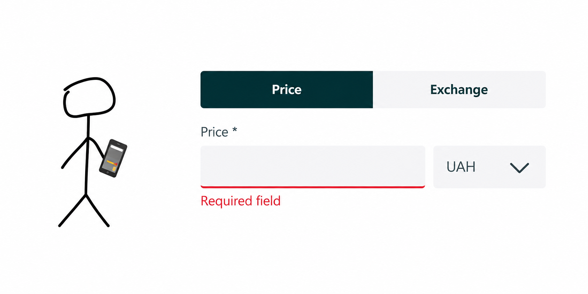
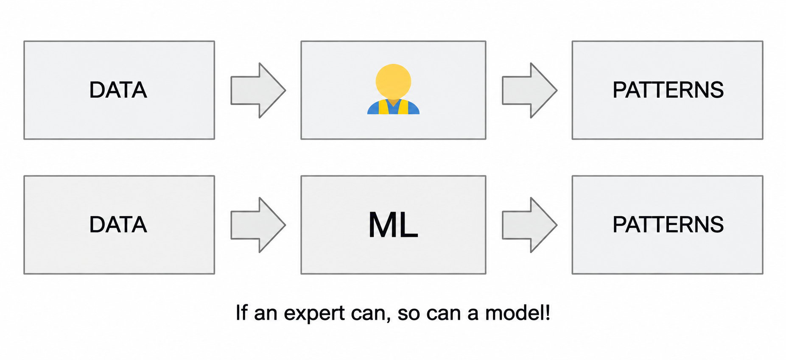
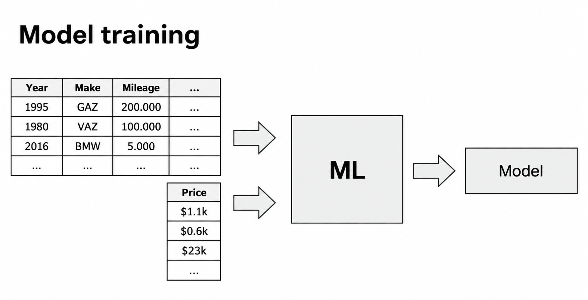
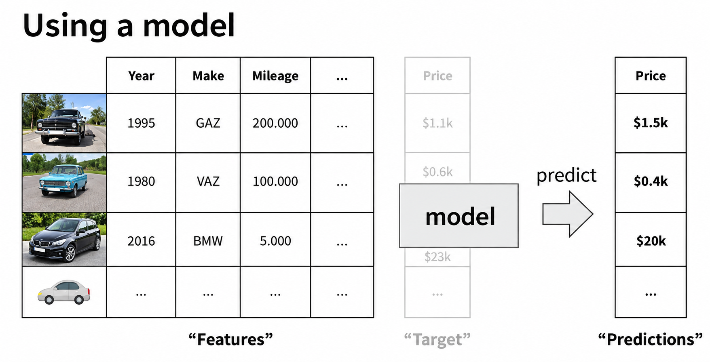
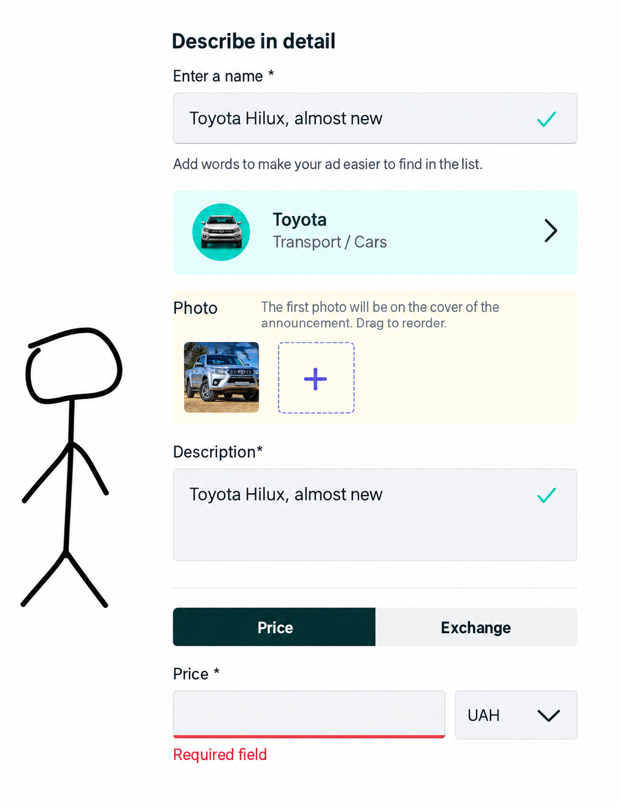

# Introduction to Machine Learning

In this first lesson we introduce machine learning using a simple example: predicting the price of a car. We look at what data a model learns from, what training means, and how the trained model helps users of a car website.

## The problem: how much should I sell my car for?

Imagine we run a website where people buy and sell used cars. A seller takes a picture of their car, uploads it, adds a title and a description, and then reaches the price field. And this is difficult to fill in.

You don't want to put a price that is too high - nobody will buy the car. You also don't want a price that is too low - you're leaving money on the table. The seller wants a price that is just right.

Some people go to the website, look at existing ads and pick a price based on similar cars. That works, but we - as the owners of the website - can do better and suggest a price automatically. This is a good use case for machine learning.

## What do we know about cars?

We already have a lot of data about the cars on our website:

- The price - the seller told us what they want for the car.
- The age of the car - we know when it was manufactured. The older the car, the cheaper it is.
- The manufacturer - a BMW is typically more expensive than a Volkswagen.
- The mileage - how many kilometers the car has driven so far.
- The model, the number of doors and many other characteristics.

Using this information, an expert can determine the price. If you want to sell a car through a dealership, an expert looks at the year, the manufacturer, the mileage, and tells you how much this car costs. Experts can do this because they have seen many cars: they learned from data, extracted patterns - an old car is less expensive, the more a car drove the cheaper it becomes - and now they apply these patterns to new cars.

If an expert can do this, so can a model. We take a dataset with these characteristics and the prices, put it into a machine learning algorithm, and the model learns the patterns itself. This is the essence of machine learning: we take data, and the model extracts patterns from it. This way we replicate what experts learn from data.

## Features and target

Two names to remember:

- Features - everything we know about the object. In our example: the age, manufacturer, mileage and other characteristics of a car.
- Target - what we want to predict. In our example: the price.

We collect the features of all the cars we have into a table, together with a column of prices - the target.

## Training a model

Training means taking the features and the target and giving them to a machine learning algorithm. The algorithm produces a model.

The model encapsulates all the patterns it learned from the data. It is a single artifact we can save and use later.

## Making predictions

Once we have the model, we can use it to predict prices of cars for which we don't know the price. We take the features - all the information about a car except the price, because this is what we want to predict - put them into the model, and the model outputs the prediction.

The model is not always able to predict the exact price of a specific car. But the predictions are usually correct on average: for a car of this year, this make and this mileage, this is roughly how much such a car costs. For a specific car it might be a bit lower or higher.

## Helping the user

Back to the seller on our website. They fill in the form with all the information about their car. We extract the features - year, make, mileage and so on - put them into the model, and it gives us the predicted price. We put this prediction into the price field for the user.

The user is happy: they don't have to research prices themselves. If they want, they can still adjust the price - put it higher or lower - but the model gives them a good starting point.

To summarize: machine learning is a process of extracting patterns from data. The data consists of features - information about the object - and the target - what we want to predict. The output of machine learning is a model. To use it, we take the features of a new object, put them into the model, and get predictions of the target.

In the next lesson we compare machine learning with rule-based systems, using a spam detection example.

## Notes

The concept of ML is depicted with an example of predicting the price of a car. The ML model
learns from data, represented as some **features** such as year, mileage, among others, and the **target** variable, in this
case, the car's price, by extracting patterns from the data.

Then, the model is given new data (**without** the target) about cars and predicts their price (target). 

In summary, ML is a process of **extracting patterns from data**, which is of two types:

* features (information about the object) and 
* target (property to predict for unseen objects). 

Therefore, new feature values are presented to the model, and it makes **predictions** from the learned patterns.
