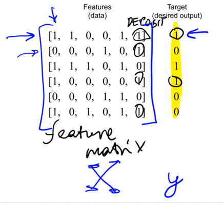
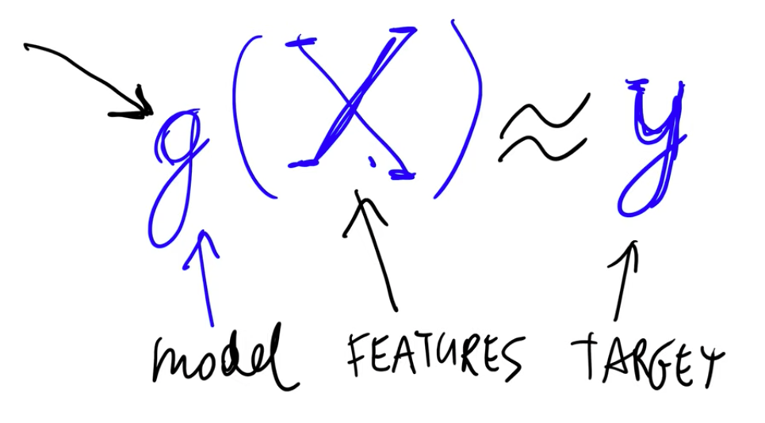

## 1.3 Supervised Machine Learning

[Slides](https://www.slideshare.net/AlexeyGrigorev/ml-zoomcamp-13-supervised-machine-learning)

## Notes

There are different kind of problems ML is trying to solve.

- Regression (predict continuous values, e.g. prices)
- Classification (predict labels to distinguish between different classes)
- Clustering (predict groups or the data without having any group labels or group characteristics)

Depending on these problem types you can use several different learning strategies to solve the problem.

- Supervised Learning
- Unsupervised Learning
- Semi-supervised Learning
- Reinforcement Learning
- Active Learning

In Supervised Machine Learning (SML) there are always labels associated with certain features.
The model is trained, and then it can make predictions on new features. In this way, the model
is taught by certain features and targets.

- **Feature matrix (X):** made of observations or objects (rows) and features (columns).
- **Target variable (y):** a vector with the target information we want to predict. For each row of X there's a value in y.

The model can be represented as a function **g** that takes the X matrix as a parameter and tries
to predict values as close as possible to y targets.
The obtention of the g function is what it is called **training**.

From this you can derive the formal definition of supervised machine learning: `g(X) ~ y` where:

- X : feature matrix
- y : target variable
- g : model that takes X and produces sth. that is approxymately close to y

### Types of SML problems

- **Regression:** the output is a number (car's price).
- **Classification:** the output is a category (spam example).
  - **Binary:** there are two categories (distinguishs between two classes (e.g. spam vs. not spam)).
  - **Multiclass problems:** there are more than two categories (distinguishs between several classes (e.g. cat, dog, car)).
- **Ranking:** the output is the top scores associated with corresponding items. It is applied in recommender systems.

In summary, SML is about teaching the model by showing different examples, and the goal is
to come up with a function that takes the feature matrix as a
parameter and makes predictions as close as possible to the y targets.

<table>
   <tr>
      <td>⚠️</td>
      <td>
         The notes are written by the community.  
         If you see an error here, please create a PR with a fix.
      </td>
   </tr>
</table>

- [Notes from Peter Ernicke](https://knowmledge.com/2023/09/11/ml-zoomcamp-2023-introduction-to-machine-learning-part-3/)

## Navigation

- [Machine Learning Zoomcamp course](../)
- [Lesson 1: Introduction to Machine Learning](./)
- Previous: [ML vs Rule-Based Systems](02-ml-vs-rules.md)
- Next: [CRISP-DM](04-crisp-dm.md)
