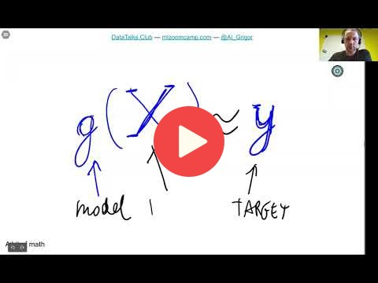

## 1.3 Supervised Machine Learning

[Slides](https://www.slideshare.net/AlexeyGrigorev/ml-zoomcamp-13-supervised-machine-learning)

## Notes

In Supervised Machine Learning (SML) there are always labels associated with certain features.
The model is trained, and then it can make predictions on new features. In this way, the model
is taught by certain features and targets. 

* **Feature matrix (X):** made of observations or objects (rows) and features (columns).
* **Target variable (y):** a vector with the target information we want to predict. For each row of X there's a value in y.

The model can be represented as a function, **g**, that takes the feature matrix, **X**, as **input** and tries to predict values as close as possible to the targets, **y**. The process of **finding** this function **g** is called **training**.

### Types of SML problems 

* **Regression:** the output is a number (car's price).
* **Classification:** the output is a category (spam example). 
	* **Binary:** there are two categories. 
	* **Multiclass problems:** there are more than two categories. 
* **Ranking:** the output is the top scores associated with corresponding items. It is applied in recommender systems. 

In summary, SML is about teaching the model by showing it different examples, and the goal is to come up with a function, that takes the feature matrix as input, and makes predictions of values as close as possible to the **y** targets. 

<table>
   <tr>
      <td>⚠️</td>
      <td>
         The notes are written by the community.  
         If you see an error here, please create a PR with a fix.
      </td>
   </tr>
</table>

* [Notes from Peter Ernicke](https://knowmledge.com/2023/09/11/ml-zoomcamp-2023-introduction-to-machine-learning-part-3/)

## Navigation

* [Machine Learning Zoomcamp course](../)
* [Lesson 1: Introduction to Machine Learning](./)
* Previous: [ML vs Rule-Based Systems](02-ml-vs-rules.md)
* Next: [CRISP-DM](04-crisp-dm.md)
