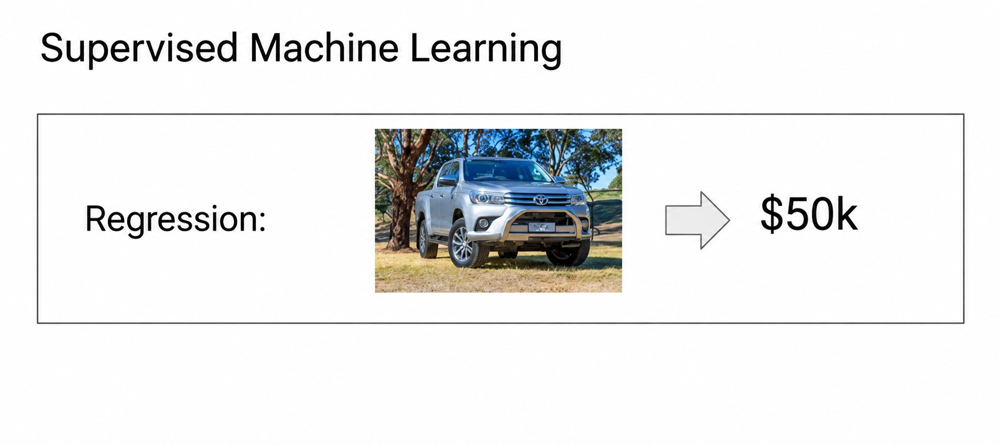
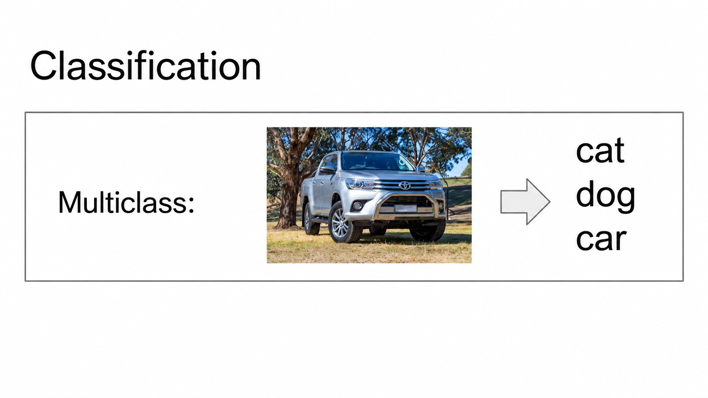
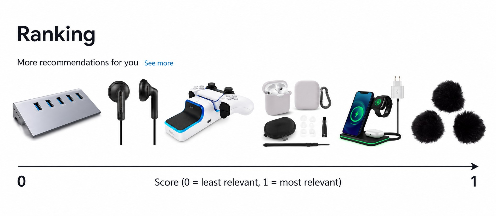
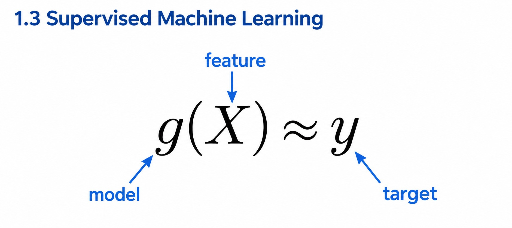

# Supervised Machine Learning

In this lesson we define supervised machine learning more formally. We introduce the feature matrix, the target variable and the model as a function, and look at the three types of supervised learning problems: regression, classification and ranking.

## Why "supervised"?

In the first lesson we predicted the price of a car. What we did there was supervise the model: we were the teachers. We showed the model different cars, and for each car we showed the price. We did it for all the cars we had, and this way we taught the algorithm: for this kind of car, this is what the price should be.

The spam example from the second lesson worked exactly the same way. We showed the machine examples of spam and non-spam messages, and just by looking at these examples the algorithm picked up the patterns - for example, that the word "deposit" makes a message more likely to be spam.

That is the idea behind supervised machine learning: in all these cases we have a label, and this is how we supervise the machine. We teach it by showing examples. From these examples the machine learns the patterns and uses them to generalize to new cases - for example, predicting the price of a car we have never seen before.

Of course, we don't always show pictures or raw text. Most of the time we extract features, and we tell the model what exactly we want it to predict: 1 means spam, 0 means not spam. Most models don't care that 1 means spam - to them it's just a number.

## The feature matrix and the target

Now let's make it formal. Machine learning is a branch of computer science and applied mathematics: it uses mathematics and statistics to extract patterns. For example, a model may notice that when the feature "deposit" is 1, in most cases the message turns out to be spam.

The data we show the model has two parts:

- The feature matrix, usually written as capital X. A matrix is a two-dimensional array: the rows are our observations - the objects we want to make predictions for, one row per email - and the columns are the features.
- The target variable, usually written as lowercase y. It is a vector - a one-dimensional array of numbers. For each row of X it contains the answer: 1 if the email is spam, 0 if not.

If you studied math a long time ago, don't worry about the terminology: X is just a two-dimensional array - an array of arrays, or a table - and y is a one-dimensional array of numbers.

## The model as a function

We put X and y into a machine learning algorithm and train the model. The model is usually denoted as g: it is a function that takes the feature matrix X as input and produces something that is approximately close to the target y.

g(X) ≈ y

The goal of supervised machine learning is to come up with this function g such that when we apply it to X, the output is as close as possible to the target variable. The process of finding g - looking at the features and coming up with the function - is called training.

For the car price example, the target is the price, and X is all the information about the car: model, make, mileage and so on. We want g to take this information and produce a price as close as possible to the actual one. If the actual price of a car is $11k and the model predicts $15k, that's fine: it's not always possible to predict the exact price, but we want it to be close enough for our purposes.

When we apply the trained g to the features, we get predictions:

| Features (data) | Predictions (output) |
| --- | ---: |
| `[0, 0, 0, 1, 0, 1]` | 0.93 |
| `[0, 0, 0, 1, 1, 0]` | 0.48 |
| `[1, 0, 1, 0, 1, 1]` | 0.19 |
| `[1, 1, 1, 0, 1, 0]` | 0.32 |
| `[1, 0, 0, 0, 0, 1]` | 0.01 |
| `[1, 1, 0, 0, 1, 1]` | 0.94 |

## Types of supervised machine learning

Based on what g outputs and what the target variable looks like, there are different types of supervised machine learning.

### Regression

Regression is the car price case: g returns a number. The output can be any number from zero to plus infinity - or whatever range makes sense for the problem.

Predicting the price of a house is another example: from the number of square meters, the number of rooms, the distance from the center and the closest subway station, we predict that the house costs, say, $1 million. Anything where the output is a number is a regression problem.

### Classification

In classification we don't output a number - we output a category. For example, we look at a picture and say it contains a car: the input is the picture, the output is the category "car". The spam detector is also classification: from the characteristics of an email we predict the category spam or not spam.

Classification has subclasses:

- Binary classification: exactly two categories. Spam detection is binary - the target is 0 or 1, and g outputs a probability between 0 and 1. This is a special subtype, and it is very widely used in practice.
- Multiclass classification: more than two categories. For example, classifying images into cats, dogs and cars. It can be ten categories, a thousand - as many as you need.

### Ranking

The last type is ranking. It usually shows up in recommender systems. Imagine you are a user of an e-commerce website with many products you could be interested in. How do we select the most interesting ones?

Under the hood there is a function that scores every item - for example, the probability that you will like it, from 0 to 1. Then it takes all the items, sorts them by score and shows you the top results, for example the top six.

Google search does something similar: when you search for "machine learning zoomcamp", it looks at all the documents containing this phrase, scores each one by how likely it is to be relevant for you, and shows the highest-scored document first. Search on marketplaces like eBay works the same way: type "iPhone" and the site shows what is most relevant for you first.

## Summary

Supervised machine learning is about teaching an algorithm by showing it examples. The examples go into the feature matrix X - all the characteristics of the objects we want to make predictions for - and the vector y is the target we want to learn.

The goal is to come up with a function g such that when we apply it to the feature matrix, we get something very close to the target variable. Inside, g extracts patterns from X. What exactly g looks like is what we will talk about throughout the course.

Depending on the type of the target variable, we get regression, classification - which can be multiclass or binary - and ranking.

In this course we focus mostly on classification, but the next lesson is about regression. Binary classification is probably the most widely used type of supervised machine learning - you will definitely encounter a problem that can be solved as binary classification.

In the next lesson we zoom out and look at a methodology for organizing machine learning projects, called CRISP-DM.

## Notes

In Supervised Machine Learning (SML) there are always labels associated with certain features.
The model is trained, and then it can make predictions on new features. In this way, the model
is taught by certain features and targets. 

* **Feature matrix (X):** made of observations or objects (rows) and features (columns).
* **Target variable (y):** a vector with the target information we want to predict. For each row of X there's a value in y.

The model can be represented as a function, **g**, that takes the feature matrix, **X**, as **input** and tries to predict values as close as possible to the targets, **y**. The process of **finding** this function **g** is called **training**.

### Types of SML problems 

* **Regression:** the output is a number (car's price).
* **Classification:** the output is a category (spam example). 
	* **Binary:** there are two categories. 
	* **Multiclass problems:** there are more than two categories. 
* **Ranking:** the output is the top scores associated with corresponding items. It is applied in recommender systems. 

In summary, SML is about teaching the model by showing it different examples, and the goal is to come up with a function, that takes the feature matrix as input, and makes predictions of values as close as possible to the **y** targets. 
