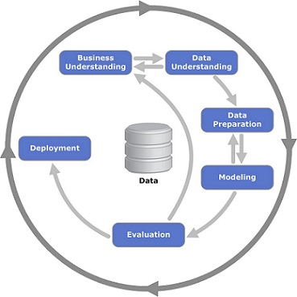

## 1.4 CRISP-DM

[Slides](https://www.slideshare.net/AlexeyGrigorev/ml-zoomcamp-14-crispdm)

## Notes

CRISP-DM, which stands for Cross-Industry Standard Process for Data Mining, is an open standard process model that describes common approaches used by data mining experts. It is the most widely-used analytics model. Conceived in 1996, it became a European Union project under the ESPRIT funding initiative in 1997. The project was led by five companies: Integral Solutions Ltd (ISL), Teradata, Daimler AG, NCR Corporation and OHRA, an insurance company:

1. **Business understanding:** An important question is do we need ML for the project. The goal of the project has to be measurable.

   - Identify the business problem
   - Detect available data sources
   - Specify requirements, premises, and conditions
   - Clarify risks and uncertainties
   - Understand whether the problem is important
   - Understand how we can solve it
   - Understand how we measure the success of our project (Cost-Benefit-Analysis)
   - Do we actually need ML here?

2. **Data understanding:** Analyze available data sources, and decide if more data is required.

   - Analyze available data sources
   - Collect and analyse data
   - Analyze if something is missing and what is missing
   - Decide if this data is good/reliable/large enough
   - Decide if we need to get more data

3. **Data preparation:** Clean data, remove noise applying pipelines, and convert the data to a tabular format, so we can put it into ML.

   - Transform the data so it can be put into a ML algorithm
   - Usually this means extracting different features
   - Clean the data / remove all the noise
   - Build the pipelines (that transform raw data into clean data)
   - Convert data into tabular form (needed to put in machine learning model)

4. **Modeling:** Train different models and choose the best one. Considering the results of this step, it is proper to decide if it is required to add new features or fix data issues. `Model quality significantly depends on data quality`

5. **Evaluation:** Measure how well the model is performing and if it solves the business problem.

6. **Deployment:** Roll out to production to all the users. The evaluation and deployment often happen together - **online evaluation**.
   - After online evaluation of some users -> deploy the model to production (all remaining users)
   - Roll out the model to all users
   - Proper monitoring
   - Ensuring the quality and maintainability
   - -> when we deploy model it has to work, it has to be reliable
   - After that we care about scalability and other things

It is important to consider how well maintainable the project is.

In general, ML projects require many iterations.

**Iteration:**

- Start simple
- Learn from the feedback
- Improve

<table>
   <tr>
      <td>⚠️</td>
      <td>
         The notes are written by the community.  
         If you see an error here, please create a PR with a fix.
      </td>
   </tr>
</table>

- [Notes from Peter Ernicke](https://knowmledge.com/2023/09/12/ml-zoomcamp-2023-introduction-to-machine-learning-part-4/)

## Navigation

- [Machine Learning Zoomcamp course](../)
- [Lesson 1: Introduction to Machine Learning](./)
- Previous: [Supervised Machine Learning](03-supervised-ml.md)
- Next: [Model Selection Process](05-model-selection.md)
