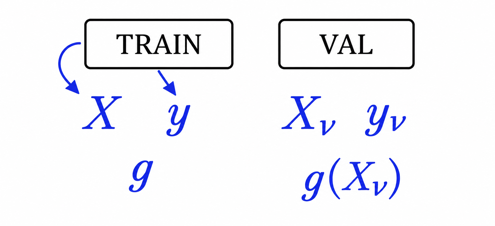
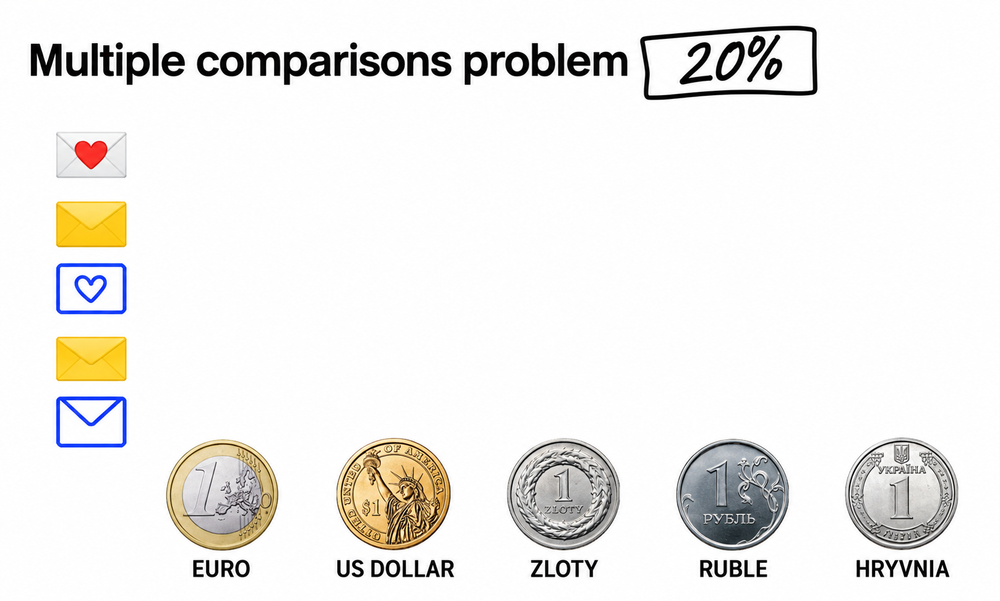
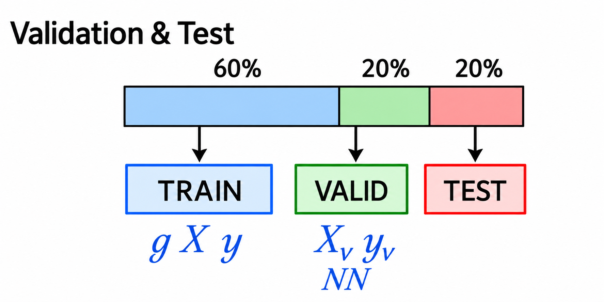
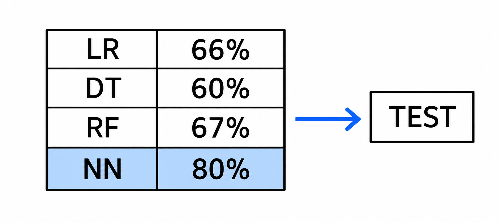

# Model Selection Process

In this lesson we zoom into the modeling step of CRISP-DM: how we try different models and select the best one. We see why a single validation set can mislead us, and how splitting the data into train, validation and test protects us.

## The modeling step

In the previous lesson we saw that modeling is the step where the actual machine learning happens. We already have the data prepared, so here we try different models - logistic regression, decision trees, neural networks and others (don't worry about what these are yet, we cover them later in the course). Some of them might work well on our problem, some might not. Our goal is to try several and choose the best one.

## Simulating future data with a validation set

Think about how we use a model in practice. It's July, and we take our feature matrix X and the target y and train the model g. In August we deploy it: the model trained on the July data is applied to new spam messages, and for each one it produces a score - for example, a 70% probability that the email is spam.

When we evaluate the model in July, we want to mimic this way of using it: we want to know how well the model will perform on data it hasn't seen. The model from July didn't see the data from August.

Of course, we cannot go into the future and take the August data. But we can do something close enough: take our dataset, put aside a small part of it - say 20% - and pretend this part doesn't exist. We train on the remaining 80% only. The held-out part plays the role of the August data; we call it the validation set.

From the training set we extract the feature matrix X and the target y, and we train the model g using only these. From the validation set we extract another matrix, Xv, and its target yv - the model has never seen them during training.

We apply g to Xv and get predictions. Because the output is a probability, we first convert the predictions into the final decisions. For example, if the probability is greater than 0.5 we predict spam, otherwise not spam. Then we compare the predicted values with the actual values of yv - spam or not spam - and count in how many cases the model was correct. If it was correct in 4 out of 6 cases, its accuracy is 66%.

## Comparing models

We can now do the same for every candidate model:

- Logistic regression: 66% accuracy
- Decision tree: 60% accuracy
- Random forest: 67% accuracy
- Neural network: 80% accuracy

(The numbers here are made up for the example.) We see that the neural network has the best accuracy, so we select it as our best model.

## The multiple comparisons problem

However, there can be a problem with this approach. Here is a made-up but illustrative example: imagine our model is not logistic regression or a neural network - it's a coin. We flip a coin, and if it lands heads we say spam, if tails - not spam.

We test several coins on the same validation set. A euro gets 20% correct. An American dollar gets 40%. A Polish zloty - 20%. A ruble - 20%. And then a Ukrainian hryvnia produces exactly the right sequence for all five emails and gets 100% correct.

Looking at the numbers, the hryvnia is the best model for spam detection. But we all know this is random: the coin just got lucky and produced the same sequence as in the validation data.

While this is a silly example, the exact same thing can happen with a real model. A model can just get lucky on a particular subset of the data - maybe the neural network happened to do really well on this specific validation set by pure chance. If we took a different 20% of the data, the results could be totally different.

In statistics this is called the multiple comparisons problem: when we perform the same comparison many times - evaluating many different models against the same validation set - one of them can get a particularly good result for no reason. Because machine learning methods are probabilistic, this can happen a lot.

## Train, validation, test

To guard against this, instead of holding out one dataset we hold out two:

- 20% for validation
- 20% more for testing
- the remaining 60% for training

(60/20/20 is not set in stone - it can be any values.)

So we have three non-overlapping subsets: the training data, the validation data and the test data. We put the test set away and forget about it for now. Then we do model selection exactly as before: train g on X and y, apply it to Xv, compute the accuracies, and select the best model - say, the neural network.

Then, to make sure this model didn't just get lucky on the validation set, we apply it to the test set - one extra round of validation. If the validation accuracy was 80% and the test accuracy is 79%, the numbers are close, and we conclude that the model indeed behaves well.

This is the model selection process, and being able to set it up is one of the most important skills in machine learning. As a recipe:

1. Split the dataset into train, validation and test.
2. Train a model on the training set.
3. Evaluate it on the validation set.
4. Repeat steps 2-3 for as many models as you need.
5. Select the best model.
6. Apply the best model to the test set and make sure the performance is close to what you saw on validation.

## Reusing the validation set

One more observation. In this scheme, 20% of the data - the validation set - is only used for checking, so it's kind of wasted. Instead of throwing it away, we can do this: first run the model selection process as usual and pick the winning model. Then combine the training data and the validation data into one big training set, and train a new model - with the same settings as the winner - on this larger set. This model should be a bit better, because it uses more data for training. Finally, we check this model against the test set one more time. This way the validation data is not wasted: it still contributes to the final model.

This was the theoretical introduction. In the next sessions we will code all of this in practice. But to do that we need to know some tools: we use Python, with libraries like NumPy and Pandas. NumPy is the topic of the next lesson, and Pandas comes right after.

## Materials

- [Slides](https://www.slideshare.net/AlexeyGrigorev/ml-zoomcamp-15-model-selection-process)

## Notes

### Which model to choose?

- Logistic regression
- Decision tree
- Neural Network
- Or many others

The validation dataset is not used in training. There are feature matrices and y vectors
for both training and validation datasets. 
The model is fitted with training data, and it is used to predict the y values of the validation
feature matrix. Then, the predicted y values (probabilities)
are compared with the actual y values. 

**Multiple comparisons problem (MCP):** just by chance one model can be lucky and obtain
good predictions because all of them are probabilistic. 

The test set can help to avoid the MCP. Obtaining the best model is done with the training and validation datasets, while the test dataset is used for assuring that the proposed best model is the best. 

1. Split datasets in training, validation, and test. E.g. 60%, 20% and 20% respectively 
2. Train the models
3. Evaluate the models
4. Select the best model 
5. Apply the best model to the test dataset 
6. Compare the performance metrics of validation and test

<u>NB:</u> Note that it is possible to reuse the validation data. After selecting the best model (step 4), the validation and training datasets can be combined to form a single training dataset for the chosen model before testing it on the test set.

<table>
   <tr>
      <td>⚠️</td>
      <td>
         The notes are written by the community.  
         If you see an error here, please create a PR with a fix.
      </td>
   </tr>
</table>

* [Notes from Peter Ernicke](https://knowmledge.com/2023/09/13/ml-zoomcamp-2023-introduction-to-machine-learning-part-5/)
