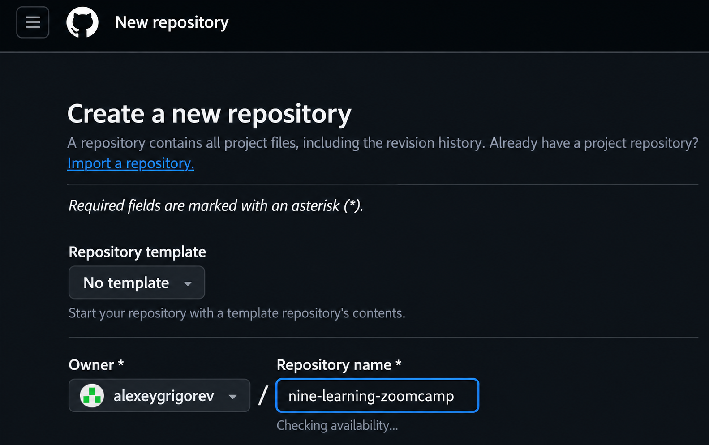
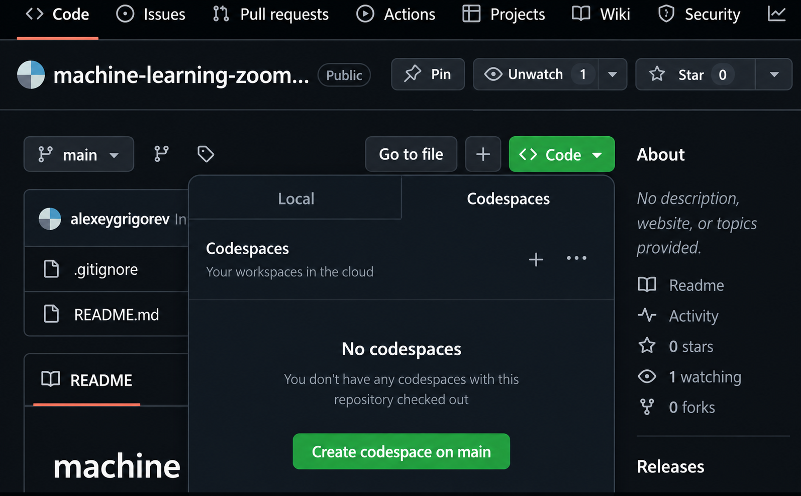
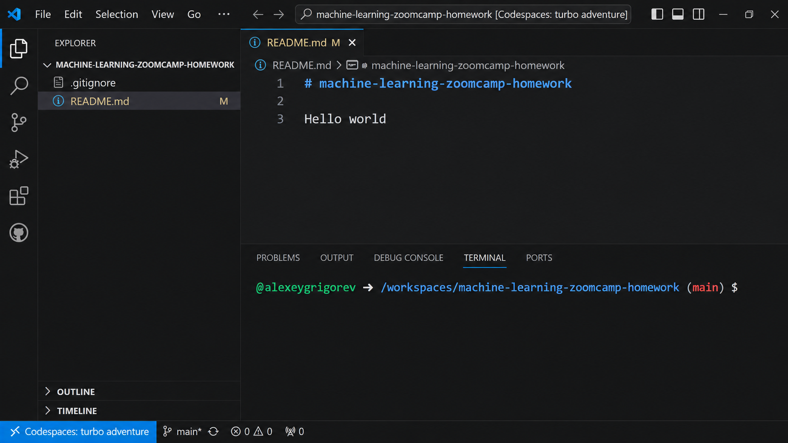

# Setting up the Environment

In this unit we prepare the environment for the course. The recommended option is GitHub Codespaces - a remote development environment that requires almost no configuration. If you prefer working locally, there are guides below for Ubuntu/WSL, Anaconda and cloud services.

You need:

* Python 3.11 (note that videos use 3.8)
* NumPy, Pandas and Scikit-Learn (latest available versions) 
* Matplotlib and Seaborn
* Jupyter notebooks

## GitHub Codespaces

This is the recommended approach for the course.

GitHub Codespaces gives you a remote environment with almost everything we need already installed. You just have a remote machine and use it from your browser - or from the desktop version of Visual Studio Code. Here is the full walk-through from the video.

First, create a new repository on GitHub - for example, a repository where you will put your homework. Add a README file, make it public, and choose Python as the .gitignore template.



Then open the Code dropdown, switch to the Codespaces tab, and click "Create codespace on main". GitHub creates a Visual Studio Code instance for you in the browser.



If you don't like using the browser - it should just work there - you can open the same environment in Visual Studio Code desktop: click the button in the corner and choose "Open in VS Code". The first time you launch VS Code desktop it will prompt you to install an extension for Codespaces; if it doesn't, go to the extensions view and search for "GitHub Codespaces" - you need that extension to connect to the remote instance.

Everything feels like developing locally. You can edit files, and you can open a terminal with Ctrl+` (or via the View menu). This is the usual file system of a remote Ubuntu machine - `git status`, `git commit` and `git push` all work, and pushing sends your changes back to GitHub.



One trick from the video: the default prompt is quite long, so there is little space left for the command you type. You can shorten it:

```bash
PS1="> "
```

Now let's install the libraries we need for the course with pip:

```bash
pip install jupyter numpy pandas scikit-learn seaborn
```

Seaborn is a library for visualization. Later in the course you will also need XGBoost and TensorFlow - and this is exactly how you install them too.

Now start Jupyter:

```bash
jupyter notebook
```

It starts remotely on the codespace, but you can use it locally. VS Code automatically detects that something is running on port 8888 and forwards it to your machine - see the Ports panel. Open the forwarded address, and if you are asked to log in, take the token (or the entire URL) from the terminal and paste it into the browser.

That's it - you have a working environment: create a folder like `01-intro`, create a notebook, `import pandas as pd` and you are ready. For the homework you will typically read a CSV file with `pd.read_csv(...)`, finish the notebook, rename it to something like `homework.ipynb`, commit it, push it, and submit the URL of your repository in the homework form.

## Ubuntu 22.04 on AWS

* [This video](https://www.youtube.com/watch?v=IXSiYkP23zo) shows a complete end-to-end environment configuration for an AWS EC2 instance
* This video was created for another course (MLOps Zoomcamp), so you'll need to adjust it slightly: clone this repo instead of the mlops one
* You can use these instructions for setting up your local Ubuntu

Note for WSL 

* Most of the instructions from the previous video apply to WSL too
* For setting up Docker, install Docker Desktop on Windows and it'll be automatically used in WSL. You don't need to install docker.io

## Anaconda and Conda

The easiest way to set up the environment is to use [Anaconda](https://www.anaconda.com/products/individual) or
[Miniconda](https://docs.conda.io/en/latest/miniconda.html).

Anaconda comes with everything we need (and much more). 
Miniconda is a smaller version of Anaconda that contains only Python. 

Follow the instructions on page for installing the correct package for your system.
The site will automatically detect your operating system and suggest the correct package.

* [Anaconda](https://www.anaconda.com/products/individual)
* [Miniconda](https://docs.conda.io/en/latest/miniconda.html#latest-miniconda-installer-links)

If you are using Windows, you can use WSL, but the plain Windows version should work too.

Anaconda is recommended.


### (Optional) Create environment for course

It is a good idea to set up a dedicated environment for the course 

In your terminal, run this command to create the environment

```bash
conda create -n ml-zoomcamp python=3.11
```

Activate it:

```bash
conda activate ml-zoomcamp
```

Installing libraries

```bash
conda install numpy pandas scikit-learn seaborn jupyter
```

Later in the course you will also need to install XGBoost and Tensorflow,
but we can skip this part for now.

## Cloud

Instead of running things locally, you can use online services or rent a server 

### AWS 

You can rent an instance on AWS:

* [Creating an AWS account](https://mlbookcamp.com/article/aws)
* [Renting an ec2 instance](https://mlbookcamp.com/article/aws-ec2)


### GCP

Google cloud platform offers $300 in free credits when you sign up.
You can use this for taking the course.


## Notebook services

There are services that allow you to host and run notebooks.
Note that notebooks alone are not sufficient for the course and for the deployment modules
you will need to have access to the command line interface with Docker, Python and other libraries installed.

### Kaggle

To use Kaggle to open and run the Jupyter notebooks provided as part of this course do the following:

*Pre-requisites - You need to have an account in Kaggle (it's free) and be logged into Kaggle*

1. Find the URL of the notebook. 
   
   
2. To open the notebook in Kaggle, in your web browser launch paste the URL as shown in below example. (*note the additional https://kaggle.com/kernels/welcome?src= before the URL of the notebook*)

   https://kaggle.com/kernels/welcome?src=https://github.com/alexeygrigorev/mlbookcamp-code/blob/master/chapter-02-car-price/02-carprice.ipynb
  
3. Check if the notebook uses any datafile to read data from it. If yes, note the datafile name from the code.- *look for pd.read_csv("somefilename.csv")*. 
   
   
4. You need to download the file into Kaggle. For this:

   a. Find the URL of the datafile in github. 
   
   
   b. Suppose the URL is https://github.com/alexeygrigorev/mlbookcamp-code/blob/master/chapter-02-car-price/data.csv , you need use the URL to raw file, which will look something like https://raw.githubusercontent.com/alexeygrigorev/mlbookcamp-code/master/chapter-02-car-price/data.csv
   
5. In the notebook opened in Kaggle, add a Code block with the command to download the file - !wget your-datafile-url 

   
This way you can start with the exercise using Kaggle


### Google Colab

To use Google Colab to open and run the Jupyter notebooks provided as part of this course do the following:

*Pre-requisites - You need to have a google account (any gmail account) and be logged into that account*

Steps for Google Colab are same as that for Kaggle, except for some changes in Step 2, as explained below.

2. To open the notebook in Google Colab, in your web browser launch paste the URL as shown in below example. (*note the https://github.com/ in the URL of the notebook is replaced by https://colab.research.google.com/github/*)

   https://colab.research.google.com/github/alexeygrigorev/mlbookcamp-code/blob/master/chapter-02-car-price/02-carprice.ipynb
