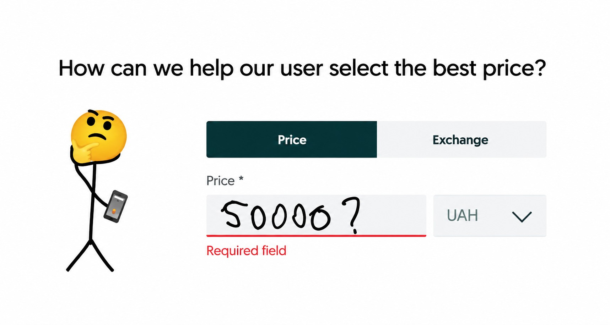
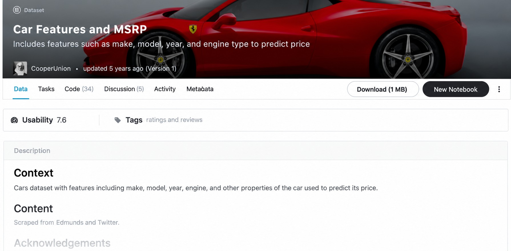
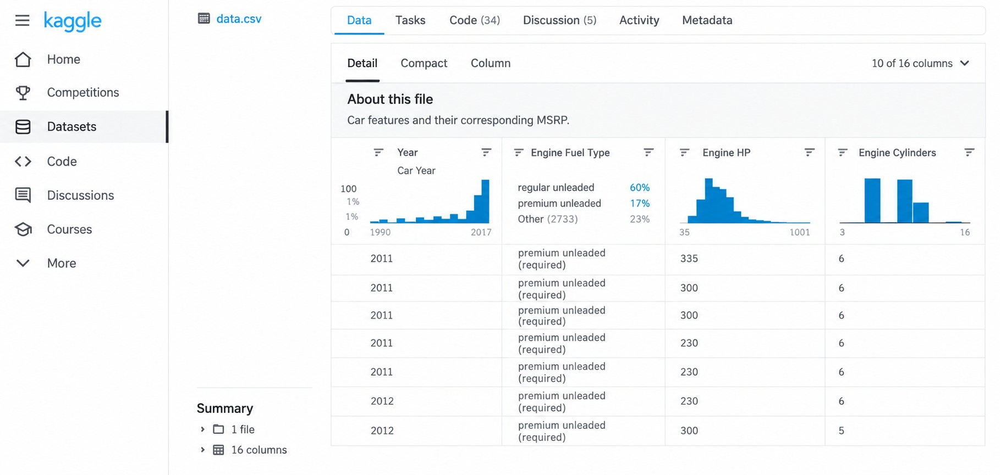
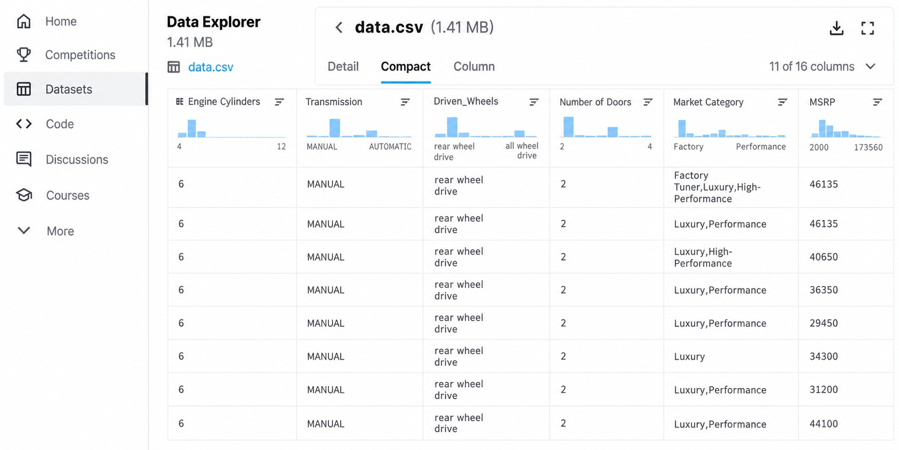
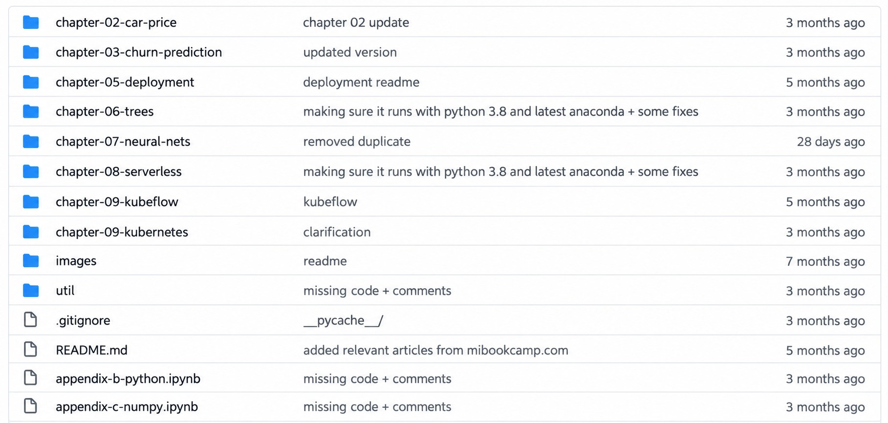
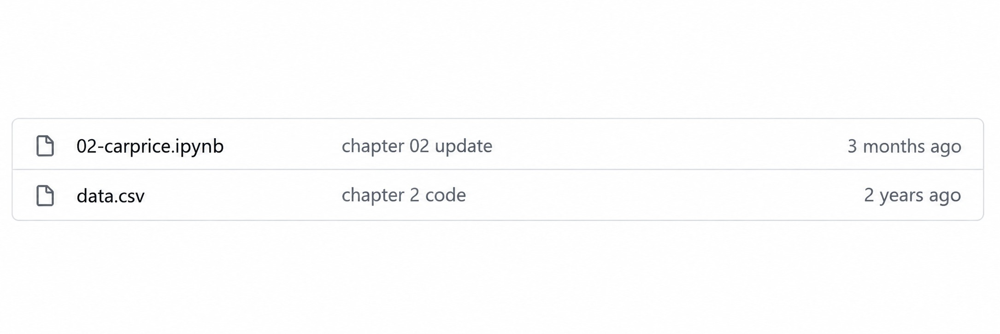

# Car price prediction project

Session two is one hands-on project: we build a model that predicts the price
of a car. In this first unit we look at the scenario, the dataset we will use,
the plan for the project, and where the code and the data live.

## The scenario

Remember the scenario from the introduction. A user wants to sell a car on an
online classified website, and the site asks them to enter a price. If they
don't know how much the car is worth, they have to guess. We want to help:
the user describes the car, and our model suggests the best price.

## The dataset

To train a model we need data, and we use a dataset with car prices from
Kaggle. It has different characteristics of cars — the make (the
manufacturer), the model, the year, the engine type, the fuel type and other
properties.

The data explorer on Kaggle shows what is inside. Every row is one car, and
every column is one characteristic of that car.

One column is especially interesting for us: MSRP. It stands for
Manufacturer Suggested Retail Price — in other words, the price of a car.
This is exactly what we want to predict. The plan is to use all the other
features — the make, the model, the year, the engine and so on — to predict
this price.

## The project plan

We will do the project in several steps:

- Get the data and do exploratory data analysis: just look at the data and
  try to learn more about it.
- Prepare the dataset and train a linear regression model on it to predict
  the price of a car.
- Go into the details of how linear regression is implemented — we will
  actually implement it ourselves.
- Evaluate the quality of the model with RMSE. RMSE stands for root mean
  squared error, a metric for evaluating the quality of model predictions.
- Do some feature engineering: the process of creating new features, new
  characteristics that we can use for our model.
- Deal with numerical stability problems and see how to solve them with
  regularization.
- Finally, use the model.

## Where the code lives

All the code for this project is available on GitHub, in the
[mlbookcamp-code](https://github.com/alexeygrigorev/mlbookcamp-code) repo —
this is the repository for the Machine Learning Bookcamp book. We need the
chapter-02-car-price folder.

The folder has two files. The first one is the notebook with all the code —
it contains everything we will do in this session. The second one is
data.csv, the actual dataset we will use for training the model. In this
cohort we walk through the notebook lesson by lesson; for this module it is
[notebook.ipynb](notebook.ipynb).

Next, we take the CSV file and do a bit of data preparation — that is the
next lesson, [data preparation](02-data-preparation.md).

## Notes

This project is about the creation of a model for helping users to predict car prices. The dataset was obtained from [this 
kaggle competition](https://www.kaggle.com/CooperUnion/cardataset).

**Project plan:**

* Prepare data and Exploratory data analysis (EDA)
* Use linear regression for predicting price
* Understanding the internals of linear regression 
* Evaluating the model with RMSE
* Feature engineering  
* Regularization 
* Using the model 

The code and dataset are available at this [link](https://github.com/alexeygrigorev/mlbookcamp-code/tree/master/chapter-02-car-price). 
