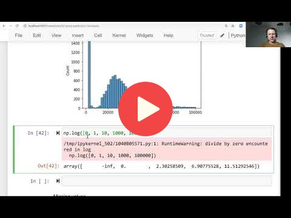

## 2.3 Exploratory data analysis

[Slides](https://www.slideshare.net/AlexeyGrigorev/ml-zoomcamp-2-slides)

## Notes

**Pandas attributes and methods:** 

* df[col].unique() - returns a list of unique values in the series 
* df[col].nunique() - returns the number of unique values in the series 
* df.isnull().sum() - returns the number of null values in the dataframe 

**Matplotlib and seaborn methods:**

* %matplotlib inline - assure that plots are displayed in jupyter notebook's cells
* sns.histplot() - show the histogram of a series 
   
**Numpy methods:**
* np.log1p() - applies log transformation to a variable and adds one to each result.

Long-tail distributions usually confuse the ML models, so the recommendation is to transform the target variable distribution to a normal one whenever possible. 

The entire code of this project is available in [this jupyter notebook](https://github.com/alexeygrigorev/mlbookcamp-code/blob/master/chapter-02-car-price/02-carprice.ipynb).  

<table>
   <tr>
      <td>⚠️</td>
      <td>
         The notes are written by the community.  
         If you see an error here, please create a PR with a fix.
      </td>
   </tr>
</table>

* [Notes from Peter Ernicke](https://knowmledge.com/2023/09/19/ml-zoomcamp-2023-machine-learning-for-regression-part-2/)

## Navigation

* [Machine Learning Zoomcamp course](../)
* [Session 2: Machine Learning for Regression](./)
* Previous: [Data preparation](02-data-preparation.md)
* Next: [Setting up the validation framework](04-validation-framework.md)
