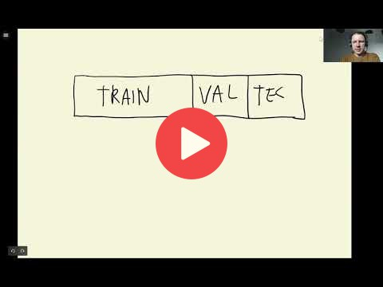

## 2.4 Setting up the validation framework

[Slides](https://www.slideshare.net/AlexeyGrigorev/ml-zoomcamp-2-slides)

## Notes

In general, the dataset is splitted into three parts: training, validation, and test. For each partition, we need to obtain feature matrices (X) and vectors of targets (y). First, the size of the partitions is calculated. Next, the records are shuffled to ensure that the values in the three partitions contain non-sequential records from the dataset. Finally, the partitions are created using the shuffled indices.

**Pandas attributes and methods:** 

* `df.iloc[]` -> return subsets of records of a dataframe, being selected by numerical indices
* `df.reset_index()` -> restate the orginal indices 
* `del df[col]` -> eliminate a column variable 

**Numpy methods:**

* `np.arange()` -> return an array of numbers 
* `np.random.shuffle()` -> return a shuffled array
* `np.random.seed()` -> set a seed for reproducibility

The entire code of this project is available in [this jupyter notebook](https://github.com/alexeygrigorev/mlbookcamp-code/blob/master/chapter-02-car-price/02-carprice.ipynb). 

<table>
   <tr>
      <td>⚠️</td>
      <td>
         The notes are written by the community.  
         If you see an error here, please create a PR with a fix.
      </td>
   </tr>
</table>

* [Notes from Peter Ernicke](https://knowmledge.com/2023/09/19/ml-zoomcamp-2023-machine-learning-for-regression-part-3/)

## Navigation

* [Machine Learning Zoomcamp course](../)
* [Session 2: Machine Learning for Regression](./)
* Previous: [Exploratory data analysis](03-eda.md)
* Next: [Linear regression](05-linear-regression-simple.md)
