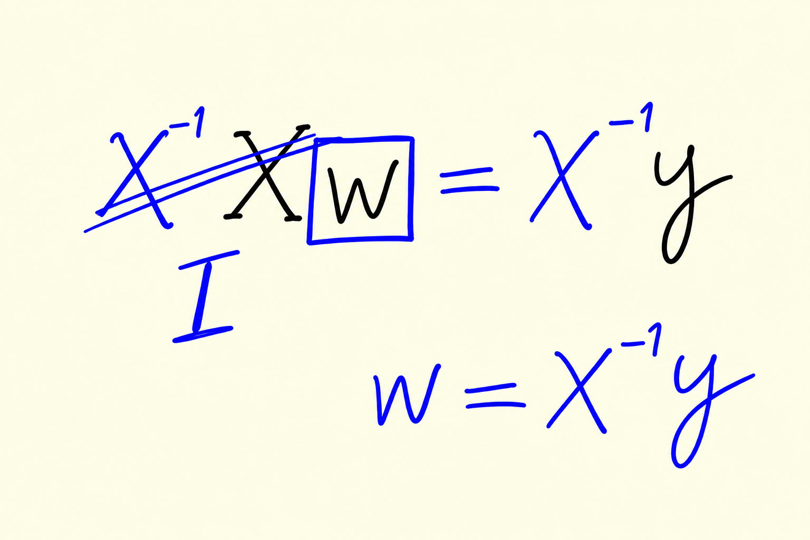
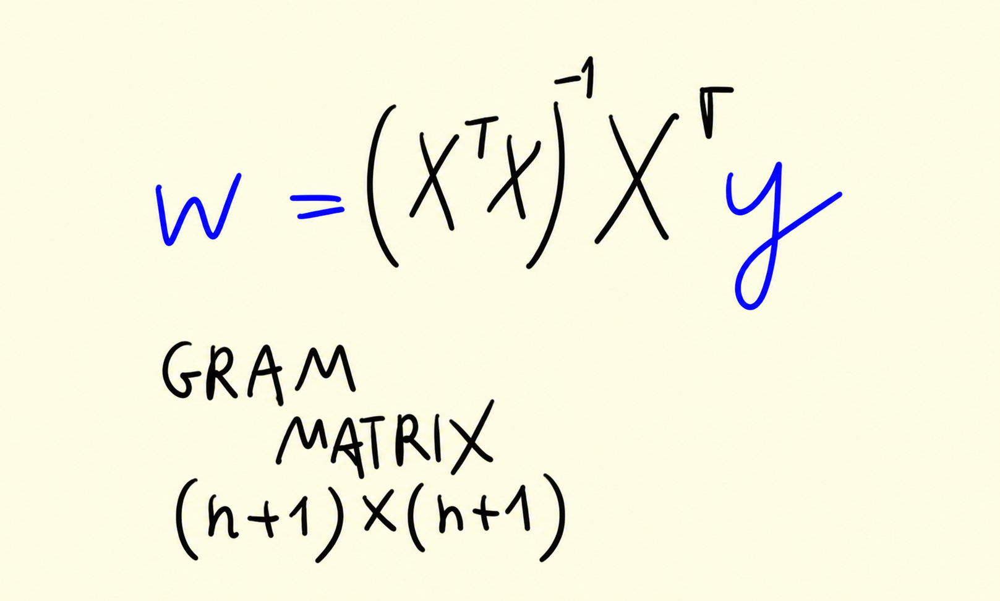
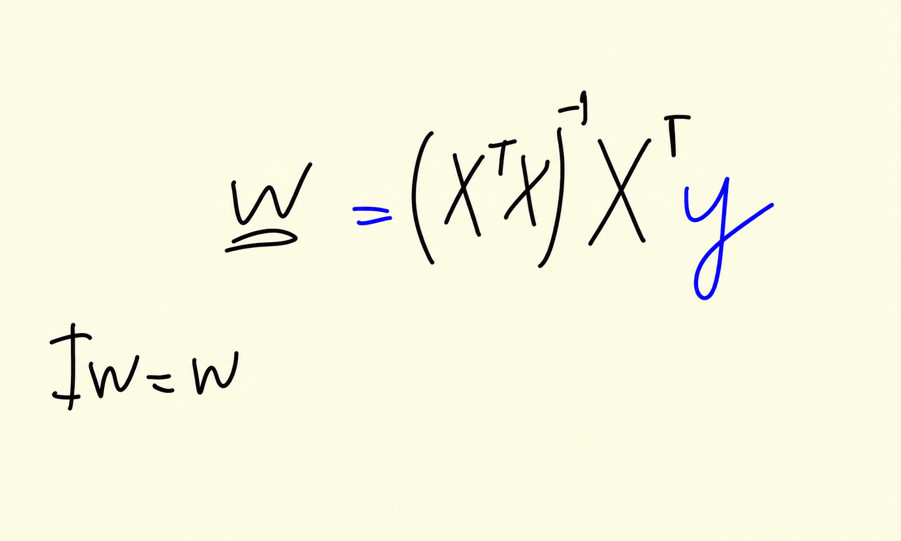

# Training linear regression: Normal equation

In the previous unit we learned how to apply a linear regression model
when we already have the weights. This unit answers the remaining
question: where do the weights come from? We derive the normal equation
- a closed-form formula for the weights - and implement it as a
`train_linear_regression` function.

## Solving for the weights

We have the feature matrix `X`, and we want the predictions `g(X) = Xw`
to be close to the actual target values `y`:

```text
Xw ≈ y
```

Ideally, `Xw` equals `y` exactly, and we can try to solve this system
for `w`.

Suppose for a moment that `X` is invertible: there exists a matrix
`X⁻¹` such that `X⁻¹X` is the identity matrix `I`. Then we can multiply
both sides of the equation by `X⁻¹`:

```text
X⁻¹Xw = X⁻¹y
   Iw = X⁻¹y
    w = X⁻¹y
```



The inverse "cancels" `X`, and we get the weights directly.

There is a problem, however. `X` is a rectangular matrix: it has `m`
rows (one per car) and `n+1` columns (one per feature, plus the bias
term). In our dataset `m` is much larger than `n+1`, so the matrix is
definitely not square - and only square matrices can have an inverse.
The solution to this system simply doesn't exist.

## The Gram matrix and the normal equation

Even though the exact solution doesn't exist, we can find the closest
possible approximate solution. Multiply both sides of `Xw ≈ y` by the
transpose of `X`:

```text
XᵀXw = Xᵀy
```

The matrix `XᵀX` is called the Gram matrix:



Unlike `X`, the Gram matrix is square - it has `n+1` rows and `n+1`
columns. Square matrices usually have an inverse (not always, and we
will deal with that case later), so we can multiply both sides by
`(XᵀX)⁻¹`:

```text
(XᵀX)⁻¹XᵀXw = (XᵀX)⁻¹Xᵀy
```

On the left, `(XᵀX)⁻¹XᵀX` is the identity matrix, and `Iw = w`. That
leaves us with:

```text
w = (XᵀX)⁻¹Xᵀy
```

This is the normal equation:



This `w` is not the solution to the original system - that solution
doesn't exist - but it is the closest possible solution. There are
formal proofs of this claim, and they involve quite a lot of
mathematics. If you are interested, the book "Elements of Statistical
Learning" covers the derivation.

## Implementing the normal equation

Let's implement the formula step by step in NumPy. To keep things
simple, we use a small toy matrix first: nine rows and three features.

```python
X = [
    [148, 24, 1385],
    [132, 25, 2031],
    [453, 11, 86],
    [158, 24, 185],
    [172, 25, 201],
    [413, 11, 86],
    [38,  54, 185],
    [142, 25, 431],
    [453, 31, 86],
]
X = np.array(X)
```

The first step of the normal equation is the Gram matrix:

```python
XTX = X.T.dot(X)
```


Then its inverse:

```python
XTX_inv = np.linalg.inv(XTX)
```

We can quickly sanity-check that the inverse is correct: multiplying
the Gram matrix by its inverse should give the identity matrix.

```python
XTX.dot(XTX_inv).round(1)
```

```text
array([[ 1., -0.,  0.],
       [-0.,  1.,  0.],
       [ 0.,  0.,  1.]])
```


We see ones on the diagonal and values that are extremely close to zero
elsewhere. They are not exactly zero because floating-point numbers
have finite precision, so small round-off errors accumulate - but we
can safely treat them as zero.

Now we need a target vector `y`. Let's just come up with nine prices
on the spot:

```python
y = [100, 200, 150, 250, 100, 200, 150, 250, 120]
```

Putting it all together, the normal equation gives us the weights:

```python
w_full = XTX_inv.dot(X.T).dot(y)
```

With this matrix we actually forgot one thing: the bias term. The bias
is important - it's the baseline prediction, the price of a car when we
know nothing else about it. To include it, we add a column of ones to
`X` and repeat the same steps:

```python
ones = np.ones(X.shape[0])
X = np.column_stack([ones, X])
XTX = X.T.dot(X)
XTX_inv = np.linalg.inv(XTX)
w_full = XTX_inv.dot(X.T).dot(y)
```

The `np.column_stack` function stacks the vector of ones and the
feature matrix together as columns, so the ones become the first
column of `X`.


The result `w_full` contains all the weights: the first element is the
bias term, the rest are the feature weights. We can split them apart:

```python
w0 = w_full[0]
w = w_full[1:]
```

Note that the weights are negative here. In our earlier examples the
weights were positive: more horsepower meant a higher price. A negative
weight means the opposite - as the feature value grows, the predicted
price goes down. If this feature were the age of a car, that would make
perfect sense: the older the car, the lower the price.


Finally, let's wrap everything into a function. The function takes `X`
and `y`, adds the column of ones internally, applies the normal
equation, and returns the bias term and the weights separately:

```python
def train_linear_regression(X, y):
    ones = np.ones(X.shape[0])
    X = np.column_stack([ones, X])

    XTX = X.T.dot(X)
    XTX_inv = np.linalg.inv(XTX)
    w_full = XTX_inv.dot(X.T).dot(y)

    return w_full[0], w_full[1:]
```

Because adding the ones happens inside the function, users of it don't
need to worry about the bias term: they pass the plain feature matrix,
and the function takes care of the rest. In the next unit we finally
use this function on the car price dataset.

## Notes

Obtaining predictions as close as possible to $y$ target values requires the calculation of weights from the general
LR equation. The feature matrix does not 
have an inverse because it is not square, so it is required to obtain an approximate solution, which can be
obtained using the **Gram matrix** 
(multiplication of feature matrix ($X$) and its transpose ($X^T$)). The vector of weights or coefficients $w$ obtained with this
formula is the closest possible solution to the LR system.

Normal Equation:

$w$ = $(X^TX)^{-1}X^Ty$

Where:

$X^TX$ is the Gram Matrix


