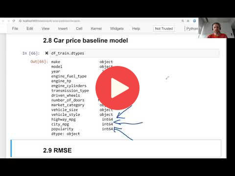

## 2.8 Baseline model for car price prediction project

[Slides](https://www.slideshare.net/AlexeyGrigorev/ml-zoomcamp-2-slides)

## Notes

* In this lesson we build a baseline model and apply the `df_train` dataset to derive weights for the bias (w0) and the features (w). For this, we use the `train_linear_regression(X, y)` function from the previous lesson.
* Linear regression only applies to numerical features. Therefore, only the numerical features from `df_train` are used for the feature matrix. 
* We notice some of the features in `df_train` are `nan`. We set them to `0` for the sake of simplicity, so the model is solvable, but it will be appropriate if a non-zeo value is used as the filler (e.g. mean value of the feature).
* Once the weights are calculated, then we apply them on  $$\\\\ \large g(X) = w_0 + X \cdot w$$ to derive the predicted y vector.
* Then we plot both predicted y and the actual y on the same histogram for a visual comparison.

The entire code of this project is available in [this jupyter notebook](https://github.com/alexeygrigorev/mlbookcamp-code/blob/master/chapter-02-car-price/02-carprice.ipynb).  

<table>
   <tr>
      <td>⚠️</td>
      <td>
         The notes are written by the community.  
         If you see an error here, please create a PR with a fix.
      </td>
   </tr>
</table>

* [Notes from Peter Ernicke](https://knowmledge.com/2023/09/21/ml-zoomcamp-2023-machine-learning-for-regression-part-7/)

## Navigation

* [Machine Learning Zoomcamp course](../)
* [Session 2: Machine Learning for Regression](./)
* Previous: [Training linear regression: Normal equation](07-linear-regression-training.md)
* Next: [Root mean squared error](09-rmse.md)
