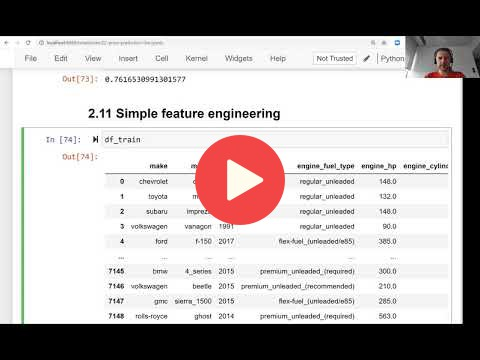

## 2.11 Feature engineering

Feature engineering is the process of creating new features

[Slides](https://www.slideshare.net/AlexeyGrigorev/ml-zoomcamp-2-slides)

## Notes

The feature age of the car was included in the dataset, obtained with the subtraction of the maximum year of cars and each of the years of cars. 
This new feature improved the model performance, measured with the RMSE and comparing the distributions of y target variable and predictions. 

The entire code of this project is available in [this jupyter notebook](https://github.com/alexeygrigorev/mlbookcamp-code/blob/master/chapter-02-car-price/02-carprice.ipynb).  

<table>
   <tr>
      <td>⚠️</td>
      <td>
         The notes are written by the community.  
         If you see an error here, please create a PR with a fix.
      </td>
   </tr>
</table>

* [Notes from Peter Ernicke](https://knowmledge.com/2023/09/22/ml-zoomcamp-2023-machine-learning-for-regression-part-9/)

## Navigation

* [Machine Learning Zoomcamp course](../)
* [Session 2: Machine Learning for Regression](./)
* Previous: [Using RMSE on validation data](10-car-price-validation.md)
* Next: [Categorical variables](12-categorical-variables.md)
