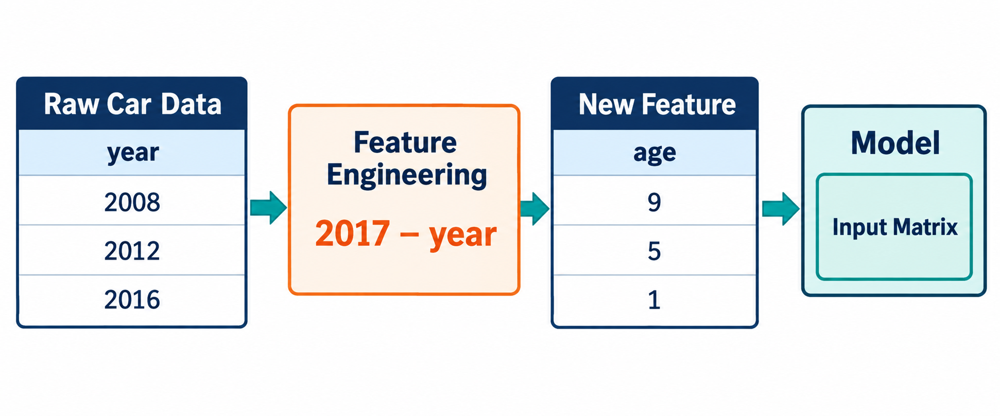

# Feature engineering

Feature engineering is the process of creating new features from the ones we
already have. In this unit we create our first new feature - the age of a car -
and see it improve the RMSE of our model quite a bit.



*Figure: Subtracting each car's year from 2017 creates the `age` feature that enters the model input matrix.*

## From year to age

Let's take a look again at our training dataset. One of the columns there is
`year`, and we know this is one of the most important variables for predicting
the price of a car: if a car is old, it is usually cheaper, and if it is new, it
is more expensive.

Instead of using the year as it is, we can compute the age of a car. For that we
need to know when this data was collected - it turns out it was collected in
2017. So "now" is 2017, and the age is simply `2017 - year`. Some of the cars
are 0 years old, some are 9, some are 26:

```python
2017 - df_train.year
```

This age is what we want to use as a feature in our model.

## Adding the age feature to prepare_X

Let's modify the `prepare_X` function we wrote in the
[previous unit](10-car-price-validation.md). The new feature is called `age`, and
we compute it in the same way we just did, except that instead of `df_train` we
use the dataframe the function receives - it could be the training, validation
or test set.

We also need to use the new feature when building the matrix. Instead of `base`,
we create a list called `features` that contains the baseline numerical features
plus the new `age` feature:

```python
def prepare_X(df):
    df['age'] = 2017 - df.year
    features = base + ['age']

    df_num = df[features]
    df_num = df_num.fillna(0)
    X = df_num.values
    return X
```

## The function should not modify the data

When we run this function, the first line adds a new column - and if we look at
`df_train` again, we see that a new column appeared in it. We modified the
dataframe we passed in.

This is not something this function should do. As a user of this function, I
don't want it to change my data - what if it does something that cannot be
undone? It is much better if the function doesn't modify the dataframes it
receives.

The fix is simple: before doing anything, we take a copy of the dataframe and
work with that copy inside the function. The original dataframe stays unchanged
- after the function returns, we simply forget about the copy, because all we
care about at the end is `X`.

```python
def prepare_X(df):
    df = df.copy()

    df['age'] = 2017 - df.year
    features = base + ['age']

    df_num = df[features]
    df_num = df_num.fillna(0)
    X = df_num.values
    return X
```

Now `X_train` has six columns - the five base features plus `age`, which is the
last one.

## Checking the improvement

Let's validate the model with the same code as before: prepare the matrices,
train the model, apply it to the validation set and compute the RMSE:

```python
X_train = prepare_X(df_train)
w0, w = train_linear_regression(X_train, y_train)

X_val = prepare_X(df_val)
y_pred = w0 + X_val.dot(w)
rmse(y_val, y_pred)
```

The model improved, and it is quite an improvement - the RMSE went down from
0.76 to 0.51:

```
0.5172055461058291
```

We can see that it is a big improvement by doing the same thing as previously:
plotting the predicted values and the actual values on the same histogram. Note
that now we compare against `y_val`, because we are predicting on the validation
dataset, not on the training dataset as previously.

```python
sns.histplot(y_pred, label='prediction', color='red', alpha=0.5, bins=50)
sns.histplot(y_val, label='target', color='blue',  alpha=0.5, bins=50)
plt.legend()
```

The shapes of the two distributions are now much closer. There is still a lot of
room for improvement - for example, the model completely misses this bar here -
but in general it is doing much better.

We can add even more features. In the
[next unit](12-categorical-variables.md) we will talk about categorical
variables - columns like `model`, `make` and so on.

## Notes

The feature age of the car was included in the dataset, obtained with the subtraction of the maximum year of cars and each of the years of cars. 
This new feature improved the model performance, measured with the RMSE and comparing the distributions of y target variable and predictions. 

