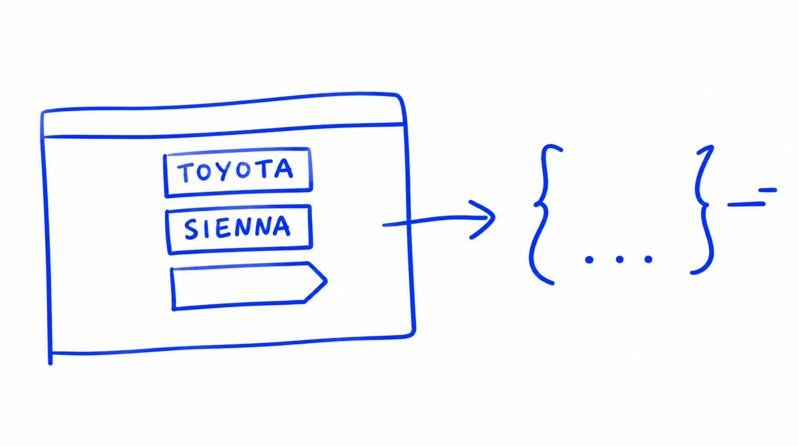

# Using the model

In the [previous unit](14-tuning-model.md) we found the best regularization
parameter. In this unit we train the final model, check it on the test data, and
then use it the way it would be used in practice: to predict the price of a
single car.

## Training the final model

Remember that we split our dataset into three parts: train, validation and
test. So far we trained the model on the training part and computed the RMSE on
the validation part. For the final model we do something different: we combine
the training and validation datasets into one - let's call it `full_train` -
train the model on all of it, and then make the final evaluation on the test
dataset.

The idea is simple: now that we have tuned all the parameters, we want to give
the model as much data as possible for training, and keep the test set untouched
for the final check. The RMSE on test shouldn't be too different from what we
saw on validation.

We have two dataframes, `df_train` and `df_val`, and we want to combine them
into one. In pandas there is a function for that - `concat`, short for
concatenate. It takes a list of dataframes and concatenates them together:

```python
df_full_train = pd.concat([df_train, df_val])
```


If we look at the result, we see that even though there are around 9500 rows
now, the index still contains the values from the validation dataframe. We can
fix that by resetting the index:

```python
df_full_train = df_full_train.reset_index(drop=True)
```

Now everything is sequential, and we can use the `prepare_X` function to get the
feature matrix:

```python
X_full_train = prepare_X(df_full_train)
```


We also need the target values `y`. There is a function in NumPy called
`concatenate` that does the same thing for arrays - and since arrays have no
index, we don't need to reset anything:

```python
y_full_train = np.concatenate([y_train, y_val])
```

Now we take the code for training the model and replace `X_train` with
`X_full_train`, `y_train` with `y_full_train`, and use the `r` we selected
earlier:

```python
w0, w = train_linear_regression_reg(X_full_train, y_full_train, r=0.001)
```

This is our final model, and these are its weights.


## Checking the model on test data

To check the final model, we prepare the test dataset exactly in the same way as
we did the validation dataset - we just replace validation with test:

```python
X_test = prepare_X(df_test)
y_pred = w0 + X_test.dot(w)
score = rmse(y_test, y_pred)
score
```

The RMSE is almost the same as on validation - equal up to the third decimal
point:

```
0.4600753970266562
```


That is a very good sign. It means our model generalizes well: it didn't get
this score just by chance.

## Predicting the price of a car

Now we can use the model the way we actually want to use it: to predict the
price of a car. Imagine there is a car, we extract all its features, put the
feature vector into the model - and it tells us the price.

For that we can take any car from the test dataset and pretend it's a new car.
This is fine, because we didn't train our model on this data. Let's take a
Toyota Sienna:

```python
car = df_test.iloc[20].to_dict()
car
```

This gives us a dictionary with all the information about the car:

```python
{'make': 'toyota',
 'model': 'sienna',
 'year': 2015,
 'engine_fuel_type': 'regular_unleaded',
 'engine_hp': 266.0,
 'engine_cylinders': 6.0,
 'transmission_type': 'automatic',
 'driven_wheels': 'front_wheel_drive',
 'number_of_doors': 4.0,
 'market_category': nan,
 'vehicle_size': 'large',
 'vehicle_style': 'passenger_minivan',
 'highway_mpg': 25,
 'city_mpg': 18,
 'popularity': 2031}
```


Usually we don't get a dataframe when we want to make a prediction. In a real
life scenario it could be a website or an app where people enter the values
about the car, and the website sends a request with all this information to the
model - the model replies back with the price. That's why we turn the car into
a dictionary: this is how such requests usually look.



Our `prepare_X` function expects a dataframe, though. So we create a small
dataframe with a single row - pandas can create a dataframe from a list of
dictionaries, and our list contains just the one car from the request:

```python
df_small = pd.DataFrame([car])
X_small = prepare_X(df_small)
```

Then we apply the model to this feature matrix with one row:

```python
y_pred = w0 + X_small.dot(w)
y_pred = y_pred[0]
y_pred
```

The prediction is:

```
10.63249250912739
```


There is just one single car, so we take the first number of the array. And
remember: this is the logarithm of the price, not the price itself. To undo the
logarithm, we take the exponent:

```python
np.expm1(y_pred)
```

This is our prediction - we think that a car with these characteristics should
cost this much:

```
41459.336786653585
```

Let's see how much this car actually costs:

```python
np.expm1(y_test[20])
```

The actual price is:

```
35000.00000000001
```


So our prediction was a bit off - the car costs 35,000 dollars and we predicted
around 41,500. It's not perfect, but it's a relatively good prediction.

So this is how we can first train a full model, and then apply this model to
predict the price of a single car. In the [next unit](16-summary.md) we will
summarize everything we learned in this session.

## Notes

After finding the best model and its parameters, it was trained with training and validation partitions and the final RMSE was calculated on the test partition. 

Finally, the final model was used to predict the price of new cars. 

The entire code of this project is available in [this jupyter notebook](https://github.com/alexeygrigorev/mlbookcamp-code/blob/master/chapter-02-car-price/02-carprice.ipynb).  
