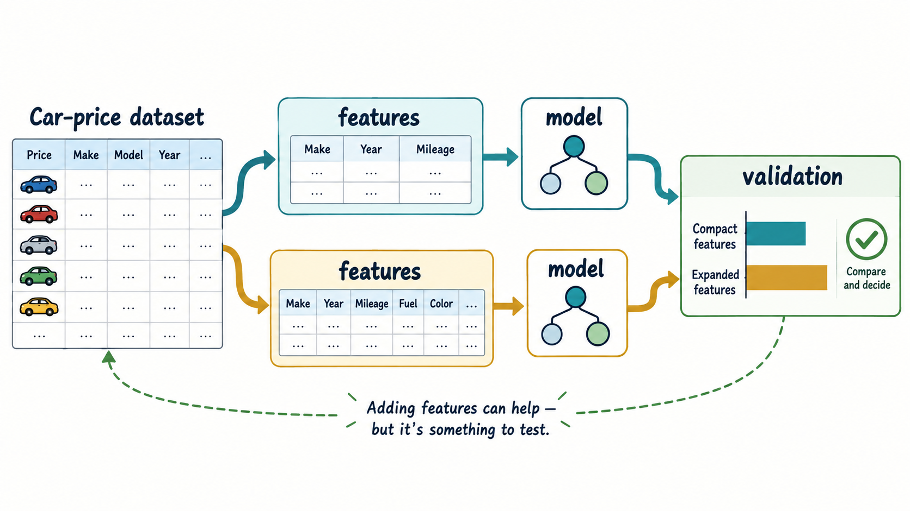

# Explore more

*Figure: Test a compact and an expanded feature set by comparing their validation results.*

### Questions

* In this project, we included only 5 top features. What happens if we include 10?

> That's not a graded homework, it's just for you if you want to try more things on this project

### Other projects

Here are other datasets that you can play with to learn more about the topic:

* [California housing dataset](https://scikit-learn.org/stable/modules/generated/sklearn.datasets.fetch_california_housing.html) - predict the price of a house
* [Student Performance Data Set](https://archive.ics.uci.edu/ml/datasets/Student+Performance) - predict the performance of students
* UCI ML Repository contains a lot of other datasets suitable for practicing regression - https://archive.ics.uci.edu/ml/datasets.php?task=reg
