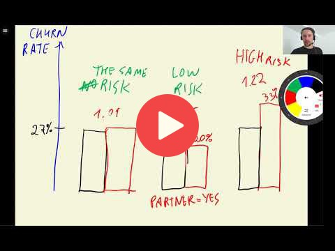

## 3.5 Feature importance: Churn rate and risk ratio

[Slides](https://www.slideshare.net/AlexeyGrigorev/ml-zoomcamp-3-machine-learning-for-classification)

## Notes

1. **Churn rate:** Difference between mean of the target variable and mean of categories for a feature. If this difference is greater than 0, it means that the category is less likely to churn, and if the difference is lower than 0, the group is more likely to churn. The larger differences are indicators that a variable is more important than others. 

2. **Risk ratio:** Ratio between mean of categories for a feature and mean of the target variable. If this ratio is greater than 1, the category is more likely to churn, and if the ratio is lower than 1, the category is less likely to churn. It expresses the feature importance in relative terms. 

**Functions and methods:** 

* `df.groupby('x').y.agg([mean()])` - returns a dataframe with mean of y series grouped by x series 
* `display(x)` displays an output in the cell of a jupyter notebook. 

The entire code of this project is available in [this jupyter notebook](https://github.com/alexeygrigorev/mlbookcamp-code/blob/master/chapter-03-churn-prediction/03-churn.ipynb). 

<table>
   <tr>
      <td>⚠️</td>
      <td>
         The notes are written by the community.  
         If you see an error here, please create a PR with a fix.
      </td>
   </tr>
</table>

## Navigation

* [Machine Learning Zoomcamp course](../)
* [Session 3: Machine Learning for Classification](./)
* Previous: [EDA](04-eda.md)
* Next: [Feature importance: Mutual information](06-mutual-info.md)
