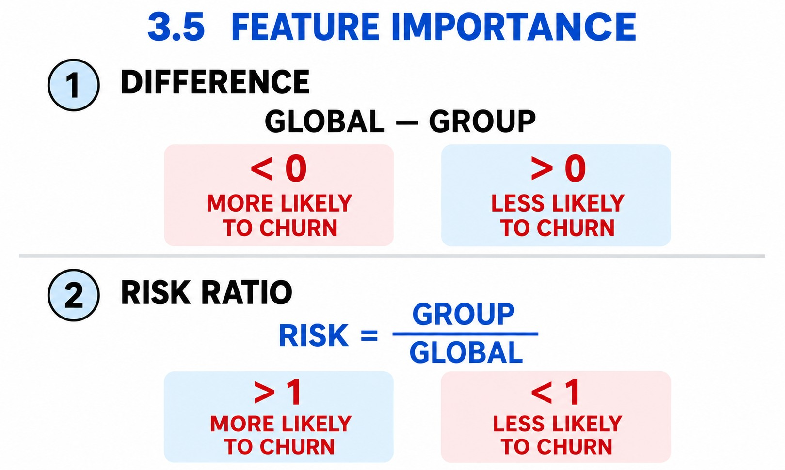

# Feature importance: Churn rate and risk ratio

Feature importance analysis is a part of EDA: we want to identify which
features affect our target variable. In this unit we do it for
categorical variables by comparing the churn rate of each group with
the global churn rate, first as a difference and then as a ratio.

## Churn rate per group

The reference point is the global churn rate - the churn rate we
computed in the EDA unit:

```python
global_churn = df_full_train.churn.mean()
```

```text
0.26996805111821087
```

Now we look at individual variables. Let's start with gender:

```python
churn_female = df_full_train[df_full_train.gender == 'female'].churn.mean()
churn_male = df_full_train[df_full_train.gender == 'male'].churn.mean()
```

```text
churn_female = 0.27682403433476394
churn_male   = 0.2632135306553911
```

The global churn rate is 0.27, women churn at 0.2768 and men at
0.2632. The differences are tiny. We compute them explicitly as the
global rate minus the group rate:

```python
global_churn - churn_female
```

```text
-0.006855983216553063
```

```python
global_churn - churn_male
```

```text
0.006754520462819769
```

Both differences are close to zero, so gender is probably not an
important feature: knowing whether a customer is a man or a woman tells
us almost nothing about churn.

Now let's look at a more promising variable - whether the customer has
a partner. First, how many customers are there in each group?

```python
df_full_train.partner.value_counts()
```

```text
no     2932
yes    2702
Name: partner, dtype: int64
```

Then the churn rates:

```python
churn_partner = df_full_train[df_full_train.partner == 'yes'].churn.mean()
churn_no_partner = df_full_train[df_full_train.partner == 'no'].churn.mean()
```

```text
churn_partner     = 0.20503330866025166
churn_no_partner  = 0.3298090040927694
```

This looks very different from gender. Customers with a partner churn
at 20.5%, customers without one at 33% - and the global rate is 27%. So
single customers are much more likely to churn. The differences from
the global rate:

```text
global_churn - churn_partner     =  0.06493474245795922
global_churn - churn_no_partner  = -0.05984095297455855
```

With this definition - global rate minus group rate - a positive
difference means the group churns less than average, and a negative
difference means it churns more. The larger the absolute difference,
the more important the variable.

## Risk ratio

The difference is expressed in absolute terms. The same idea can be
expressed in relative terms - as a ratio between the group churn rate
and the global churn rate:



```python
churn_no_partner / global_churn
```

```text
1.2216593879412643
```

```python
churn_partner / global_churn
```

```text
0.7594724924338315
```

This is the risk ratio. It is easy to read:

- risk = 1 means the group is as likely to churn as everyone else
- risk > 1 means the group is more likely to churn
- risk < 1 means the group is less likely to churn

Customers without a partner have a risk of 1.22 - they churn 22% more
often than the average customer. Customers with a partner have a risk
of 0.76 - they churn about 24% less often.

## Doing it for every variable with groupby

Doing this manually for every variable is tedious. The operation we did
is expressible as a SQL query:

```sql
SELECT
    gender,
    AVG(churn),
    AVG(churn) - global_churn AS diff,
    AVG(churn) / global_churn AS risk
FROM
    data
GROUP BY
    gender;
```

In pandas the same thing is a `groupby` with an aggregation:

```python
from IPython.display import display

for c in categorical:
    print(c)
    df_group = df_full_train.groupby(c).churn.agg(['mean', 'count'])
    df_group['diff'] = df_group['mean'] - global_churn
    df_group['risk'] = df_group['mean'] / global_churn
    display(df_group)
    print()
    print()
```

For every categorical variable we take the mean of churn for each
group - the group churn rate - and the number of rows in the group.
Then we add two columns: `diff` and `risk`. Note that in this loop the
`diff` column is computed the other way around, as the group mean minus
the global mean, so here a positive diff means the group churns more
than average. The `risk` column is the ratio we just saw.

Inside a loop, a table is not printed automatically, so we use the
`display` function from `IPython.display` to show each one.

Here is the output for gender:

```text
           mean  count      diff      risk
gender                                     
female  0.276824   2796  0.006856  1.025396
male    0.263214   2838 -0.006755  0.974980
```

And for partner:

```text
          mean  count      diff      risk
partner                                    
no     0.329809   2932  0.059841  1.221659
yes    0.205033   2702 -0.064935  0.759472
```

Scanning through all 16 tables, some variables stand out. For
`contract`, customers on a month-to-month contract churn far more than
average, while two-year contracts almost never churn:

```text
                  mean  count      diff      risk
contract                                          
month-to-month  0.431701   3104  0.161733  1.599082
one_year        0.120573   1186 -0.149395  0.446621
two_year        0.028274   1344 -0.241694  0.104730
```

`internetservice` tells a similar story - fiber optic customers churn
much more than DSL customers:

```text
                 mean  count      diff      risk
internetservice                                  
dsl              0.192347   1934 -0.077621  0.712482
fiber_optic      0.425171   2479  0.155203  1.574895
no               0.077805   1221 -0.192163  0.288201
```

And in `paymentmethod`, customers paying by electronic check are the
riskiest group in this table:

```text
                               mean  count      diff      risk
paymentmethod                                                 
bank_transfer_(automatic)  0.168171   1219 -0.101797  0.622928
credit_card_(automatic)    0.164339   1217 -0.105630  0.608733
electronic_check           0.455890   1893  0.185922  1.688682
mailed_check               0.193870   1305 -0.076098  0.718121
```

So contract type, internet service and payment method look important;
gender and phone service do not. What these per-group tables cannot do
is compare the importance of whole variables with each other - for
that we need mutual information, which is the next unit.

## Notes

1. **Churn rate:** Difference between global mean of the target variable and mean of the target variable for categories of a feature. If this difference is greater than 0, it means that the category is less likely to churn, and if the difference is lower than 0, the group is more likely to churn. The larger differences are indicators that a variable is more important than others. 

2. **Risk ratio:** Ratio between mean of the target variable for categories of a feature and global mean of the target variable. If this ratio is greater than 1, the category is more likely to churn, and if the ratio is lower than 1, the category is less likely to churn. It expresses the feature importance in relative terms. 

**Functions and methods:** 

* `df.groupby('x').y.agg([mean()])` - returns a dataframe with mean of y series grouped by x series 
* `display(x)` displays an output in the cell of a jupyter notebook. 

