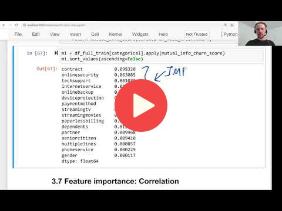

## 3.6 Feature importance: Mutual information

[Slides](https://www.slideshare.net/AlexeyGrigorev/ml-zoomcamp-3-machine-learning-for-classification)

## Notes

Mutual information is a concept from information theory, which measures how much we can learn about one variable if we know the value of another. In this project, we can think of this as how much do we learn about churn if we have the information from a particular feature. So, it is a measure of the importance of a categorical variable. 

**Classes, functions, and methods:** 

* `mutual_info_score(x, y)` - Scikit-Learn class for calculating the mutual information between the x target variable and y feature. 
* `df[x].apply(y)` - apply a y function to the x series of the df dataframe. 
* ` df.sort_values(ascending=False).to_frame(name='x')` - sort values in an ascending order and called the column as x. 

The entire code of this project is available in [this jupyter notebook](https://github.com/DataTalksClub/machine-learning-zoomcamp/blob/master/03-classification/notebook.ipynb). 

<table>
   <tr>
      <td>⚠️</td>
      <td>
         The notes are written by the community.  
         If you see an error here, please create a PR with a fix.
      </td>
   </tr>
</table>

* [Notes from Peter Ernicke](https://knowmledge.com/2023/09/28/ml-zoomcamp-2023-machine-learning-for-classification-part-6/)

## Navigation

* [Machine Learning Zoomcamp course](../)
* [Session 3: Machine Learning for Classification](./)
* Previous: [Feature importance: Churn rate and risk ratio](05-risk.md)
* Next: [Feature importance: Correlation](07-correlation.md)
