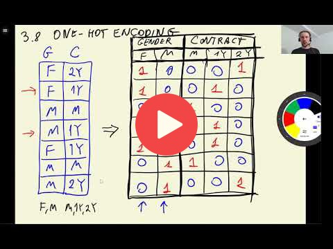

## 3.8 One-hot encoding

[Slides](https://www.slideshare.net/AlexeyGrigorev/ml-zoomcamp-3-machine-learning-for-classification)

## Notes

One-Hot Encoding allows encoding categorical variables in numerical ones. This method represents each category of a variable as one column, and a 1 is assigned if the value belongs to the category or 0 otherwise. 

**Classes, functions, and methods:** 

* `df[x].to_dict(orient='records')` - convert x series to dictionaries, oriented by rows. 
* `DictVectorizer().fit_transform(x)` - Scikit-Learn class for one-hot encoding by converting x dictionaries into a sparse matrix. It does not affect the numerical variables. 
* `DictVectorizer().get_feature_names()` -  return the names of the columns in the sparse matrix.  

The entire code of this project is available in [this jupyter notebook](https://github.com/DataTalksClub/machine-learning-zoomcamp/blob/master/03-classification/notebook.ipynb). 

<table>
   <tr>
      <td>⚠️</td>
      <td>
         The notes are written by the community.  
         If you see an error here, please create a PR with a fix.
      </td>
   </tr>
</table>

* [Notes from Peter Ernicke](https://knowmledge.com/2023/09/29/ml-zoomcamp-2023-machine-learning-for-classification-part-8/)

## Navigation

* [Machine Learning Zoomcamp course](../)
* [Session 3: Machine Learning for Classification](./)
* Previous: [Feature importance: Correlation](07-correlation.md)
* Next: [Logistic regression](09-logistic-regression.md)
