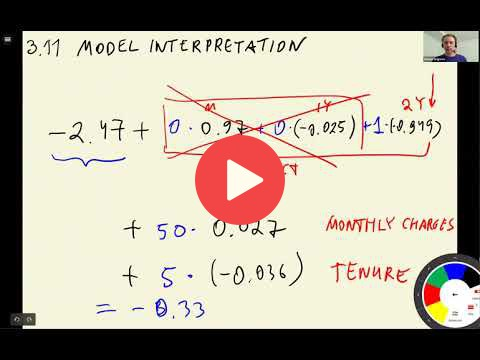

## 3.11 Model interpretation

[Slides](https://www.slideshare.net/AlexeyGrigorev/ml-zoomcamp-3-machine-learning-for-classification)

## Notes

This video was about the interpretation of coefficients, and training a model with fewer features. 

In the formula of the logistic regression model, only one of the one-hot encoded categories is multiplied by 1, and the other by 0. In this way, we only consider the appropriate category for each categorical feature. 

**Classes, functions, and methods:** 

* `zip(x,y)` - returns a new list with elements from x joined with their corresponding elements on y 

The entire code of this project is available in [this jupyter notebook](https://github.com/DataTalksClub/machine-learning-zoomcamp/blob/master/03-classification/notebook.ipynb). 

<table>
   <tr>
      <td>⚠️</td>
      <td>
         The notes are written by the community.  
         If you see an error here, please create a PR with a fix.
      </td>
   </tr>
</table>

* [Notes from Peter Ernicke](https://knowmledge.com/2023/10/01/ml-zoomcamp-2023-machine-learning-for-classification-part-11/)

## Navigation

* [Machine Learning Zoomcamp course](../)
* [Session 3: Machine Learning for Classification](./)
* Previous: [Training logistic regression with Scikit-Learn](10-training-log-reg.md)
* Next: [Using the model](12-using-log-reg.md)
