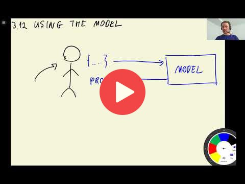

## 3.12 Using the model

[Slides](https://www.slideshare.net/AlexeyGrigorev/ml-zoomcamp-3-machine-learning-for-classification)

## Notes

We trained the logistic regression model with the full training dataset (training + validation), considering numerical and categorical features. Thus, predictions were made on the test dataset, and we evaluate the model using the accuracy metric. 

In this case, the predictions of validation and test were similar, which means that the model is working well.

<table>
   <tr>
      <td>⚠️</td>
      <td>
         The notes are written by the community.  
         If you see an error here, please create a PR with a fix.
      </td>
   </tr>
</table>

## Navigation

* [Machine Learning Zoomcamp course](../)
* [Session 3: Machine Learning for Classification](./)
* Previous: [Model interpretation](11-log-reg-interpretation.md)
* Next: [Summary](13-summary.md)