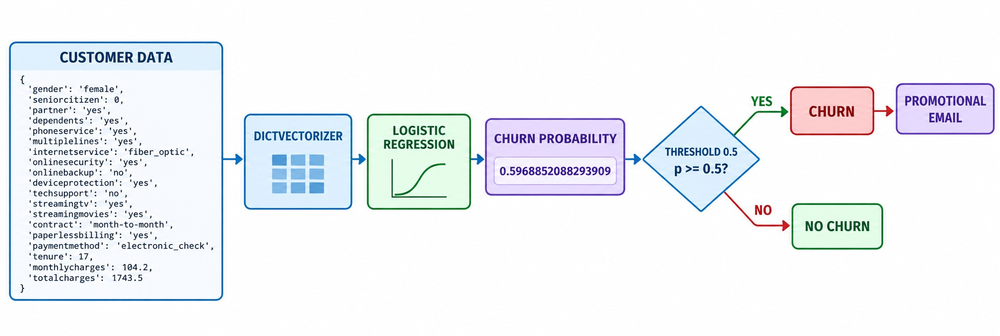

# Using the model

The model is ready. In this lesson we do the final step of the project:
retrain it on the full training data (train plus validation), check it
on the held-out test set, and score individual customers with it.

## Final model

During training and tuning we kept the test set untouched. Now that we
no longer need the validation set for checking the model, we can use
that data for training too - more data usually means a slightly better
model. That is exactly what `df_full_train` is for:

```python
dicts_full_train = df_full_train[categorical + numerical].to_dict(orient='records')

dv = DictVectorizer(sparse=False)
X_full_train = dv.fit_transform(dicts_full_train)

y_full_train = df_full_train.churn.values
```

```python
model = LogisticRegression(solver='lbfgs')
model.fit(X_full_train, y_full_train)
```

Note that we fit a new `DictVectorizer` on the full training data as
well - the encoding and the model always go together.

## Checking on the test set

Now we take the test set, encode it with the same vectorizer, and
compute the predictions:

```python
dicts_test = df_test[categorical + numerical].to_dict(orient='records')
X_test = dv.transform(dicts_test)

y_pred = model.predict_proba(X_test)[:, 1]
churn_decision = (y_pred >= 0.5)
(churn_decision == y_test).mean()
```

```
0.815471965933286
```

Accuracy on the test set is about 81.5%. On validation we had 80.3%.
The two numbers are close, which is what we want to see: the model
performs on unseen data about as well as on the data it was tuned with.
A large gap between the two would be a sign of overfitting.

## Scoring one customer

In practice we will not score a whole test set - we score customers one
by one. Each customer is one row of our data, so one dictionary. Take
the last customer from the test set:

```python
customer = dicts_test[-1]
customer
```

```
{'gender': 'female',
 'seniorcitizen': 0,
 'partner': 'yes',
 'dependents': 'yes',
 'phoneservice': 'yes',
 'multiplelines': 'yes',
 'internetservice': 'fiber_optic',
 'onlinesecurity': 'yes',
 'onlinebackup': 'no',
 'deviceprotection': 'yes',
 'techsupport': 'no',
 'streamingtv': 'yes',
 'streamingmovies': 'yes',
 'contract': 'month-to-month',
 'paperlessbilling': 'yes',
 'paymentmethod': 'electronic_check',
 'tenure': 17,
 'monthlycharges': 104.2,
 'totalcharges': 1743.5}
```

The vectorizer expects a list of dictionaries, so we wrap the customer
in a list. `transform` - not `fit_transform`, because the vectorizer is
already fitted:

```python
X_small = dv.transform([customer])
model.predict_proba(X_small)[0, 1]
```

```
0.5968852088293909
```

The model gives this customer a 60% chance of churning. Since that is
above our 0.5 threshold, the decision is "churn" - and indeed, this
customer actually churned in the data:

```python
y_test[-1]
```

```
1
```

This is how the model would be used in a real project. A service
receives the customer's data as a dictionary, encodes it with the
vectorizer, and asks the model for a probability. If it is above the
threshold - for example, 0.5 - the business sends this customer a
promotional email with a discount, hoping to keep them.



The model itself is just numbers - weights and the bias term - and the
vectorizer with the list of categories. To use it outside the notebook
we would need to save both to a file, which is what we cover in a later
lesson.

## Notes

We trained the logistic regression model with the full training dataset (training + validation), considering numerical and categorical features. Thus, predictions were made on the test dataset, and we evaluated the model using the accuracy metric. 

In this case, the predictions of validation and test were similar, which means that the model is working well.
