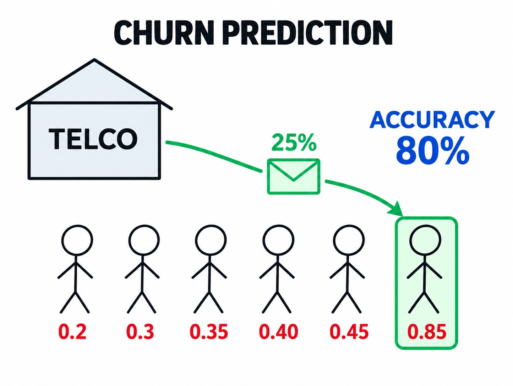

# Evaluation metrics: session overview

In this session we start module 4. In the previous module we trained a logistic regression model that predicts customer churn - now we need to answer the question: how do we know if it's good? We first recap the code that gets us back to the trained model, and then we look at the metrics we will use to evaluate it.

## What is a metric

A metric is a function that compares the predictions with the actual values and outputs a single number that tells how good the predictions are.

That is all a metric is: predictions go in, the true values go in, and one number comes out. Different metrics look at different aspects of the predictions, and picking the right one for the problem is the topic of this whole module.

## The dataset

We keep working with the telco churn dataset from the previous module. Each row is a customer of a telecom company, and the target is the `churn` column: 1 if the customer left, 0 if they stayed. The dataset comes from [Kaggle](https://www.kaggle.com/blastchar/telco-customer-churn) (the link is also in the notes below).



## Recap: back to the trained model

The session is mostly a recap of the code from module 3 - the metric discussion starts in the next lesson, and for that we need a model and its predictions.

First, we load the data and clean it: column names are lowercased, spaces are replaced with underscores, `totalcharges` is converted to numbers with `errors='coerce'` and the missing values are filled with 0, and the target is turned into 0/1:

```python
df = pd.read_csv('data-week-3.csv')

df.columns = df.columns.str.lower().str.replace(' ', '_')

categorical_columns = list(df.dtypes[df.dtypes == 'object'].index)

for c in categorical_columns:
    df[c] = df[c].str.lower().str.replace(' ', '_')

df.totalcharges = pd.to_numeric(df.totalcharges, errors='coerce')
df.totalcharges = df.totalcharges.fillna(0)

df.churn = (df.churn == 'yes').astype(int)
```

Then we split the data into train, validation and test: 60% for training, 20% for validation and 20% for test. We do it in two steps - first split off the test set, then split the rest - and we use `random_state=1` so the shuffle is reproducible:

```python
df_full_train, df_test = train_test_split(df, test_size=0.2, random_state=1)
df_train, df_val = train_test_split(df_full_train, test_size=0.25, random_state=1)
```

We keep 3 numerical features (`tenure`, `monthlycharges`, `totalcharges`) and 16 categorical ones, one-hot encode them with `DictVectorizer(sparse=False)`, and train a logistic regression model.

At the end of the recap we get predictions on the validation set. `predict_proba` returns the churn probability for each customer, and we say the model predicts churn when this probability is at least 0.5:

```python
y_pred = model.predict_proba(X_val)[:, 1]
churn_decision = (y_pred >= 0.5)
(y_val == churn_decision).mean()
```

This gives us `0.8034066713981547` - the model agrees with the actual outcomes about 80% of the time. Is 80% good? That is exactly what we cannot tell yet: a single agreement number is the simplest metric, accuracy, and in the next lesson we start poking at it.

## What we cover in this module

- Accuracy, and why a dummy model that predicts "no churn" for everybody is a useful sanity check
- The confusion table: the four types of correct decisions and errors a binary classifier makes
- Precision and recall: metrics that look at the positive class specifically
- ROC curves: true positive rate and false positive rate across all possible thresholds, with random and ideal models as reference points
- ROC AUC: the area under the ROC curve, a single number for curve quality
- Cross-validation: a more reliable way to measure model quality and tune parameters

The whole module walks through one notebook, [notebook.ipynb](notebook.ipynb) - the same churn prediction project as in module 3.

## Notes

The fourth week of Machine Learning Zoomcamp is about different metrics to evaluate a binary classifier. These measures include accuracy, confusion table, precision, recall, ROC curves(TPR, FRP, random model, and ideal model), AUROC, and cross-validation. 

For this project, we used a [Kaggle dataset](https://www.kaggle.com/blastchar/telco-customer-churn) about churn prediction. 
