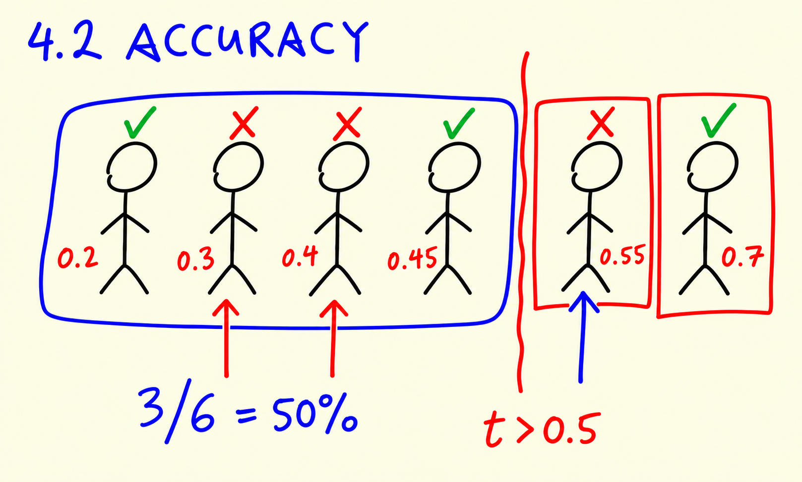
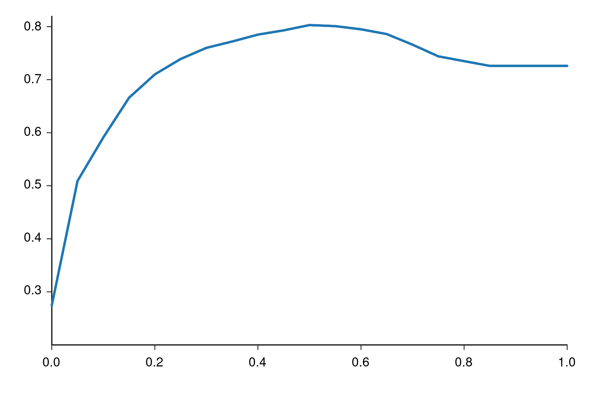
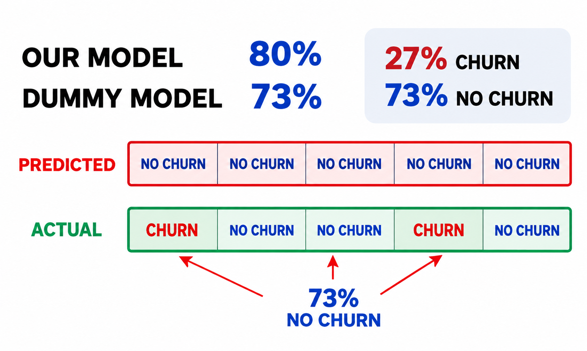

# Accuracy and dummy model

In this lesson we look at accuracy, the simplest evaluation metric: the fraction of predictions the model got right. We check whether 0.5 is the best decision threshold for our churn model, and then compare it against a dummy model that predicts nobody will churn.

## Accuracy

Accuracy measures the fraction of correct predictions: the number of correct predictions divided by the total number of predictions.



Our validation set has 1409 customers:

```python
len(y_val)
```

This gives `1409`. With the decision threshold at 0.5, the model made the right call for 1132 of them:

```python
(y_val == churn_decision).mean()
```

This gives `0.8034066713981547`. Indeed, 1132 / 1409 is 0.8034 - about 80% of the predictions match the actual outcomes.

Scikit-learn has this computation built in as `accuracy_score`:

```python
from sklearn.metrics import accuracy_score

accuracy_score(y_val, y_pred >= 0.5)
```

This gives the same `0.8034066713981547`.

## Checking different thresholds

The 0.5 threshold was a guess. Nothing forces us to use it: the model outputs a probability, and we can announce churn for any cutoff we like. Let's check all thresholds from 0 to 1 in steps of 0.05 and see which one gives the best accuracy:

```python
thresholds = np.linspace(0, 1, 21)

scores = []

for t in thresholds:
    score = accuracy_score(y_val, y_pred >= t)
    print('%.2f %.3f' % (t, score))
    scores.append(score)
```

The output:

```text
0.00 0.274
0.05 0.509
0.10 0.591
0.15 0.666
0.20 0.710
0.25 0.739
0.30 0.760
0.35 0.772
0.40 0.785
0.45 0.793
0.50 0.803
0.55 0.801
0.60 0.795
0.65 0.786
0.70 0.766
0.75 0.744
0.80 0.735
0.85 0.726
0.90 0.726
0.95 0.726
1.00 0.726
```

Plotted, the accuracy rises quickly, peaks around 0.5, and then slowly declines before flattening out:



So for this problem the best decision cutoff is indeed 0.5, with 80% accuracy. That was a lucky guess - but it didn't have to be. On other problems the best threshold is often different from 0.5, and this simple loop is how you find it.

## The dummy model

Here comes the uncomfortable check. What if we don't use a model at all, and simply predict that no customer will ever churn? That is the same as setting the threshold to 1.0: no prediction can reach it, so every customer is predicted as "no churn":

```python
from collections import Counter

Counter(y_pred >= 1.0)
```

The output confirms it - every single prediction is `False`:

```text
Counter({False: 1409})
```

What accuracy does this dummy model get? The answer is the fraction of customers who did not churn:

```python
1 - y_val.mean()
```

This gives `0.7260468417317246` - 73%.

So a model that doesn't look at the data at all scores 73%, and our logistic regression scores 80%. The improvement over the dummy baseline is much smaller than "80% correct" made it sound.

## Why accuracy fails here: class imbalance

The reason is that the classes are unbalanced: only 27% of the customers in the validation set churned, and 73% stayed. This is called class imbalance - there are many more instances of one class than of the other.



With such an imbalance, a model can get a high accuracy by always predicting the majority class, while being completely useless for the minority class - which is exactly the class we care about: we want to find the customers who are about to leave.

So for this problem, accuracy alone cannot tell us how good the model is. We need metrics that look at the errors in more detail - that is what the confusion table in the next lesson is for.

## Notes

**Accuracy** measures the fraction of correct predictions. Specifically, it is the number of correct predictions divided by the total number of predictions. 

We can change the **decision threshold**, it should not be always 0.5. But, in this particular problem, the best decision cutoff, associated with the hightest accuracy (80%), was indeed 0.5. 

Note that if we build a **dummy model** in which the decision cutoff is 1, so the algorithm predicts that no clients will churn, the accuracy would be 73%. Thus, we can see that the improvement of the original model with respect to the dummy model is not as high as we would expect. 

Therefore, in this problem accuracy can not tell us how good is the model because the dataset is **unbalanced**, which means that there are more instances from one category than the other. This is also known as **class imbalance**. 

**Classes and methods:**

* `np.linspace(x,y,z)` - returns a numpy array starting at `x` until `y` with `z` evenly spaced samples 
* `Counter(x)` - collection class that counts the number of instances that satisfy the `x` condition
* `accuracy_score(x, y)` - sklearn.metrics class for calculating the accuracy of a model, given a predicted `x` dataset and a target `y` dataset. 

The entire code of this project is available in [this jupyter notebook](notebook.ipynb).  
