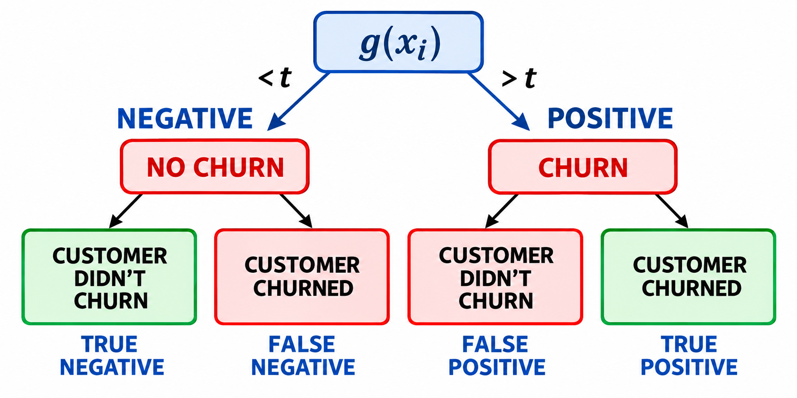
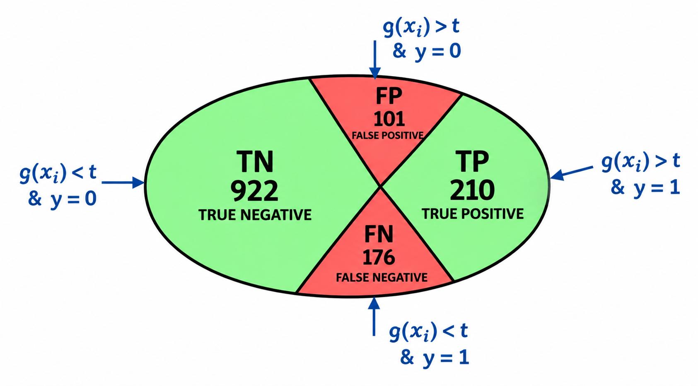

# Confusion table

Accuracy collapses all predictions into a single number, so it cannot tell us which kinds of mistakes the model makes. In this lesson we look at the confusion table: a way of measuring the different types of errors and correct decisions a binary classifier can make, arranged in one table.

## Four outcomes of a prediction

For churn prediction, each customer in the validation set falls into one of four categories, depending on what we predicted and what actually happened:

| Prediction | Actual | Name |
|------------|--------|------|
| Customer will churn (positive) | Churned | True Positive (TP) |
| Customer will churn (positive) | Did not churn | False Positive (FP) |
| Customer will not churn (negative) | Churned | False Negative (FN) |
| Customer will not churn (negative) | Did not churn | True Negative (TN) |

Reading the names: "positive"/"negative" is what we predicted, "true"/"false" is whether that prediction was correct. A false positive is a customer we sent a promotional email to, but who was never going to leave. A false negative is a customer who left without us ever flagging them - often the more costly mistake.



## Computing the counts

To put every customer into one of the four cells, we compare the actual values with the predictions at threshold 0.5:

```python
actual_positive = (y_val == 1)
actual_negative = (y_val == 0)

t = 0.5
predict_positive = (y_pred >= t)
predict_negative = (y_pred < t)
```

Each cell is the number of customers where the two conditions hold at the same time. The `&` operator is the element-wise logical AND:

```python
tp = (predict_positive & actual_positive).sum()
tn = (predict_negative & actual_negative).sum()

fp = (predict_positive & actual_negative).sum()
fn = (predict_negative & actual_positive).sum()
```

For our model this gives tp = 210, tn = 922, fp = 101 and fn = 176 - and indeed 210 + 922 + 101 + 176 = 1409, all customers accounted for.



## The table

Arranging the four numbers with predictions in columns and actual values in rows gives the confusion table:

```python
confusion_matrix = np.array([
    [tn, fp],
    [fn, tp]
])
confusion_matrix
```

The output:

```text
array([[922, 101],
       [176, 210]])
```

|                | Predicted negative | Predicted positive |
|----------------|--------------------|--------------------|
| Actual negative | TN = 922          | FP = 101           |
| Actual positive | FN = 176          | TP = 210           |

Dividing each cell by the total turns the counts into fractions of the whole validation set:

```python
(confusion_matrix / confusion_matrix.sum()).round(2)
```

The output:

```text
array([[0.65, 0.07],
       [0.12, 0.15]])
```

So 65% of all customers are true negatives, 7% false positives, 12% false negatives and 15% true positives.

Accuracy fits right back in: it is the sum of the diagonal - the correct decisions TN and TP - divided by the total. Here (922 + 210) / 1409 = 0.8034, the same 80% as before. What the table adds is the split of the remaining 20% into 7% of false positives and 12% of false negatives - two errors with very different business costs.

## Notes

Confusion table is a way of measuring different types of errors and correct decisions that binary classifiers can make. Considering this information, it is possible to evaluate the quality of the model by different strategies.

When comes to a prediction of an LR model, each falls into one of four different categories:

* Prediction is that the customer WILL churn. This is known as the **Positive class**
  * And Customer actually churned - Known as a **True Positive (TP)**
  * But Customer actually did not churn - Known as a **False Positive (FP)**
* Prediction is that the customer WILL NOT churn' - This is known as the **Negative class**
  * Customer did not churn - **True Negative (TN)**
  * Customer churned - **False Negative (FN)**

`Confusion Table` is a way to summarize the above results in a tabular format, as shown below:

<table>
  <tr>
    <th></th>
    <th></th>
    <th colspan="2" style="text-align: center;">Predictions</th>
  </tr>
  <tr>
    <td></td>
    <td></td>
    <td>Negative</td>
    <td>Positive</td>
  </tr>
  <tr>
    <td rowspan="2">Actual</td>
    <td>Negative</td>
    <td style="text-align: center;">TN</td>
    <td style="text-align: center;">FP</td>
  </tr>
  <tr>
    <td>Positive</td>
    <td style="text-align: center;">FN</td>
    <td style="text-align: center;">TP</td>
  </tr>
</table>

The **accuracy** corresponds to the sum of TN and TP divided by the total of observations.

<table>
   <tr>
      <td>⚠️</td>
      <td>
         The notes are written by the community. <br>
         If you see an error here, please create a PR with a fix.
      </td>
   </tr>
</table>

* [Notes from Peter Ernicke](https://knowmledge.com/2023/10/04/ml-zoomcamp-2023-evaluation-metrics-for-classification-part-3/)
