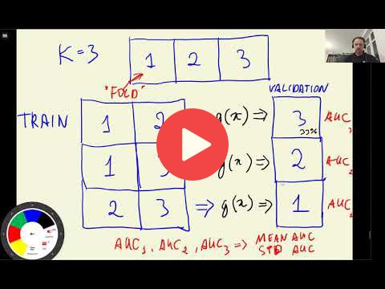

## 4.7 Cross-Validation

[Slides](https://www.slideshare.net/AlexeyGrigorev/ml-zoomcamp-4-evaluation-metrics-for-classification)

### Extra resources

In the lesson we talked about iterators and generators in Python. You can read more about them here:

- https://anandology.com/python-practice-book/iterators.html
- https://www.google.com/search?q=python+iterators+and+generators

## Notes

**Cross-validations** refers to evaluating the same model on different subsets of a dataset, getting the average prediction, and spread within predictions. This method is applied in the **parameter tuning** step, which is the process of selecting the best parameter.

In this algorithm, the full training dataset is divided into **k partitions**, we train the model in k-1 partitions of this dataset and evaluate it on the remaining subset. Then, we end up evaluating the model in all the k folds, and we calculate the average evaluation metric for all the folds.

In general, if the dataset is large, we should use the hold-out validation dataset strategy. In the other hand, if the dataset is small or we want to know the standard deviation of the model across different folds, we can use the cross-validation approach.

**Libraries, classes and methods:**

- `Kfold(k, s, x)` - sklearn.model_selection class for calculating the cross validation with k folds, s boolean attribute for shuffle decision, and an x random state
- `Kfold.split(x)` - sklearn.Kfold method for splitting the x dataset with the attributes established in the Kfold's object construction.
- `for i in tqdm()` - library for showing the progress of each i iteration in a for loop.

The code of this project is available in [this jupyter notebook](notebook.ipynb).

Add notes from the video (PRs are welcome)

<table>
   <tr>
      <td>⚠️</td>
      <td>
         The notes are written by the community.  
         If you see an error here, please create a PR with a fix.
      </td>
   </tr>
</table>

- [Notes from Peter Ernicke](https://knowmledge.com/2023/10/08/ml-zoomcamp-2023-evaluation-metrics-for-classification-part-7/)

## Navigation

- [Machine Learning Zoomcamp course](../)
- [Session 4: Evaluation Metrics for Classification](./)
- Previous: [ROC AUC](06-auc.md)
- Next: [Summary](08-summary.md)
