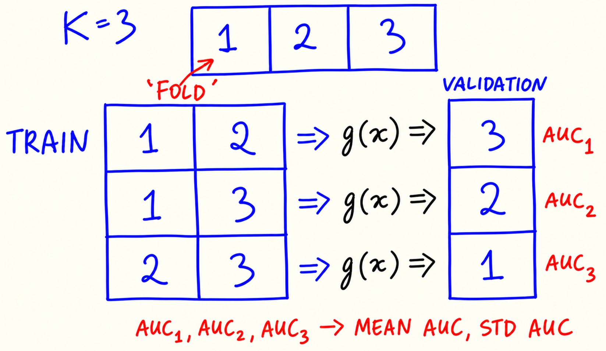

# Cross-Validation

So far we measured the model once, on one validation set. Cross-validation is a way to evaluate the same model on different subsets of the data, so we get not just one number but an average and a spread - and we can use it for parameter tuning: selecting the best parameters for the model.

## Preparing the pieces

Parameter tuning uses the training data, so first we merge the train and validation sets back together into `df_full_train` - the test set stays untouched for the very end.

To make the loop tidy, we wrap training and prediction into two functions. `train` one-hot encodes the dataframe with a fresh `DictVectorizer` and fits logistic regression. The `C` parameter controls regularization - we will tune it shortly:

```python
def train(df_train, y_train, C=1.0):
    dicts = df_train[categorical + numerical].to_dict(orient='records')

    dv = DictVectorizer(sparse=False)
    X_train = dv.fit_transform(dicts)

    model = LogisticRegression(C=C, max_iter=1000)
    model.fit(X_train, y_train)
    
    return dv, model
```

`predict` applies the saved vectorizer and model to any dataframe and returns the churn probabilities:

```python
def predict(df, dv, model):
    dicts = df[categorical + numerical].to_dict(orient='records')

    X = dv.transform(dicts)
    y_pred = model.predict_proba(X)[:, 1]

    return y_pred
```

## K-fold cross-validation

The idea of k-fold cross-validation: split the full training dataset into k partitions (folds). Train the model on k-1 folds, evaluate on the remaining one. Repeat k times, so every fold serves as the validation set once, and average the scores.



Scikit-learn implements the splitting with `KFold`. With `shuffle=True` the rows are shuffled before splitting, and `random_state=1` makes the shuffle reproducible:

```python
from sklearn.model_selection import KFold

kfold = KFold(n_splits=5, shuffle=True, random_state=1)
```

`kfold.split(df_full_train)` is a Python generator: each call to `next` yields the next split as two arrays of row indices - the indices to train on and the indices to validate on. We slice the dataframe with `iloc`, train, predict and score with AUC:

```python
from tqdm.auto import tqdm

n_splits = 5

for C in tqdm([0.001, 0.01, 0.1, 0.5, 1, 5, 10]):
    kfold = KFold(n_splits=n_splits, shuffle=True, random_state=1)

    scores = []

    for train_idx, val_idx in kfold.split(df_full_train):
        df_train = df_full_train.iloc[train_idx]
        df_val = df_full_train.iloc[val_idx]

        y_train = df_train.churn.values
        y_val = df_val.churn.values

        dv, model = train(df_train, y_train, C=C)
        y_pred = predict(df_val, dv, model)

        auc = roc_auc_score(y_val, y_pred)
        scores.append(auc)

    print('C=%s %.3f +- %.3f' % (C, np.mean(scores), np.std(scores)))
```

The `tqdm` wrapper draws a progress bar so we can see the loop moving. The output:

```text
C=0.001 0.825 +- 0.009
C=0.01 0.840 +- 0.009
C=0.1 0.841 +- 0.008
C=0.5 0.840 +- 0.007
C=1 0.841 +- 0.008
C=5 0.841 +- 0.008
C=10 0.841 +- 0.008
```

For each value of `C` we get the mean AUC across the 5 folds and the standard deviation. The mean tells us the average performance; the standard deviation tells us how spread out the scores are across the folds - how stable the model is. For example, for the last run (`C=10`) the five fold scores were:

```python
scores
```

```text
[0.8419433083969826,
 0.8458047775129122,
 0.8325145494681918,
 0.8325466042079682,
 0.8525462018763139]
```

Reading the tuning table: everything from `C=0.01` up performs about the same (0.840-0.841), and only the smallest `C=0.001` is clearly worse. So there is no strong sensitivity to `C` here, and the default `C=1.0` is a fine choice.

## Training the final model

Once the parameter is selected, we train the final model on the full training data - all of `df_full_train` - and evaluate once on the held-out test set:

```python
dv, model = train(df_full_train, df_full_train.churn.values, C=1.0)
y_pred = predict(df_test, dv, model)

auc = roc_auc_score(y_test, y_pred)
auc
```

This gives `0.8572386167896259`. That is slightly better than the cross-validation average - a small difference like this is normal.

## When to use cross-validation

- If the dataset is large, a single hold-out validation split is usually enough - it is faster, and the estimate is already stable.
- If the dataset is small, or we want to know how stable the model is across different splits, cross-validation is worth the extra computation. More folds give a better estimate but take longer to compute.

## Extra resources

In the lesson we talked about iterators and generators in Python. You can read more about them here:

- https://anandology.com/python-practice-book/iterators.html
- https://www.google.com/search?q=python+iterators+and+generators

## Notes

**Cross-validations** refers to evaluating the same model on different subsets of a dataset, getting the average prediction, and spread within predictions. This method is applied in the **parameter tuning** step, which is the process of selecting the best parameter.

In this algorithm, the full training dataset is divided into **k partitions**, we train the model in k-1 partitions of this dataset and evaluate it on the remaining subset. Then, we end up evaluating the model in all the k folds, and we calculate the average evaluation metric for all the folds.

In general, if the dataset is large, we should use the hold-out validation dataset strategy. In the other hand, if the dataset is small or we want to know the standard deviation of the model across different folds, we can use the cross-validation approach.

**Libraries, classes and methods:**

- `Kfold(k, s, x)` - sklearn.model_selection class for calculating the cross validation with k folds, s boolean attribute for shuffle decision, and an x random state
- `Kfold.split(x)` - sklearn.Kfold method for splitting the x dataset with the attributes established in the Kfold's object construction.
- `for i in tqdm()` - library for showing the progress of each i iteration in a for loop.

