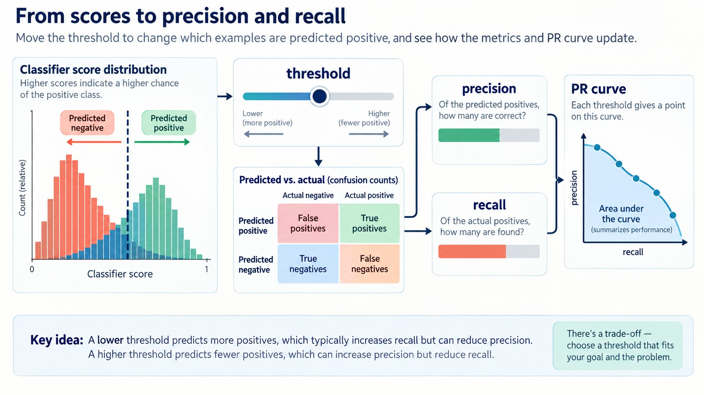

# Explore more

This unit has no video. It lists a few things you can try on your own to go
deeper into the topics of this module:

*Figure: Changing the threshold changes the precision-recall trade-off.*

* Check the precision and recall of the dummy classifier that always predicts "FALSE"
* F1 score = 2 P R / (P + R)
* Evaluate precision and recall at different thresholds, plot P vs R - this way you'll get the precision/recall curve (similar to the ROC curve)
* The area under the PR curve is also a useful metric

## Other projects

* Calculate the metrics for the suggested datasets from the previous week
