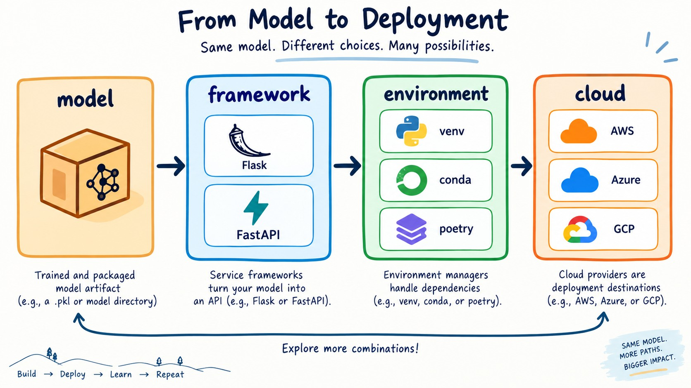

# Explore more

This unit has no video. It lists a few things you can try on your own to go
deeper into the topics of this module:

*Figure: Deployment choices form a stack from the model artifact to the cloud.*

* Flask is not the only framework for creating web services. Try others, e.g. FastAPI.
* Experiment with other ways of managing environment, e.g. virtual env, conda, poetry.
* Explore other ways of deploying web services, e.g. GCP, Azure, Heroku, Python Anywhere, etc.
