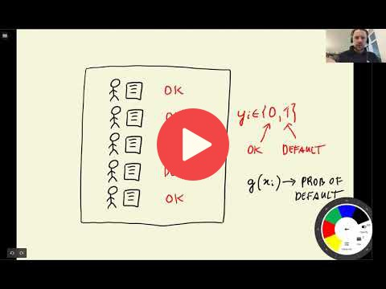

## 6.1 Credit risk scoring project

 

[Slides](https://www.slideshare.net/AlexeyGrigorev/ml-zoomcamp-6-decision-trees-and-ensemble-learning)

## Notes

In this session we'll learn about decision trees and ensemble learning algorithms. The questions that we try to address this week are, "What are decision trees? How are they different from ensemble algorithms? How can we implement and fine-tune these models to make binary classification predictions?"

To be specific, we'll use [credit scoring data](https://github.com/gastonstat/CreditScoring) to build a model that predicts whether a bank should lend loan to a client or not. The bank takes these decisions based on the historical record.

In the credit scoring classification problem, 
- if the model returns 0, this means, the client is very likely to payback the loan and the bank will approve the loan.  
- if the model returns 1, then the client is considered as a `defaulter` and the bank may not approval the loan.

Add notes from the video (PRs are welcome)

<table>
   <tr>
      <td>⚠️</td>
      <td>
         The notes are written by the community.  
         If you see an error here, please create a PR with a fix.
      </td>
   </tr>
</table>

## Navigation

* [Machine Learning Zoomcamp course](../)
* [Session 6: Decision Trees and Ensemble Learning](./)
* Next: [Data cleaning and preparation](02-data-prep.md)
