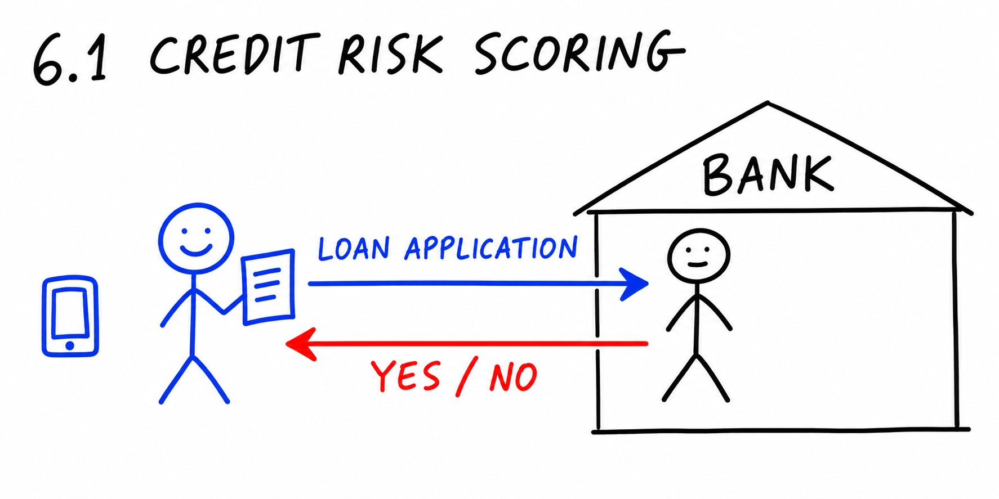
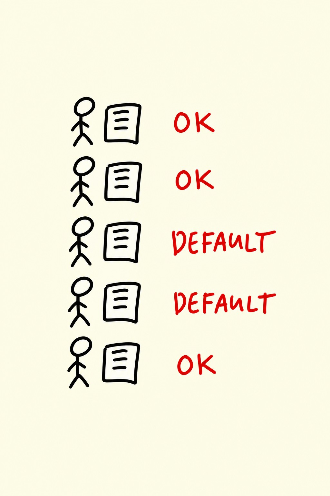
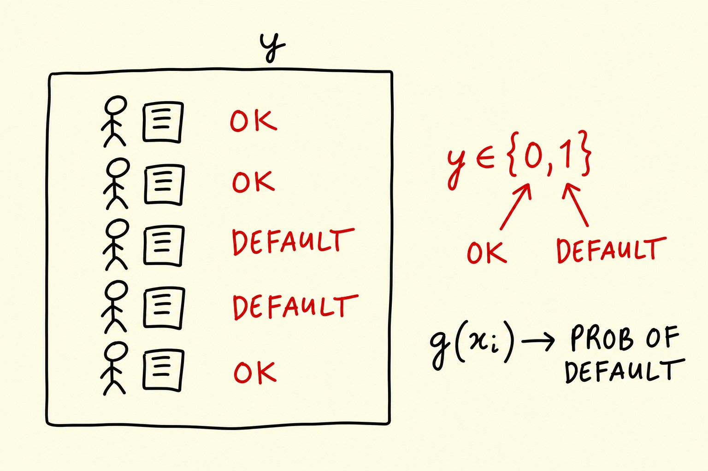

# Credit risk scoring project

This unit introduces the project for this module: predicting whether a
bank should lend money to a customer. We also look at the plan for the
whole week - decision trees and ensemble learning.

## The problem

Imagine you want to buy a phone, but you don't want to pay for it right
away. You go to a bank and apply for a loan. You fill in a form with
your details: your income, the price of the phone, the amount you want
to borrow. The bank looks at this information and makes a decision:
approve the loan or decline it.

Historically, banks made this decision manually. Today we can automate
it with machine learning. The idea is simple: we take historical data
about past customers. For each of them we know what they asked for and
what happened afterwards - did they pay back the loan, or did they
default? For example:



- Customer A - OK
- Customer B - OK
- Customer C - DEFAULT
- Customer D - DEFAULT
- Customer E - OK



We use this data to train a model. Then, when a new customer applies
for a loan, the model looks at their information and predicts the risk
that this customer will default.

## Binary classification

This is a binary classification problem. The target variable `y` takes
two values:

- `y = 0` - the customer is OK, they paid back their loan
- `y = 1` - the customer defaulted

The model `g` takes the customer information `x` and produces the
probability of default:

```text
g(xi) -> probability of default
```

So for each customer, we predict a number between 0 and 1 that says how
likely they are to fail to pay back the loan. The bank uses this score
to decide whether to lend money to this customer or not. If the model
returns a value close to 0, the client is likely to pay back and the
bank can approve the loan. If it returns a value close to 1, the client
is a likely defaulter and the bank may decline the application.



## The dataset

We will use a credit scoring dataset with information about past
customers: how much they earn, what their assets and debt are, whether
they have records of previous defaults, and so on. The target column is
`status` - it says whether the customer defaulted or not.

The dataset is available on
[GitHub](https://github.com/gastonstat/CreditScoring).

In the next unit we start with cleaning and preparing this dataset for
the model.

## What we'll cover in this module

This week is about decision trees and tree-based ensemble methods:

- How decision trees work and how to train them
- How the tree learning algorithm finds the best splits
- How to tune a decision tree to avoid overfitting
- Ensembles: random forest and gradient boosting with XGBoost

Everything is illustrated with the credit risk scoring project: we
train the models, compare them, and pick the best one.

## Notes

In this session we'll learn about decision trees and ensemble learning algorithms. The questions that we try to address this week are, "What are decision trees? How are they different from ensemble algorithms? How can we implement and fine-tune these models to make binary classification predictions?"

To be specific, we'll use [credit scoring data](https://github.com/gastonstat/CreditScoring) to build a model that predicts whether a bank should lend loan to a client or not. The bank takes these decisions based on the historical record.

In the credit scoring classification problem, 
- if the model returns 0, this means, the client is very likely to payback the loan and the bank will approve the loan.  
- if the model returns 1, then the client is considered as a `defaulter` and the bank may not approve the loan.
