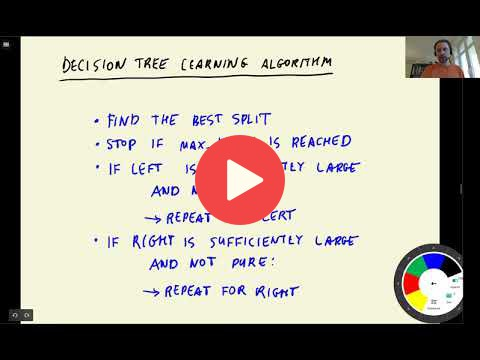

## 6.5 Decision trees parameter tuning

[Slides](https://www.slideshare.net/AlexeyGrigorev/ml-zoomcamp-6-decision-trees-and-ensemble-learning)

## Notes

In this lesson, we will discuss about different parameters used to control a Decision Tree (DT). Two of them, `max_depth` and `min_samples_leaf` have a greater importance than the others. We will further see how we first tune `max_depth` parameter and then move to tuning other parameters will help. After that, a dataframe will be created with all possible combinations of `max_depth`, `min_sample_leaf` and the auc score corresponding to them. These results will be visualized using a heatmap by pivoting the dataframe to easily determine the best possible `max_depth` and `min_samples_leaf` combination. Finally, the DT will be retrained using the identified parameter combination. The DT so trained will be viewed as a tree diagram, for visualizing decision rules.     

### Steps
* **Fine-Tuning Process:** iterate to find optimal parameter settings.
    *   Start by tuning `max_depth` with various values to determine a subset of optimal
depths.
    *   Then, using this subset, fine-tune the model further by exploring different
`min_samples_leaf` values.

    This method is computationally efficient for **large datasets**, though it may not be optimal for smaller ones.

* **Heatmaps for Visualization:** Store the scores (e.g., AUC) obtained during tuning in a pivot table, and create a heatmap with `seaborn` to easily identify high score areas, which helps pinpoint the optimal `max_depth` and `min_samples_leaf` combination.

**NB:** Choose parameter values that effectively control the tree's size and avoid values like 'nan' (Not a Number), even if they seem to lead to better scores.

### Importance of  `max_depth` and `min_samples_leaf`

*   **Controlling Overfitting:** these parameters play a critical role in preventing overfitting.
    *   `max_depth` limits the tree's complexity, preventing it from growing too deep and memorizing the training data.
    *   `min_samples_leaf` ensures that leaf nodes have a sufficient number of samples,
reducing the chance of creating nodes that are too specific to the training data.

*   **Impact on Bias and Variance:** They also affect the model's bias and variance.
    *   Increasing `max_depth` and decreasing `min_samples_leaf` can lead to a more complex model with lower bias but higher variance.
    *   Decreasing `max_depth` and increasing `min_samples_leaf` results in a simpler model with higher bias but lower variance.
      
It's then important to find the right balance between `max_depth` and `min_samples_leaf` to achieve optimal model performance.
This involves a trade-off between bias and variance, and the best values depend on the specific dataset and problem.

Add notes from the video (PRs are welcome)

<table>
   <tr>
      <td>⚠️</td>
      <td>
         The notes are written by the community.  
         If you see an error here, please create a PR with a fix.
      </td>
   </tr>
</table>

* [Notes from Peter Ernicke](https://knowmledge.com/2023/10/23/ml-zoomcamp-2023-decision-trees-and-ensemble-learning-part-8/)

## Navigation

* [Machine Learning Zoomcamp course](../)
* [Session 6: Decision Trees and Ensemble Learning](./)
* Previous: [Decision tree learning algorithm](04-decision-tree-learning.md)
* Next: [Ensemble learning and random forest](06-random-forest.md)
