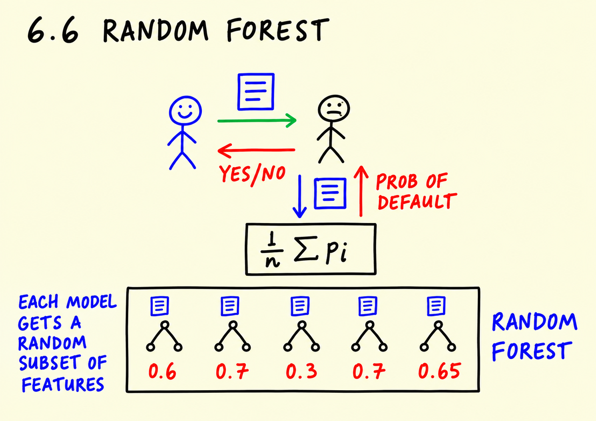
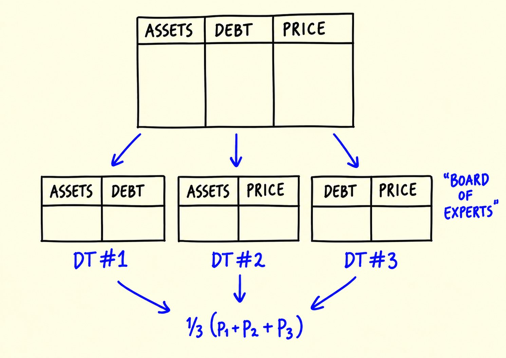
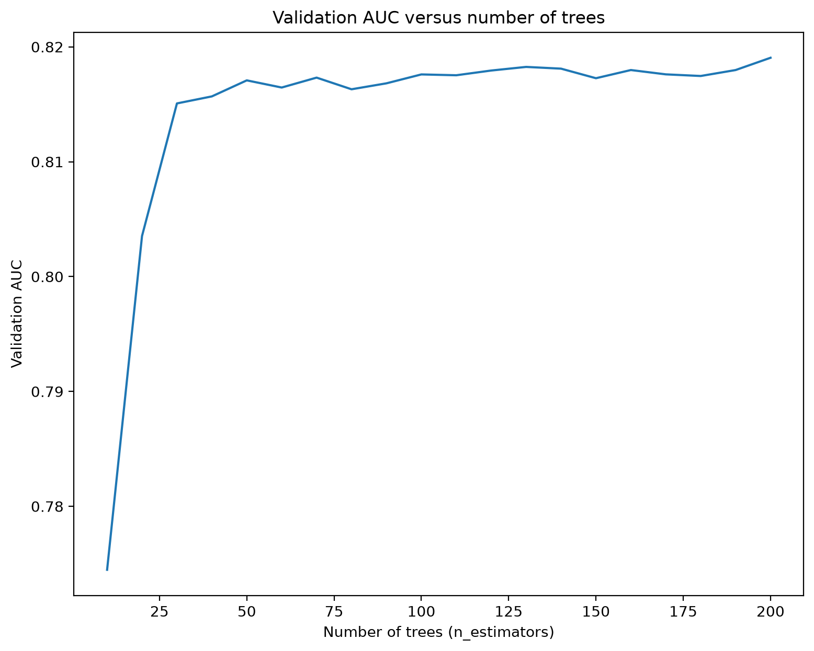
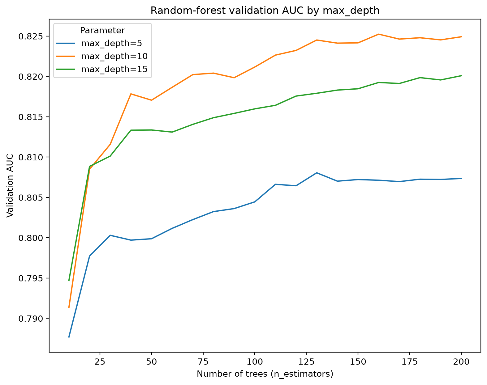
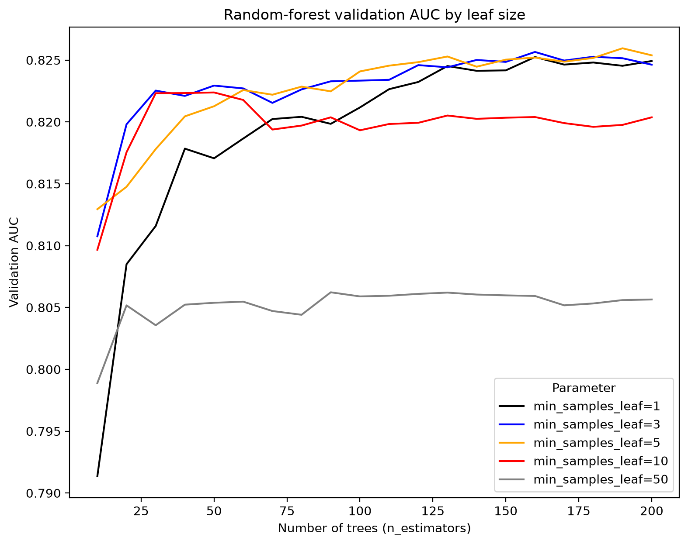

# Ensemble learning and random forest

In this unit we combine many decision trees into one model. We start with the
idea behind it - asking a board of experts instead of trusting a single one -
then build a random forest with scikit-learn and tune its three main
parameters.

## Board of experts

So far we score a loan application with a single decision tree: the features
of the client go in, the tree outputs the probability of default, and the
bank uses this score to approve or reject the application.

Instead of one expert, imagine a board of five experts. When a client
submits an application, it goes to each of them. Every expert looks at the
application and decides: approve or reject. The final decision is made by
majority vote. The idea is that the collective opinion of five experts is
more reliable than the opinion of one.



We can do the same with models. Instead of five people, we have five models
- g1, g2 and so on - and each of them returns its probability of default.
To combine them, we take the average of these probabilities:

```text
(1/n) * (p1 + p2 + ... + pn)
```

Combining several models this way is called ensembling, and the individual
models are often called "weak learners": each one alone is not great, but
together they are stronger than any single model.

## Random forest

When the models we ensemble are decision trees, the ensemble is called a
random forest. But it cannot be just any group of trees - the trees need to
be different from each other. If we simply train the same tree several times
on the same data with the same parameters, we get identical trees that
produce identical predictions, and averaging them gives exactly the same
result as a single tree.

The "random" in random forest is what makes the trees diverse: each tree
gets a random subset of features, and - depending on the `bootstrap`
parameter - a randomly resampled copy of the training data. To see the idea,
suppose we have three features: `assets`, `debt` and `price`, and we train
three trees. The first tree may see `assets` and `debt`, the second `assets`
and `price`, and the third `debt` and `price`. Each tree gives its own
prediction - p1, p2 and p3 - and the final prediction is the average:
1/3 (p1 + p2 + p3).



In scikit-learn, random forest lives in the `ensemble` package. Let's take our
credit scoring data and train a random forest with a varying number of trees -
from 10 to 200 with a step of 10 - and see how the number of trees affects the
AUC on validation:

```python
from sklearn.ensemble import RandomForestClassifier

scores = []

for n in range(10, 201, 10):
    rf = RandomForestClassifier(n_estimators=n, random_state=1)
    rf.fit(X_train, y_train)

    y_pred = rf.predict_proba(X_val)[:, 1]
    auc = roc_auc_score(y_val, y_pred)

    scores.append((n, auc))
```

Then we put the scores into a dataframe and plot them:

```python
df_scores = pd.DataFrame(scores, columns=['n_estimators', 'auc'])
plt.plot(df_scores.n_estimators, df_scores.auc)
```



The curve grows quickly at the beginning and then stabilizes: after some
number of trees, adding more of them does not improve the score. Still, more
trees never hurt the quality - the curve stays flat - so the main cost of
extra trees is training time, not accuracy. This is why `n_estimators` is
usually set to "as many as you can afford", and we tune the other parameters
first.

## Tuning max_depth

Now let's tune `max_depth`, the maximum depth of each tree in the forest. We
use the same loop, but this time we try three values of `max_depth` - 5, 10
and 15 - and for each of them we again iterate over the number of trees:

```python
scores = []

for d in [5, 10, 15]:
    for n in range(10, 201, 10):
        rf = RandomForestClassifier(n_estimators=n,
                                    max_depth=d,
                                    random_state=1)
        rf.fit(X_train, y_train)

        y_pred = rf.predict_proba(X_val)[:, 1]
        auc = roc_auc_score(y_val, y_pred)

        scores.append((d, n, auc))
```

To compare the three depths, we plot each of them as a separate line:

```python
columns = ['max_depth', 'n_estimators', 'auc']
df_scores = pd.DataFrame(scores, columns=columns)

for d in [5, 10, 15]:
    df_subset = df_scores[df_scores.max_depth == d]

    plt.plot(df_subset.n_estimators, df_subset.auc,
             label='max_depth=%d' % d)

plt.legend()
```



The curves for `max_depth=10` and `max_depth=15` are clearly better than the
one for `max_depth=5`, and `max_depth=10` is the best of the three. So we fix
it:

```python
max_depth = 10
```

## Tuning min_samples_leaf

The third parameter is `min_samples_leaf` - the minimal number of observations
allowed in a leaf of a tree. We repeat the same procedure: keep `max_depth`
fixed at 10 and try `min_samples_leaf` of 1, 3, 5, 10 and 50, each combined
with a varying number of trees:

```python
scores = []

for s in [1, 3, 5, 10, 50]:
    for n in range(10, 201, 10):
        rf = RandomForestClassifier(n_estimators=n,
                                    max_depth=max_depth,
                                    min_samples_leaf=s,
                                    random_state=1)
        rf.fit(X_train, y_train)

        y_pred = rf.predict_proba(X_val)[:, 1]
        auc = roc_auc_score(y_val, y_pred)

        scores.append((s, n, auc))
```

And plot all five curves, giving each value its own color:

```python
columns = ['min_samples_leaf', 'n_estimators', 'auc']
df_scores = pd.DataFrame(scores, columns=columns)

colors = ['black', 'blue', 'orange', 'red', 'grey']
values = [1, 3, 5, 10, 50]

for s, col in zip(values, colors):
    df_subset = df_scores[df_scores.min_samples_leaf == s]

    plt.plot(df_subset.n_estimators, df_subset.auc,
             color=col,
             label='min_samples_leaf=%d' % s)

plt.legend()
```



The curves with small values - 1, 3 and 5 - are close to each other at the
top, while 10 and especially 50 are worse. We take `min_samples_leaf=3`:

```python
min_samples_leaf = 3
```

## The final model

With the parameters selected, we train the final random forest with 200 trees:

```python
rf = RandomForestClassifier(n_estimators=200,
                            max_depth=max_depth,
                            min_samples_leaf=min_samples_leaf,
                            random_state=1)
rf.fit(X_train, y_train)
```

There are other useful parameters for random forest - for example
`max_features`, which controls the size of the random feature subset each tree
sees, and `bootstrap`, which controls whether each tree is trained on a
randomly resampled copy of the data. We don't tune them here, but they are
worth knowing - see the
[RandomForestClassifier documentation](https://scikit-learn.org/stable/modules/generated/sklearn.ensemble.RandomForestClassifier.html)
for the full list.

## Materials

[Slides](https://www.slideshare.net/AlexeyGrigorev/ml-zoomcamp-6-decision-trees-and-ensemble-learning)


## Notes
**Ensemble learning** is a machine learning paradigm where multiple models, often referred to as 'weak learners', are strategically combined to solve a particular computational intelligence problem. This approach frequently yields superior predictive performance compared to using a single model.

**Random Forest** is an example of ensemble learning where each model is a decision tree and their predictions are aggregated to identify the most popular result. Random forest only selects a random subset of features from the original data to make predictions. The 'randomness' in Random Forest stems from two key aspects: 

- Each tree is potentially trained on a bootstrapped sample of the original data, introducing randomness at the row level.
- At each node during tree construction, only a random subset of features is considered for splitting. This feature randomness helps decorrelate the trees, preventing overfitting and promoting generalization to unseen data.

**Bootstrapping** is a resampling technique where numerous subsets
of the data are created by sampling the original data with replacement. This means that
some data points may appear multiple times in a single bootstrap sample, while others may
be excluded. In Random Forest, each decision tree is trained on a distinct bootstrap sample,
further contributing to the diversity and robustness of the ensemble.

**Parameter tuning** is crucial for optimizing the performance of a
Random Forest model.  Two critical parameters are `max_depth`, which controls the maximum
depth of each decision tree, and `n_estimators`, which determines the number of trees in
the forest. Increasing `max_depth` allows for more complex trees, potentially leading to
overfitting. Conversely, a larger `n_estimators` generally improves model accuracy but
increases computational cost.

In random forests, the decision trees are trained independently to each other.

**Classes, functions, and methods**:

- `from sklearn.ensemble import RandomForestClassifier`: random forest classifier from sklearn ensemble class.
- `plt.plot(x, y)`: draw line plot for the values of y against x values.

<table>
   <tr>
      <td>⚠️</td>
      <td>
         The notes are written by the community. <br>
         If you see an error here, please create a PR with a fix.
      </td>
   </tr>
</table>

* [Notes from Peter Ernicke](https://knowmledge.com/2023/10/24/ml-zoomcamp-2023-decision-trees-and-ensemble-learning-part-9/)
