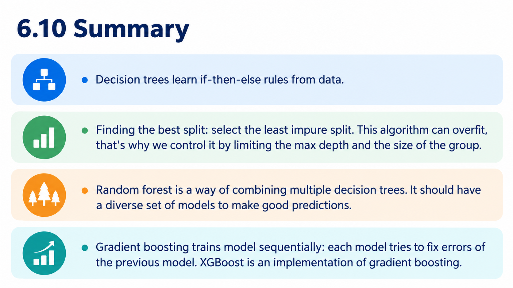
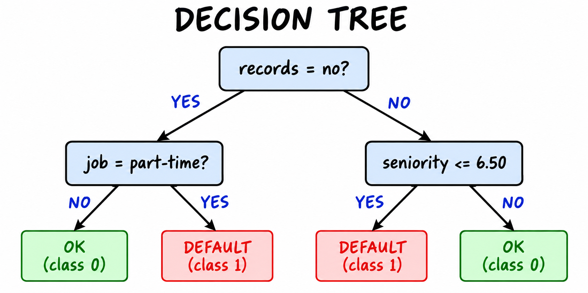
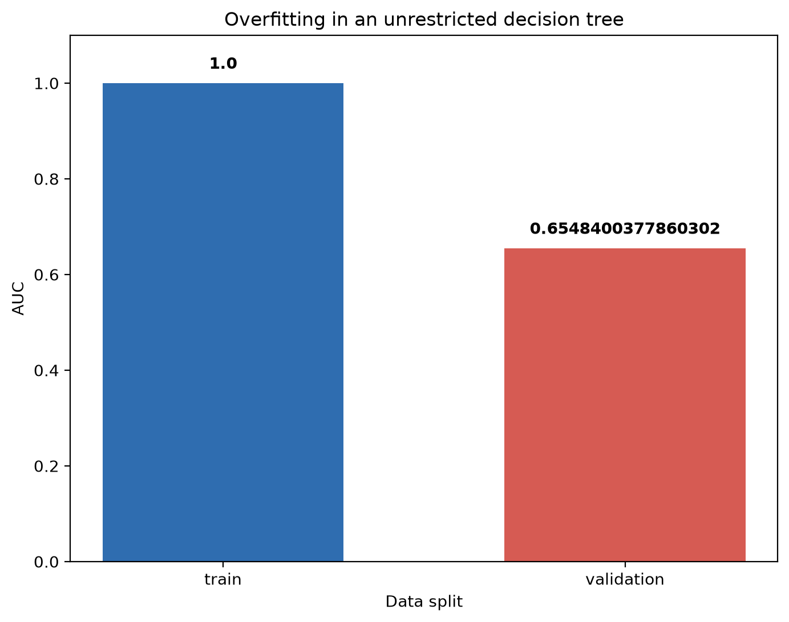
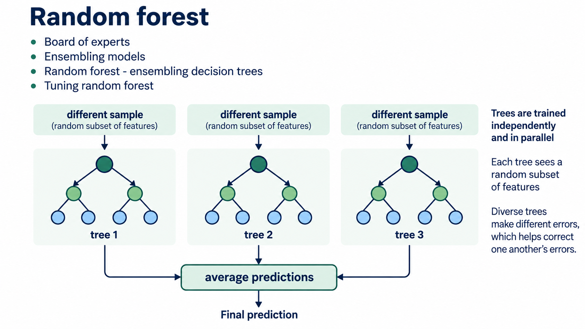
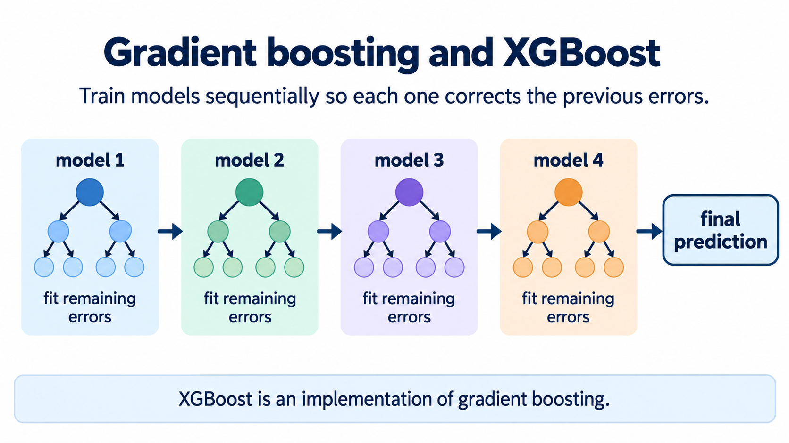
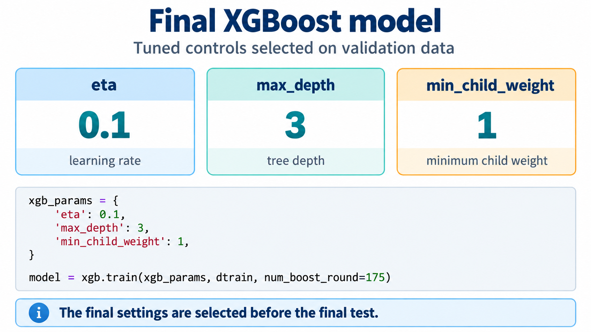

# Summary

In this final unit of the module we recap what we have learned about decision
trees and ensemble learning.

## What we learned in this module

The module started with a credit risk scoring project: we predict whether a
customer will default on a loan. On the way we learned four main things.

Decision trees learn if-then-else rules from data. The tree asks a sequence
of questions like "is the amount of assets greater than 3000" and assigns the
prediction in the leaves. To build the tree, the learning algorithm finds the
best split: the condition that gives the least impure left and right groups.
Left unchecked, this algorithm always grows a tree that memorizes the
training data, so we control it by limiting the maximum depth and the
minimal size of a group - `max_depth` and `min_samples_leaf` in
scikit-learn.

Random forest is a way of combining multiple decision trees: each tree sees
a random subset of features, all trees are trained independently and in
parallel, and their predictions are averaged. For an ensemble to work, its
models need to be diverse - the errors of one tree should be corrected by
the others. We tuned the number of trees, the depth and the leaf size, and
it improved the single tree considerably while needing little tuning
effort.

Gradient boosting trains models sequentially instead: each next model is
trained on the errors of the previous ones and tries to fix them. XGBoost is
the most popular implementation of this idea. It gave us the best model of
this module, but it also has the most knobs to tune - `eta`, `max_depth`,
`min_child_weight` and others - so it requires the most attention.

The final XGBoost model reached an AUC of about 0.836 on validation and
0.832 on test, compared to about 0.785 for the single decision tree. The
course continues in module 8, where we meet neural networks and train one
for image classification.

## Notes

- Decision trees learn if-then-else rules from data.
- Finding the best split: select the least impure split. This algorithm can overfit, that's why we control it by limiting the max depth and the size of the group.
- Random forest is a way of combining multiple decision trees. It should have a diverse set of models to make good predictions.
- Gradient boosting trains model sequentially: each model tries to fix errors of the previous model. XGBoost is an implementation of gradient boosting.
