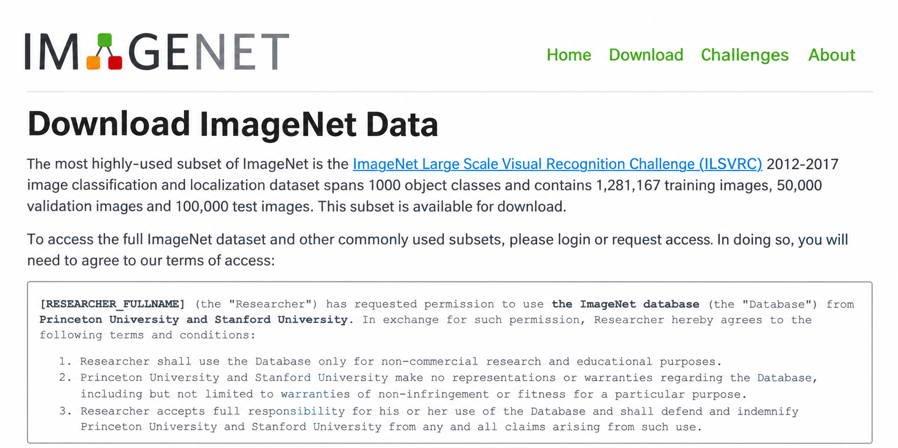
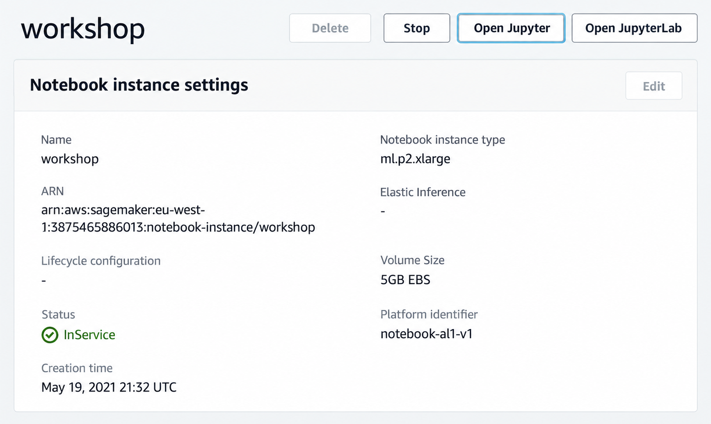

# Pre-trained convolutional neural networks

In the previous lesson we installed TensorFlow and Keras and learned
how to load images. Now we take the image of a t-shirt and run it
through an off-the-shelf neural network - a model that somebody else
already trained and made available - and see what it tells us about
the image.

## Keras Applications and ImageNet

The pre-trained models live on the Keras website, on the page called
Keras Applications. It has a list of available pre-trained models.
Most of them (I think all of them) were trained on ImageNet.

ImageNet is a dataset with a lot of images. On its website we can see
that it spans 1000 object classes and has almost 1,300,000 images in
the training set, 50,000 in validation and 100,000 in test:



We will not download it - it's huge. It contains all sorts of animals,
objects, wheels, yachts, planes, nature, people, even clothes. It's a
dataset for general-purpose image classification.

Big companies like Google or Facebook, or big universities with access
to a lot of data and cool computers, took this dataset, took some
neural networks, trained them on ImageNet and shared the results. The
results are the models on the Keras Applications page:


There are different kinds of models - Xception, VGG, ResNet and many
others. They have different so-called architectures: an architecture
is how exactly the layers of a neural network are arranged inside a
model. For each model the page reports statistics: the size, the top-1
and top-5 accuracy, the number of parameters, how fast the model is.
We can use these characteristics to decide which one to take.

I usually choose Xception: it's a small model, quite accurate and also
quite fast. Maybe there are faster ones, but it has an okay trade-off
between size, accuracy and speed.

## Running on a GPU

Before I was running TensorFlow locally, but now let me use SageMaker.
I created an instance there - this instance type has a GPU:



A GPU is needed if you want to run things faster. You can run on your
usual processor (CPU), but it will be around 8 times slower. GPUs are
very good at parallelizing things - they are fast at matrix
multiplication and other number-crunching operations, and this is what
neural networks are mostly about.

You don't have to use SageMaker: Google Cloud, Kaggle or any other
cloud solution works too, or you can simply run things locally. I
uploaded the same notebook as before, selected the TensorFlow kernel
and executed the previous cells.

## Using the Xception model

Xception lives in `keras.applications.xception`, so we import it from
there:

```python
from tensorflow.keras.applications.xception import Xception
from tensorflow.keras.applications.xception import preprocess_input
from tensorflow.keras.applications.xception import decode_predictions
```

Then we create the model:

```python
model = Xception(weights='imagenet', input_shape=(299, 299, 3))
```

The first parameter, `weights='imagenet'`, means we want the network
that was pre-trained on ImageNet. The input to this model is 299x299x3
- so we also load our t-shirt image with `target_size=(299, 299)`:


The first time you run this, it downloads the model from the internet
and unpacks it, so it takes some time:


Now we want to use this model to classify the image of the t-shirt.
The model doesn't expect just one image - it expects a bunch of
images. So we create a NumPy array with our image inside:

```python
X = np.array([x])
X.shape
```

The shape is `(1, 299, 299, 3)`: one image, 299 by 299, with three
channels. If we had several images - say 3 - we would put all of them
in this array, and the shape would be `(3, 299, 299, 3)`:


## Preprocessing

If we call `model.predict` now, the predictions won't make sense - we
mostly see zeros and super tiny numbers. The reason: this model
expects the input to look a certain way. When Xception was trained,
all the images were preprocessed with a special function, so we have
to apply exactly the same function to our data:

```python
X = preprocess_input(X)
```

After preprocessing, our image no longer contains numbers between 0
and 255 - they are converted to numbers between -1 and 1:


We have to do this if we want the model to function correctly, because
this is the preprocessing that was used for training it.

Now the predictions make more sense:

```python
pred = model.predict(X)
pred.shape
```

The shape is `(1, 1000)` - 1000 classes, one image. Each value in this
array is the probability that our image belongs to that class.

## Decoding the predictions

To make sense of this output we need to know which class each of the
1000 values corresponds to. There is another function in the Xception
package - `decode_predictions`. It looks at the predictions and makes
them human-readable, downloading the mapping from indices to class
names:

```python
decode_predictions(pred)
```


The top class is jersey with probability 0.68. Jersey is an item of
knitted clothing, usually made of wool or cotton. It's not exactly a
t-shirt - but it's also not very far. At least the model didn't say
this is a dog or a plane. The other suggestions are a bulletproof
vest, a sweatshirt, a maillot and velvet - related items, but not
really what we need.

## Why it doesn't work for us

The reason is in the ImageNet classes themselves. If we look at the
list, there are all sorts of things - but there's no t-shirt. There
are sweatshirts, but no t-shirts and no simple shirts.

Even though ImageNet is big, comprehensive and general, when it comes
to clothes and fashion it's not particularly good. So this model
doesn't work for our purpose. Remember what we wanted: suggest a
proper category to the users of our website when they create a
listing. For that we need to train a different model, with the classes
we need for our particular case.

The good news: we don't have to train from scratch. We can reuse
these pre-trained models and build on top of what big companies and
universities have already trained, adapting them to our use case.
That's what we will do soon. But in the next video we'll first look
under the hood of neural networks to get some intuition for how they
work.

## Materials

- [Slides](https://www.slideshare.net/AlexeyGrigorev/ml-zoomcamp-8-neural-networks-and-deep-learning-250592316)
- [Renting a GPU with AWS SageMaker](https://livebook.manning.com/book/machine-learning-bookcamp/appendix-e/6)
- [Keras Applications](https://keras.io/api/applications/)
- [ImageNet](https://www.image-net.org/)

## Notes

> **Important**: If you rent a GPU from a cloud provider (such as AWS), don't forget to turn it
> off after you finish. It's not free and you might get a large bill at the end of the month.

- The `keras.applications` module has different pre-trained models with different architectures. We'll use the model [Xception](https://keras.io/api/applications/xception/) which takes the input image size of `(229, 229)` and each image's pixel is scaled between `-1` and `1`.
- We create the instance of the pre-trained model using `model = Xception(weights='imagenet', input_shape=(299, 229, 3))`. Our model will use the weights from pre-trained imagenet and expect the input shape of (229, 229, 3) for images.
- Along with image size, the model also expects the `batch_size` which is the size of the batches of data (default 32). If one image is passed to the model, then the expected shape of the model should be (1, 229, 229, 3).
- The image data was peprocessed using `preprocess_input` function during `Xception` model's pre-taining. Therefore, we'll have to use this function on our data before making predictions, like so: `X = preprocess_input(X)`.
- The `pred = model.predict(X)` function returns 2D array of shape `(1, 1000)`, where 1000 is the probablity of the image classes. `decode_predictions(pred)` can be used to get the class names and their probabilities in readable format.
- In order to make the pre-trained model useful specific to our case, we'll have to do some tweak, which we'll do in the coming sections.

**Classes, functions, and methods**:
- `from tensorflow.keras.applications.xception import Xception`: import the model from keras applications
- `from tensorflow.keras.application.xception import preprocess_input`: function to perform preprocessing on images
- `from tensorflow.keras.applications.xception import decode_predictions`: extract the predictions class names in the form of tuple of list
- `model.predict(X)`: function to make predictions on the test images

**Links**:

- [Renting a GPU with AWS SageMaker](https://livebook.manning.com/book/machine-learning-bookcamp/appendix-e/23)
- [Keras Applications](https://keras.io/api/applications/) provide a list of pre-trained deep learning models
- [ImageNet](https://www.image-net.org/) is an image database that has 1,431,167 images of 1000 classes
