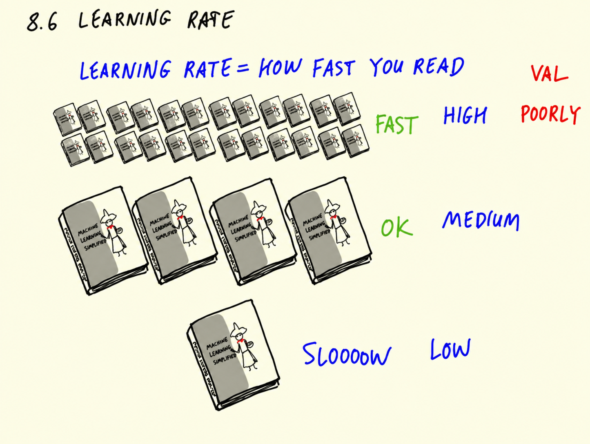
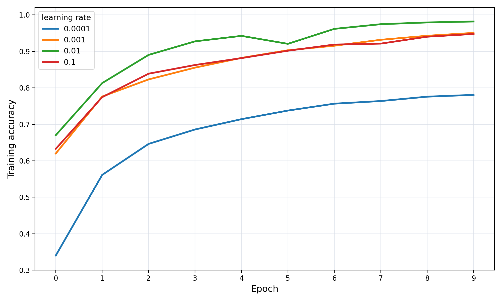
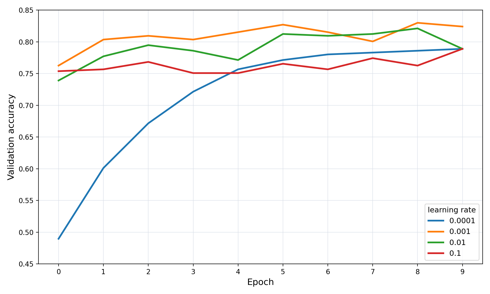
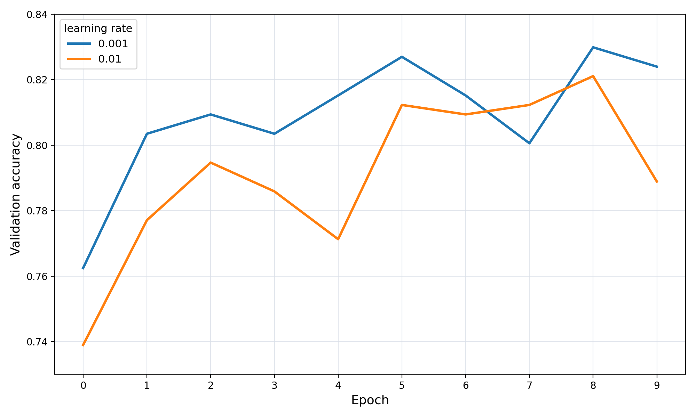
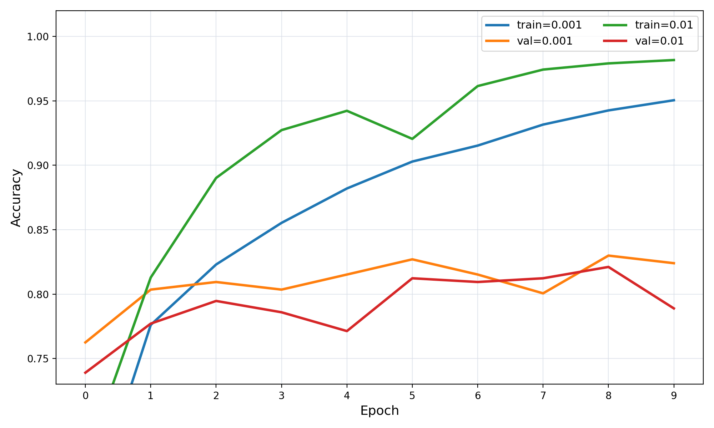

# Adjusting the learning rate

In the previous unit we trained our first model with transfer learning
and got around 80% accuracy. One parameter we did not tune at all is
the learning rate of the optimizer - and it is one of the most
important hyperparameters of a neural network. In this unit we try
several learning rates, compare the training results, and select the
best one.

## The book analogy

A good way of thinking about the learning rate is to imagine that it
is how fast you read. Say you have a book and you want to read it:

- If you read one book per day, you can get through a lot of books,
  but you're just skimming: you flip through the pages and look at the
  table of contents. When you later try to apply what you learned, you
  don't remember much - you may even forget the first book by the time
  you finish the second.
- If you read one book per quarter, you're not rushing, and you still
  learn enough to apply it.
- If you read one book per year, copying every word into your notebook,
  you'll know that one book really well - but you're making very little
  progress, one page a day.

Reading fast is a high learning rate: you do a lot, but what you learn
is superficial. Reading very slowly is a low learning rate: what you
learn is solid, but it takes forever. Reading maps to training, and
applying what you learned maps to validation:

- With a high learning rate the model does poorly on validation - it
  overfits. It saw a lot, but doesn't generalize.
- With a very low learning rate it also does poorly - it underfits. It
  simply hasn't learned enough yet; it could have learned faster.

A medium learning rate is okay: not the fastest possible learning, but
it generalizes and it actually makes progress. The same idea applies to
neural networks, to gradient boosting, and to many other machine
learning models: if we set the learning rate too high we risk
overfitting, if we set it too low training takes forever, and we need
to find the right balance.



## Wrapping the model in a function

We select the learning rate the same way we did it for gradient
boosting: try different values, look at plots, and see which one works
best. For that, let's take the code from the previous lesson and put it
into a function - `make_model` - with a parameter `learning_rate`:

```python
def make_model(learning_rate=0.01):
    base_model = Xception(
        weights='imagenet',
        include_top=False,
        input_shape=(150, 150, 3)
    )

    base_model.trainable = False

    #########################################

    inputs = keras.Input(shape=(150, 150, 3))
    base = base_model(inputs, training=False)
    vectors = keras.layers.GlobalAveragePooling2D()(base)
    outputs = keras.layers.Dense(10)(vectors)
    model = keras.Model(inputs, outputs)

    #########################################

    optimizer = keras.optimizers.Adam(learning_rate=learning_rate)
    loss = keras.losses.CategoricalCrossentropy(from_logits=True)

    model.compile(
        optimizer=optimizer,
        loss=loss,
        metrics=['accuracy']
    )

    return model
```


Inside, everything is exactly what we had before: the base model with
frozen convolutional layers, the new top with pooling and a dense
layer, then the Adam optimizer - the only thing that changes now is its
learning rate - the categorical cross-entropy loss, and `compile`. The
hash-mark comments just visually separate the parts of the function:
the base model, the new top, and the training setup. We could also move
the middle part into a separate function - something like
`create_architecture` - but let's keep it simple and use the comments.

## Trying different values

Now we can iterate over several learning rates and train a model for
each of them. We keep the results in a dictionary `scores`, mapping the
learning rate to `history.history`:

```python
scores = {}

for lr in [0.0001, 0.001, 0.01, 0.1]:
    print(lr)

    model = make_model(learning_rate=lr)
    history = model.fit(train_ds, epochs=10, validation_data=val_ds)
    scores[lr] = history.history

    print()
    print()
```


We try `0.0001` and `0.001` - smaller than the `0.01` we used before -
and `0.1`, larger. We print the learning rate before each model and two
empty lines after, to make it easier to tell one run from another in
the output. Training four models takes a while - go away, come back in
10-15 minutes.

## Selecting the best learning rate

When it finishes, we don't want to read all those logs. Instead we plot
the accuracies - one curve per learning rate:

```python
for lr, hist in scores.items():
    plt.plot(hist['accuracy'], label=lr)

plt.xticks(np.arange(10))
plt.legend()
```

On the training set the smallest learning rate `0.0001` learns too
slowly: after 10 epochs it reaches only about 80% accuracy, while the
others are higher.



Now the same for validation:

```python
for lr, hist in scores.items():
    plt.plot(hist['val_accuracy'], label=lr)

plt.xticks(np.arange(10))
plt.legend()
```

Again `0.0001` is too slow - after 10 epochs it's still below 80% - and
`0.1` is the worst of all four. Let's remove both from `scores` and
compare only `0.001` and `0.01`:



```python
del scores[0.1]
del scores[0.0001]
```



`0.001` is better on validation in general - it's better in all cases
except one, where `0.01` just got lucky. Out of curiosity we can also
plot the training accuracies of these two, with different labels:

```python
for lr, hist in scores.items():
    plt.plot(hist['accuracy'], label=('train=%s' % lr))
    plt.plot(hist['val_accuracy'], label=lr)

plt.xticks(np.arange(10))
plt.legend()
```



It turns out `0.01` is better on the training data, but worse on
validation - the gap between its train and validation curves is bigger.
That's a sign that `0.01` overfits a bit more, and it's another
argument in favor of the smaller learning rate. So the learning rate we
use for training subsequent versions of the model is `0.001`:

```python
learning_rate = 0.001
```

This is how we select the learning rate: try different values, train
the model, and see which one performs best on the validation dataset.

In the next lesson we'll talk about checkpointing. Now that we know the
validation accuracy oscillates - goes up, then down - we want to save
the model at the good iterations, not just the last one.

## Materials

[Slides](https://www.slideshare.net/AlexeyGrigorev/ml-zoomcamp-8-neural-networks-and-deep-learning-250592316)

## Notes

One of the most important hyperparameters of deep learning models is the learning rate. It is a tuning parameter in an optimization function that determines the step size (how big or small) at each iteration while moving toward a mininum of a loss function.

Imagine you have a book, and you want to read it. The *learning rate* represents how fast you can read and absorb its content. If you read the book very quickly, you risk forgetting important parts and struggling to recall key details when you need to apply them. On the other hand, reading slowly allows you to study each concept thoroughly and understand it deeply, ensuring better retention. However, if you read too slowly, you might never finish the book. The goal is to find the right reading pace, or learning rate, that balances comprehension and efficiency. Reading too fast may result in superficial understanding, while reading too slowly might mean not acquiring knowledge quickly enough to meet your goals. By maintaining a moderate, balanced pace, you can maximize understanding and effectively apply what you've learned.  

This analogy relates to training machine learning models. Training a model is like reading a book: you're trying to "learn" from the data. Applying that knowledge during testing or validation corresponds to validating the model. If you train the model too quickly (with a high learning rate), it may overfit, memorizing the training data without generalizing well to new data. If you train it too slowly (with a low learning rate), it may underfit, failing to learn enough patterns from the data. A balanced learning rate ensures the model acquires sufficient knowledge and performs well on both training and validation data. 

We can experiement with different learning rates to find the optimal value where the model has best results. In order to try different learning rates, we should define a function to create a function first, for instance:

```python
# Function to create model
def make_model(learning_rate=0.01):
    base_model = Xception(weights='imagenet',
                          include_top=False,
                          input_shape=(150,150,3))

    base_model.trainable = False
    
    #########################################
    
    inputs = keras.Input(shape=(150,150,3))
    base = base_model(inputs, training=False)
    vectors = keras.layers.GlobalAveragePooling2D()(base)
    outputs = keras.layers.Dense(10)(vectors)
    model = keras.Model(inputs, outputs)
    
    #########################################
    
    optimizer = keras.optimizers.Adam(learning_rate=learning_rate)
    loss = keras.losses.CategoricalCrossentropy(from_logits=True)

    # Compile the model
    model.compile(optimizer=optimizer,
                  loss=loss,
                  metrics=['accuracy'])
    
    return model
```

Next, we can loop over on the list of learning rates:

```python
# Dictionary to store history with different learning rates
scores = {}

# List of learning rates
lrs = [0.0001, 0.001, 0.01, 0.1]

for lr in lrs:
    print(lr)
    
    model = make_model(learning_rate=lr)
    history = model.fit(train_ds, epochs=10, validation_data=val_ds)
    scores[lr] = history.history
    
    print()
    print()
```

Visualizing the training and validation accuracies help us to determine which learning rate value is the best for for the model. One typical way to determine the best value is by looking at the gap between training and validation accuracy. The smaller gap indicates the optimal value of the learning rate.

* learning rate analogy: the speed of reading a book
* reading fast (skimming thus missing details) vs reading slow (not much progress and leaving out books)
* finding the optimal learning rate

<table>
   <tr>
      <td>⚠️</td>
      <td>
         The notes are written by the community. <br>
         If you see an error here, please create a PR with a fix.
      </td>
   </tr>
</table>

* [Notes from Peter Ernicke](https://knowmledge.com/2023/11/23/ml-zoomcamp-2023-deep-learning-part-8/)
