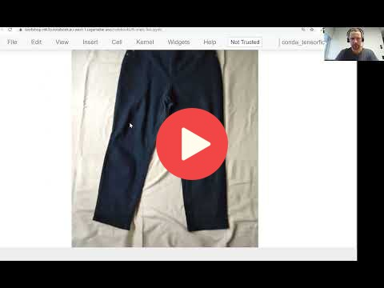

## 8.12 Using the model

<a href="https://www.youtube.com/watch?v=cM1WHKae1wo&list=PL3MmuxUbc_hIhxl5Ji8t4O6lPAOpHaCLR"></a>

[Slides](https://www.slideshare.net/AlexeyGrigorev/ml-zoomcamp-8-neural-networks-and-deep-learning-250592316)

Earlier we used **h5 format** to save our model when creating the checkpoint. The HDF5 format contains the model's architecture, weights values, and `compile()` information. The saved model can be loaded and used for prediction with `keras.models.load_model(path/to/saved_model)` method.

To evaluate the model and make prediction on test data, we'll need to create the same preprocessing steps for the image as we have done with train and validation data:

```python
# Create image generator for test data
test_gen = ImageDataGenerator(preprocessing_function=preprocess_input)

# Path of test images directory
test_imgs_dir = '../input/mlzoomcampimageclassification/zoomcamp-image-classification/clothing-dataset-small/test'

# Load in test images to generator
test_ds = test_gen.flow_from_directory(directory=test_imgs_dir,
                                       target_size=(299,299),
                                       batch_size=32,
                                       shuffle=False)

# Path of an image to make predictions
img_path = 'path/to/image'
# Load image
img = load_img(img_path, target_size=(299,299))

# Convert image to numpy array
x = np.array(img)
# Add batch dimension to the image
X = np.array([x])
# Preprocess the image 
X = preprocess_input(X)
```

The model performance can be evaluated on test data with `model.evaluate(test_ds)` and the prediction on the test image can be made using the method `model.predict(X)`. We can then zip the class names and prediction to see the likelihood.

**Classes, functions, attributes**:

- `keras.models.load_model()`: method to load saved model
- `model.evaluate()`: method to evaluate the performance of the model based on the evaluation metrics
- `model.predict()`: method to make predictions of output depending on the input

## Notes

Add notes from the video (PRs are welcome)


<table>
   <tr>
      <td>⚠️</td>
      <td>
         The notes are written by the community. <br>
         If you see an error here, please create a PR with a fix.
      </td>
   </tr>
</table>


## Navigation

* [Machine Learning Zoomcamp course](../)
* [Session 8: Neural Networks and Deep Learning](./)
* Previous: [Training a larger model](11-large-model.md)
* Next: [Summary](13-summary.md)