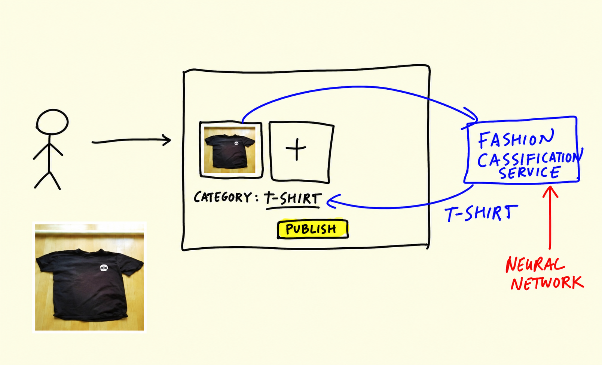

# Summary

In this short unit we wrap up the module and recall what we built
over the past lessons.



We started from a pre-trained model - Xception, trained on ImageNet -
and reused it for our clothing dataset. The main ideas:

- We can use pre-trained models for general image classification
- Convolutional layers let us turn an image into a vector
- Dense layers use the vector to make the predictions
- Instead of training a model from scratch, we can use transfer
  learning and re-use already trained convolutional layers

Then we tuned and improved that model, step by step:

- First, train a small model (150x150) before training a big one
  (299x299) - smaller images train faster, which is what we want
  while experimenting
- Learning rate - how fast the model trains. Fast learners aren't
  always the best ones, so it's worth tuning
- We can save the best model using callbacks and checkpointing
- To avoid overfitting, use dropout and augmentation

The result of all this is a model that classifies clothes with about
90% accuracy on the test set - saved as an h5 checkpoint that we can
load and use anywhere.

The predictions we ended up with were:

```python
dict(zip(classes, pred[0]))
```

```text
{'dress': -1.4282539,
 'hat': -5.522186,
 'longsleeve': -3.1655293,
 'outwear': -2.201648,
 'pants': 9.294684,
 'shirt': -3.4289198,
 'shoes': -4.2395606,
 'shorts': 3.4339347,
 'skirt': -4.194675,
 't-shirt': -2.9939806}
```

If you want to go further, the video mentions a few directions:
other datasets with fashion items, the
[albumentations](https://github.com/albumentations-team/albumentations)
library for more kinds of augmentations, other architectures from
`keras.applications` such as ResNet50 or MobileNet, and other
frameworks like PyTorch. In the homework you'll apply the same
approach to a different dataset - cats vs dogs.

## Notes

<table>
   <tr>
      <td>⚠️</td>
      <td>
         The notes are written by the community. <br>
         If you see an error here, please create a PR with a fix.
      </td>
   </tr>
</table>
