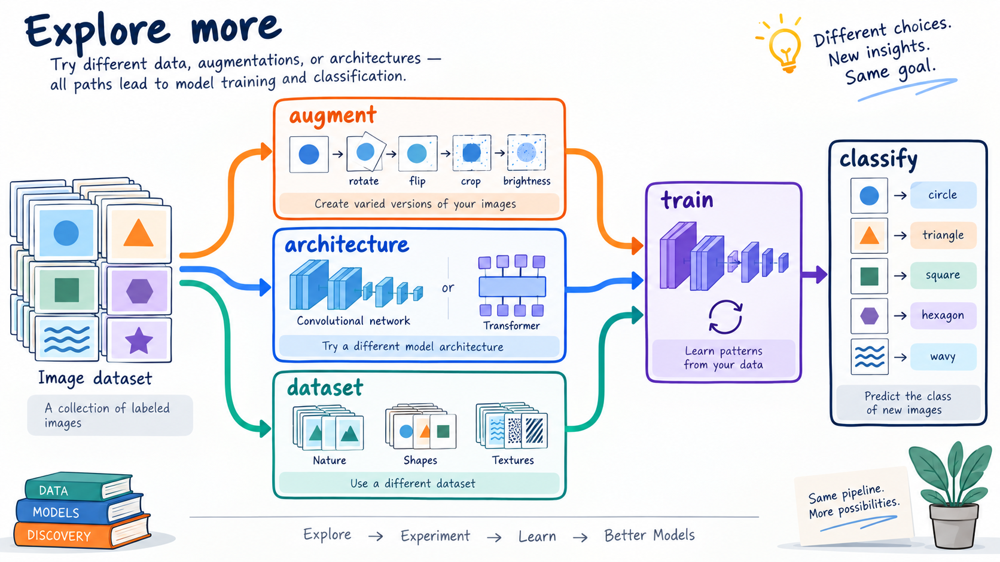

# Explore more

**TODO**

*Figure: Different data and model choices create new paths to the same classification goal.*

- Add more data, e.g, Zalando etc
- Albumentations - another way of generating augmentations
- Use PyTorch or MXNet instead of TensorFlow/Keras
- In addition to Xception, there are others architectures - try them

**Other projects:**

- cats vs dogs
- Hotdog vs not hotdog
- Category of images
