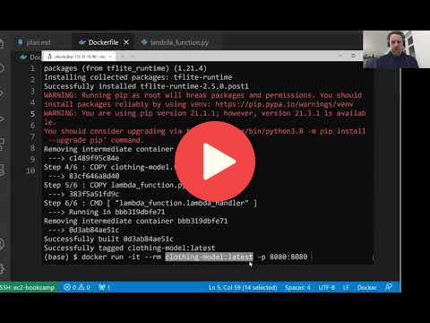

## 9.5 Preparing a Docker image

> Note: the materials in this unit are outdated.
> 
> Refer to the [ONNX Workshop](workshop/) for the up-to-date materials.


<a href="https://www.youtube.com/watch?v=y4_YQjfOsDo&list=PL3MmuxUbc_hIhxl5Ji8t4O6lPAOpHaCLR"></a>


## Notes

Refer to [updates.md](updates.md) for info on running TF lite
in 2024. 

### Using `pip install` for TF-Lite binaries

When using `pip` to install the compiled binary, make sure you use the raw file, not a link to the github page.

Correct:

```bash
pip install https://github.com/alexeygrigorev/tflite-aws-lambda/raw/main/tflite/tflite_runtime-2.14.0-cp310-cp310-linux_x86_64.whl
```


(Note `/raw/` in the path)

Also correct:

```bash
pip install https://github.com/alexeygrigorev/tflite-aws-lambda/blob/main/tflite/tflite_runtime-2.14.0-cp310-cp310-linux_x86_64.whl?raw=true
```

The wheel file above is for Python 3.10. Check other available compiled TF lite versions [here](https://github.com/alexeygrigorev/tflite-aws-lambda/tree/main/tflite).


Not correct - won't work:

```bash
pip install https://github.com/alexeygrigorev/tflite-aws-lambda/blob/main/tflite/tflite_runtime-2.14.0-cp310-cp310-linux_x86_64.whl
```

If the file is incorrect, you'll get an error message like that: 

```
zipfile.BadZipFile: File is not a zip file
```

### `ENTRYPOINT` vs `CMD`

This link explains the difference between them: https://stackoverflow.com/a/34245657

> `ENTRYPOINT` specifies a command that will always be executed when the container starts.
> `CMD` specifies arguments that will be fed to the `ENTRYPOINT`.

In case of the lambda base pacakge, the authors already specified the entrypoint and
we only need to overwrite the arguments passed to the entrypoint,


<table>
   <tr>
      <td>⚠️</td>
      <td>
         The notes are written by the community. <br>
         If you see an error here, please create a PR with a fix.
      </td>
   </tr>
</table>

* [Notes from Peter Ernicke](https://knowmledge.com/2023/12/04/ml-zoomcamp-2023-serverless-part-5/)

## Navigation

* [Machine Learning Zoomcamp course](../)
* [Session 9: Serverless Deep Learning](./)
* Previous: [Preparing the code for Lambda](04-preparing-code.md)
* Next: [Creating the lambda function](06-creating-lambda.md)
