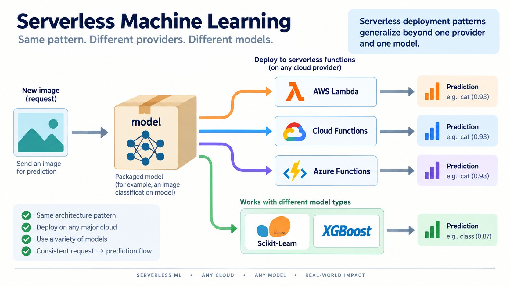

# Explore more



*Figure: The serverless request-to-prediction pattern generalizes across providers and models.*

* Try similar serverless services from Google Cloud and Microsoft Azure
* Deploy cats vs dogs and other Keras models with AWS Lambda
* AWS Lambda is also good for other libraries, not just Tensorflow. You can deploy Scikit-Learn and XGBoost models with it as well

### Deploying with the AWS SAM CLI

Instead of assembling the container and Lambda by hand, you can use the [AWS SAM CLI](https://docs.aws.amazon.com/serverless-application-model/latest/developerguide/install-sam-cli.html) ([getting started](https://docs.aws.amazon.com/serverless-application-model/latest/developerguide/serverless-getting-started.html)) to create a Lambda function as a container image:

1. Run `sam init`, then follow the wizard: "AWS Quick Start Templates" → "Machine Learning" as the application type → your Python version → the "TensorFlow Machine Learning Inference API" template. This creates a SAM project folder with an `app` folder inside.
2. Move your deployment files (the TensorFlow Lite model, `app.py`, `class_indices.json`) into `app`.
3. In `app/requirements.txt`, replace TensorFlow with `tflite-runtime`:

   ```
   pillow==11.1.0
   requests==2.32.3
   numpy==1.26.4
   tflite-runtime==2.7.0
   ```

4. Adjust `app/Dockerfile` to copy the files and set the model/classes paths:

   ```dockerfile
   FROM public.ecr.aws/lambda/python:3.9

   COPY requirements.txt ./
   RUN python3.9 -m pip install -r requirements.txt -t .

   COPY app.py ./
   COPY class_indices.json ./
   COPY classification_model.tflite ./

   ENV MODEL_PATH ./classification_model.tflite
   ENV CLASSES_PATH ./class_indices.json

   CMD ["app.lambda_handler"]
   ```

5. Build and test locally:

   ```bash
   sam build --build-dir .aws-build
   sam local invoke -t .aws-build/template.yaml -e events/event.json
   ```

   Put the expected JSON input (e.g. `{"url": "http://bit.ly/mlbookcamp-pants"}`) into `app/events/event.json`.

6. Deploy with `sam deploy --guided` — SAM creates the ECR repository and the Lambda function for you.
 
