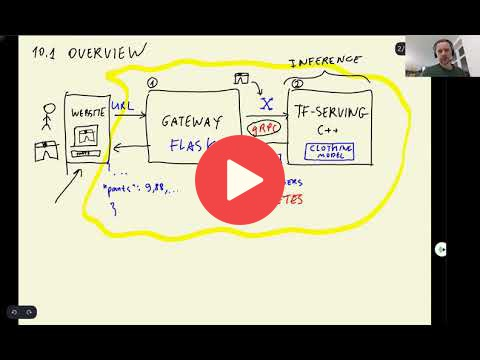

## 10.1 Overview

 

[Slides](https://www.slideshare.net/AlexeyGrigorev/ml-zoomcamp-10-kubernetes)

## Notes

Add notes from the video (PRs are welcome)

* same use case as in the session before: classifying images of clothes
* using tensorflow serving, written in C++, with focus on inference
* gRPC binary protocol
* deploying to kubernetes
* 1st component: gateway (download image, resize, turn into numpy array - computationally not expensive - can be done with CPU)
* 2nd component: model (matrix multiplications - computationally expensive - thus use GPU)
* scaling the two components independently: i.e. 5 gateways handing images to 1 model
* two components in two different docker container (lesson four)
* kubernetes main concepts (lesson five)
* running kubernetes on your local machine (lesson six)
* deploy the two services to kubernetes (lesson seven)
* move from local to cloud (lesson eight)

<table>
   <tr>
      <td>⚠️</td>
      <td>
         The notes are written by the community.  
         If you see an error here, please create a PR with a fix.
      </td>
   </tr>
</table>

## Navigation

* [Machine Learning Zoomcamp course](../)
* [Session 10: Kubernetes and TensorFlow Serving](./)
* Next: [TensorFlow Serving](02-tensorflow-serving.md)
