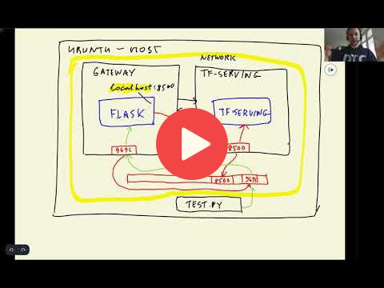

## 10.4 Running everything locally with Docker-compose

<a href="https://www.youtube.com/watch?v=ZhQQfpWfkKY&list=PL3MmuxUbc_hIhxl5Ji8t4O6lPAOpHaCLR"></a>
 

[Slides](https://www.slideshare.net/AlexeyGrigorev/ml-zoomcamp-10-kubernetes)

Docker Compose is a tool that helps us to define and share multi-container applications. With Compose, we can create a YAML file to define the services (in our case it is `gateway` service and `clothing-model` model) and with a single command, we can spin everything up or tear it all down. Docker compose is very useful to test the application locally.

Instead of mapping the volumn, port, and then running the docker in the terminal for our tf-serving model (clothing-model), we want to create a docker image and put everything in there. For this we want to create docker image by the name `image-model.dockerfile`:

```dockerfile
FROM tensorflow/serving:2.7.0

# Copy model in the image
COPY clothing-model /models/clothing-model/1
# Specify environmental variable
ENV MODEL_NAME="clothing-model"
```

To build the image we also need to specify the dockerfile name along with the tag, for example, `docker build -t clothing-model:xception-v4-001 -f image-model.dockerfile .`

Since we have created the dockerfile to the image, we can simply run the image with `docker run -it --rm -p 8500:8500 clothing-model:xception-v4-001`

Similarly we can do the same thing for our gateway service. The file name is `image-gateway.dockerfile`:

```dockerfile
FROM python:3.8.12-slim

RUN pip install pipenv

# Create working directory in docker image
WORKDIR /app

# Copy Pipfile and Pipfile.lock files in working dir
COPY ["Pipfile", "Pipfile.lock", "./"]

# Install required packages using pipenv
RUN pipenv install --system --deploy

# Copy gateway and protobuf scripts in the working dir
COPY ["gateway.py", "protobuf.py", "./"]

EXPOSE 9696

ENTRYPOINT ["gunicorn", "--bind=0.0.0.0:9696", "gateway:app"]
```

Build image: `docker build -t clothing-model-gateway:001 -f image-gateway.dockerfile .`
Run image: `docker run -it --rm -p 9696:9696 clothing-gateway:001`

Upon running these two containers and testing for prediction, we should expect connection error. This is because the gateway service is unable to communicate with tf-serving. In order to connect the two containers and work simultaneously we need docker compose. Docker compose require yaml file which will be executed when running the commands from docker compose, usually the file is named as `docker-compose.yaml`:

```yaml
version: "3.9"
services:
  clothing-model: # tf-serving model
    image: zoomcamp-10-model:xception-v4-001
  gateway: # flask gateway service
    image: zoomcamp-10-gateway:002 # new version
    environment:
      - TF_SERVING_HOST=clothing-model:8500 # look for clothing model and port 8500
    ports: # map host machine with gateway
      - "9696:9696"
```

Now we also need to make slight changes in the `gateway.py` to make the environment variable configurable and assign it to the host. This can be done using `host = os.getenv('TF_SERVING_HOST', 'localhost:8500')`

Running the command `docker-compose up` will establish this connection between both images, and as everything is configured properly we should have the request predictions.

**Useful commands**

- `docker-compose up`: run docker compose
- `docker-compose up -d`: run docker compose in detached mode
- `docker ps`: to see the running containers
- `docker-compose down`: stop the docker compose


## Notes

Add notes from the video (PRs are welcome)


<table>
   <tr>
      <td>⚠️</td>
      <td>
         The notes are written by the community. <br>
         If you see an error here, please create a PR with a fix.
      </td>
   </tr>
</table>


## Navigation

* [Machine Learning Zoomcamp course](../)
* [Session 10: Kubernetes and TensorFlow Serving](./)
* Previous: [Creating a pre-processing service](03-preprocessing.md)
* Next: [Introduction to Kubernetes](05-kubernetes-intro.md)
