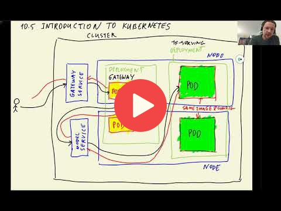

## 10.5 Introduction to Kubernetes

[Slides](https://www.slideshare.net/AlexeyGrigorev/ml-zoomcamp-10-kubernetes)

Kubernetes, also known as **K8s**, is an open-source system for automating the deployment, scaling, and management of containerized applications.  

### 🧩 Anatomy of a Kubernetes Cluster  
Imagine we have a Kubernetes cluster. Within this cluster, there are **nodes** (servers or computers running the processes). On these nodes, we find 🐳 **pods:** containers that run specific images, with allocated resources like **RAM/CPU**.  

Pods are typically grouped into **deployments** 📦. All pods in a deployment share the same Docker image and configuration. Think of a deployment as a set of identical workers, ready to process requests. For example, our **gateway service** can be structured as a deployment.  

- Larger pods require more resources 💪.  
- In addition to pods, Kubernetes uses **services** 🛎️, such as:  
  - 🌐 `gateway service`: An entry point for external requests.  
  - 🤖 `tf-model service`: Manages communication with model-serving pods.  

### 🔄 How it Works  
1. When a user uploads an image 🖼️ to the website, the request first reaches the **gateway service**.  
2. The gateway routes the request to one of the available pods, distributing traffic evenly (load balancing ⚖️).  
3. After pre-processing, the gateway deployment forwards the request to the **model service**.  
4. The model service routes the request to a pod in the `tf-serving` deployment.  
5. Predictions are made 🔮 and sent back to the user, following the same path.  

### 📍 Service Types  
Kubernetes services act as entry points to route requests to the correct pods:  
- **External Services** (`Load Balancer` 🌐): Accessible from outside the cluster. Example: `gateway service`.  
- **Internal Services** (`Cluster IP` 🔒): Accessible **only** within the cluster. Example: `model service`.  

At the front of the cluster, there’s an **entry point** called `INGRESS` 🚪. This directs user traffic to the appropriate external services.  

### ⚙️ Scaling with Kubernetes  
To handle multiple users simultaneously, Kubernetes can launch additional pods 🚀.  
- As traffic increases, Kubernetes **automatically scales** the deployment up 🆙.  
- When traffic decreases, it scales down 🛑 to save resources.  
- This dynamic scaling is managed by the **Horizontal Pod Autoscaler (HPA)** 📊.  
- If existing nodes are overwhelmed, Kubernetes can even request the creation of new nodes to handle the extra load.  

Kubernetes ensures that your application stays responsive, efficient, and ready to scale at any moment!

## Notes

Add notes from the video (PRs are welcome)

* kubernetes is open source system for automating deployment scaling and management of containerized applications
* to scale up = add more instances of our application
* add more instances when load increases and remove instances when load decreases
* kubernetes cluster consists of nodes (running machines, servers)
* each node can have multiple container
* one container = one pod
* grouping pods according to type of docker image
* routing the request to the pods
* external (visible, i.e. entry point) service/client vs internal service/client
* HPA horizontal pod autoscaler = allocating resources depending on demand
* Ingress
* kubernetes configuration

<table>
   <tr>
      <td>⚠️</td>
      <td>
         The notes are written by the community.  
         If you see an error here, please create a PR with a fix.
      </td>
   </tr>
</table>

## Navigation

* [Machine Learning Zoomcamp course](../)
* [Session 10: Kubernetes and TensorFlow Serving](./)
* Previous: [Running everything locally with Docker-compose](04-docker-compose.md)
* Next: [Deploying a simple service to Kubernetes](06-kubernetes-simple-service.md)
