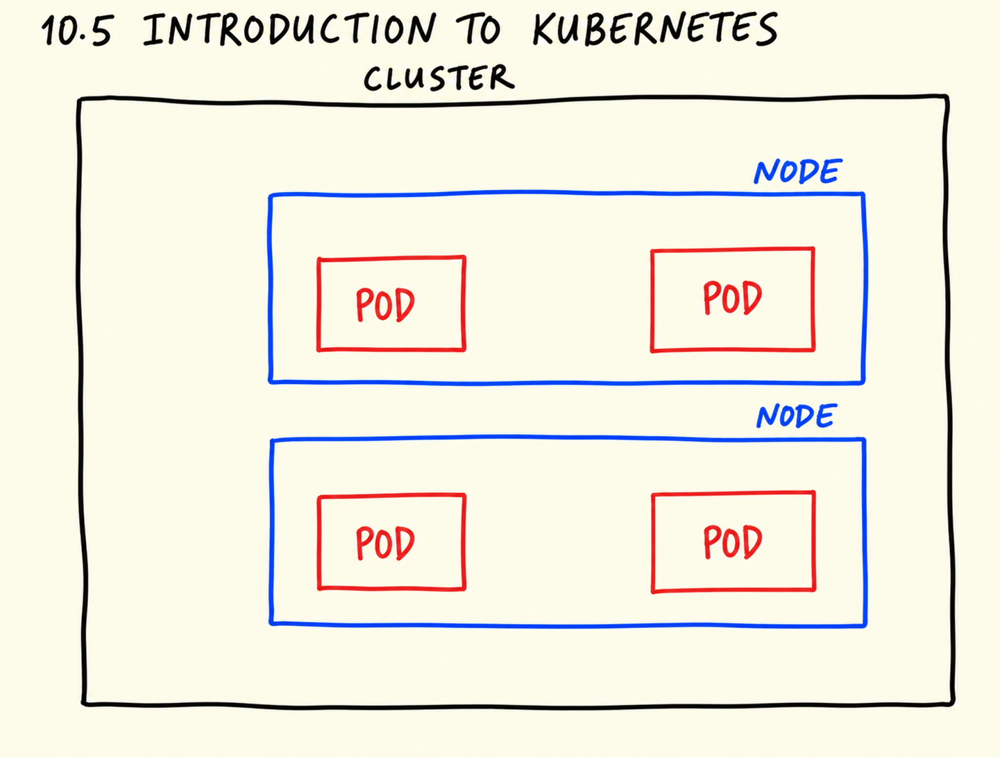
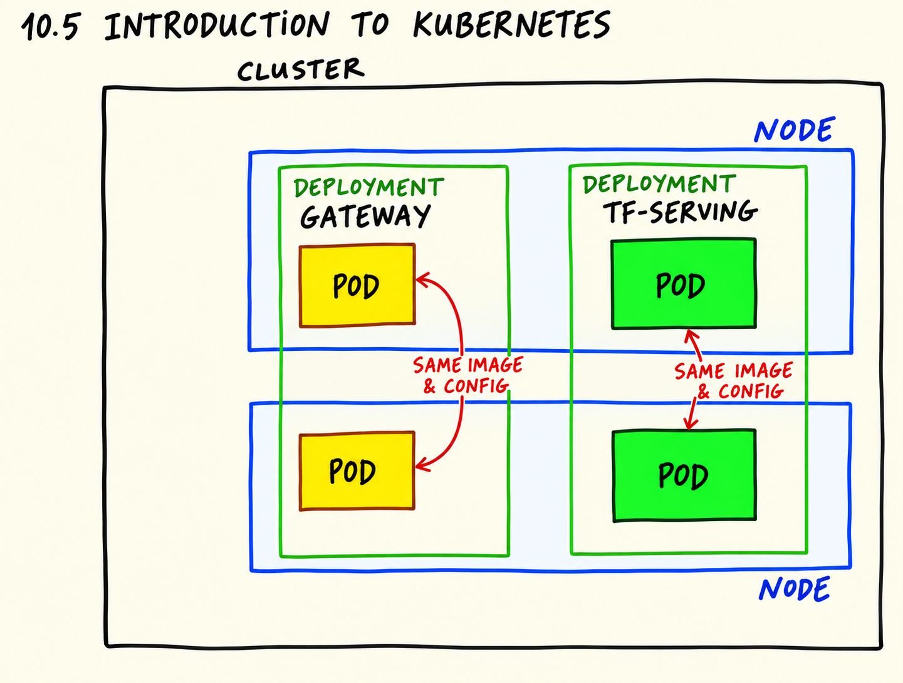
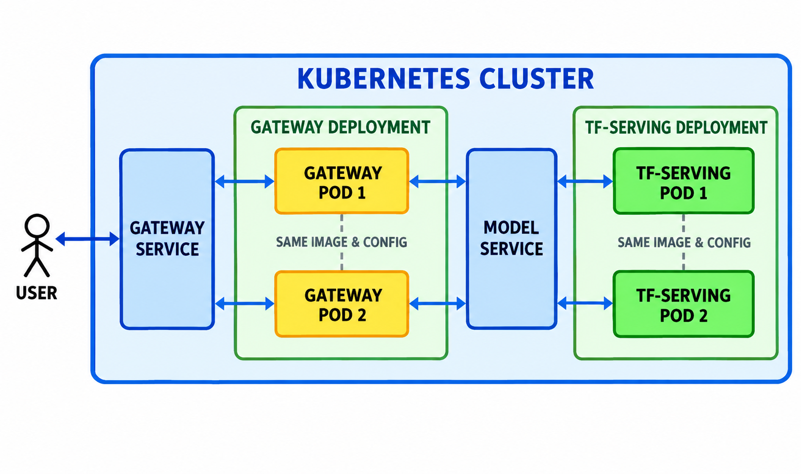
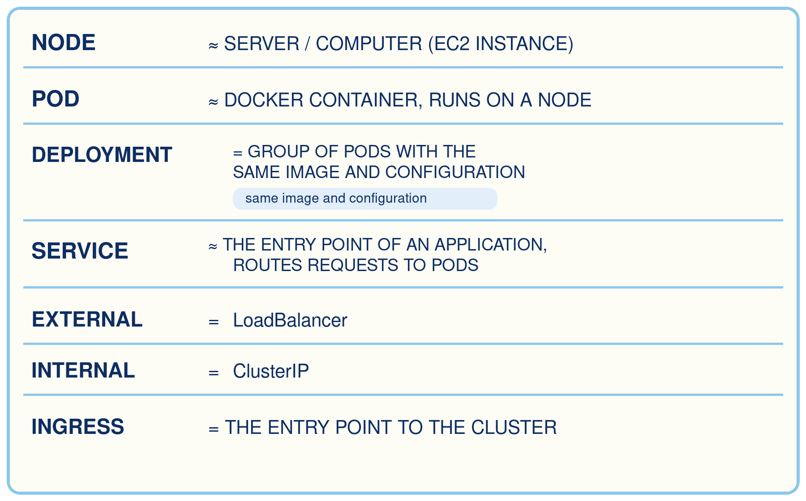
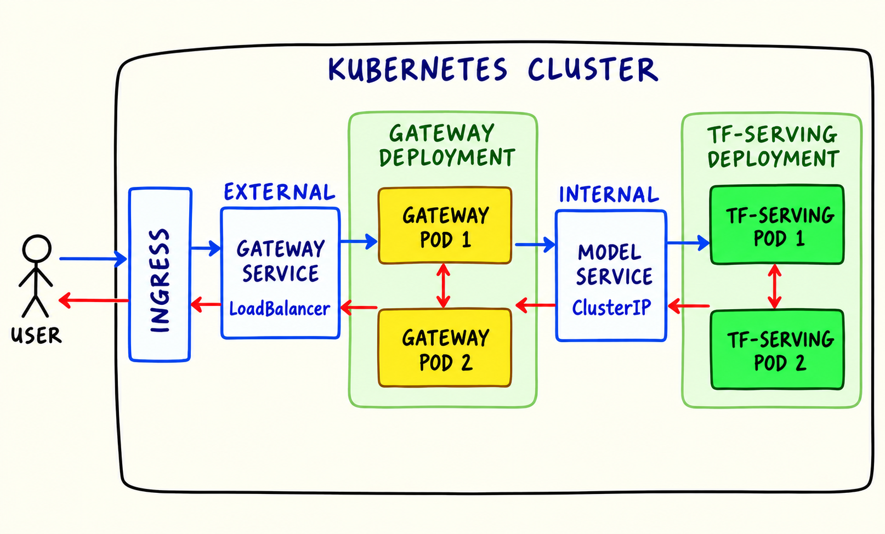
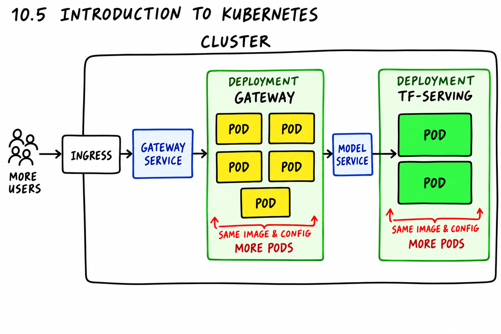

# Introduction to Kubernetes

In this lesson we look at the main concepts of Kubernetes: what a cluster
consists of, how pods, deployments and services relate to each other, and
how Kubernetes scales an application up and down depending on the load.

If we look up Kubernetes, the official page says that Kubernetes is an
open-source system for automating deployment, scaling and management of
containerized applications. What this means for us: we can use Kubernetes
to deploy Docker images, it will manage them, and it will scale them -
add more instances of our application when the load increases, and remove
these instances when the load decreases. It gives us a way to take the
Docker image we built locally, deploy it to the cloud, and let
Kubernetes handle everything for us.

In this lesson we talk about the main concepts. Let's say this box is our
Kubernetes cluster.

## Nodes and pods

Inside the cluster we have nodes. Nodes are machines or servers where
things are running: a node is approximately a server or a computer - an
EC2 instance, for example. Or, if you build your own Kubernetes cluster
from old computers at home, each computer would be a node of the cluster.

On these nodes we have pods. A pod is a container that runs a specific
image with specific parameters. Each node can have multiple pods, and
different pods may need different amounts of resources - one pod might
take more CPU and RAM, another one less.

## Deployments

We usually group pods in deployments. All pods within one deployment have
the same Docker image and the same configuration - by configuration we
mean the environment variables and things like that.

For example, one deployment is our gateway service: all its pods run the
same image (`zoomcamp-10-gateway:002`) with the same parameters. The other
deployment is our TensorFlow Serving model: its pods also share the same
image and config, but they are larger - serving the model needs more
resources.

So, to write it down: a node is approximately a server or computer, a pod
is approximately a Docker container that runs on a node, and a deployment
is a group of pods with the same image and configuration.

## Services

Next, we have things called services. In our example there are two: the
gateway service and the model service. A service is an entry point to a
deployment.

Here is how a request flows. A user uploads an image to the website, and
the website sends a request to our gateway service - the main point of
contact for the web application. Because the gateway deployment has
multiple pods, the service needs to figure out where to route this
request: it sends it to any available pod, spreading the load and the
traffic across all the pods in the deployment.

The gateway pod downloads the image, resizes it, prepares the input,
converts it to protobuf and sends the request on. But the gateway pods
don't know how to access specific model pods - instead, each gateway pod
goes to the model service, and the model service routes the request to
one of the TensorFlow Serving pods. That pod gets the protobuf request
and replies with predictions, which come all the way back to the user.

So we can think of a service as the main point of entry to a deployment:
it gets the request and decides which pod should handle it.

There are two types of services (actually more, but we can simplify):

- The service the user contacts is an external service - it has to be
  visible outside of the Kubernetes cluster. In Kubernetes terms it's
  called `LoadBalancer`.
- The model service doesn't need to be visible outside the cluster, so
  it's internal - it can only be used by pods inside the cluster. This
  type is called `ClusterIP`, and it's the default: if you don't specify
  the type of a service, it will be internal.

And one technical detail: in front of the cluster there's a thing called
`Ingress`. This is what clients actually contact first, and then it
routes the request to one of the external services. It's the entry point
to the cluster.

## Scaling

One more thing: say we get a bunch of clients and all of them start
sending requests. To cope with the load, Kubernetes can start more pods -
and we can set this in the configuration: the minimum and the maximum
number of pods. Kubernetes will then automatically scale the deployment
up when the load increases and scale it down when the load decreases.

The thing that takes care of this is called HPA - the Horizontal Pod
Autoscaler. It allocates more resources to a deployment when it needs
them. And in principle it can go further: if all our nodes are already
occupied with too many pods, it can request a new node - the new node
gets created, and the new pods are placed there.

This is the mechanism for dealing with traffic increases. Most of what we
discussed here we won't need to set up ourselves in this course - we
won't configure the HPA, and we won't deal with ingress. But if you work
with Kubernetes, these terms will come up, and now you know what they
are.

## Summary

Let's summarize one more time:

- Nodes in Kubernetes are like computers - EC2 instances, for example.
- On these nodes we have pods, which are approximately Docker containers.
- We group these containers in deployments: all pods in a deployment
  share the same image and configuration.
- Services are the points of entry to these deployments: external
  clients and internal clients deal with pods through services. External
  services (`LoadBalancer`) can be exposed outside of Kubernetes;
  internal services (`ClusterIP`) are only visible within the cluster.

What we will actually need in this module are pods, deployments and
services - that's what we'll set up to deploy things to Kubernetes. In
the next lesson we deploy a simple application to a Kubernetes cluster.

## Notes

* kubernetes is open source system for automating deployment scaling and management of containerized applications
* to scale up = add more instances of our application
* add more instances when load increases and remove instances when load decreases
* kubernetes cluster consists of nodes (running machines, servers)
* each node can have multiple container
* one container = one pod
* grouping pods according to type of docker image
* routing the request to the pods
* external (visible, i.e. entry point) service/client vs internal service/client
* HPA horizontal pod autoscaler = allocating resources depending on demand
* Ingress
* kubernetes configuration
