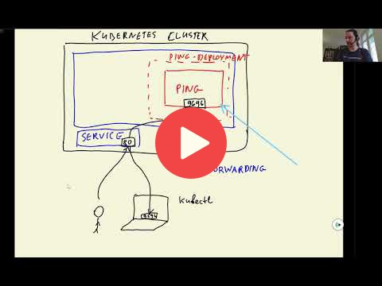

## 10.7 Deploying TensorFlow models to Kubernetes

<a href="https://www.youtube.com/watch?v=6vHLMdnjO2w&list=PL3MmuxUbc_hIhxl5Ji8t4O6lPAOpHaCLR"></a>

In this section we'll deploy the tf-serving model to kubernetes. In order to do that we'll create a separate folder `kube-config` and implement the following steps:

- Create deployment for the tf-serving model `model-deployment.yaml`:
  - ```yaml
    apiVersion: apps/v1
    kind: Deployment
    metadata:
      name: tf-serving-clothing-model
    spec:
      replicas: 1
      selector:
        matchLabels:
          app: tf-serving-clothing-model
      template:
        metadata:
          labels:
            app: tf-serving-clothing-model
        spec:
          containers:
          - name: tf-serving-clothing-model
            image: zoomcamp-10-model:xception-v4-001
            resources:
              limits:
                memory: "512Mi"
                cpu: "0.5"
            ports:
            - containerPort: 8500
    ```
  - Load the model image to kind: `kind load docker-image clothing-model:xception-v4-001`
  - Create model deployment: `kubectl apply -f model-deployment.yaml`
  - Get the running pod id for the model: `kubectl get pod`
  - Test the model deployment using the pod id: `kubectl port-forword tf-serving-clothing-model-85cd6dsb6-rfvg410m 8500:8500` and run `gateway.py` script to get the predictions.
- Create service of tf-serving model `model-service.yaml`:
  - ```yaml
    apiVersion: v1
    kind: Service
    metadata:
      name: tf-serving-clothing-model
    spec:
      type: ClusterIP # default service type is always ClusterIP (i.e., internal service)
      selector:
        app: tf-serving-clothing-model
      ports:
      - port: 8500
        targetPort: 8500
    ```
  - Create model service: `kubectl apply -f model-service.yaml`
  - Check the model service: `kubectl get service`.
  - Test the model service: `kubectl port-forward service/tf-serving-clothing-model 8500:8500` and run `gateway.py` for predictions.
- Create deployment for the gateway `gateway-deployment.yaml`:
  - ```yaml
    apiVersion: apps/v1
    kind: Deployment
    metadata:
      name: gateway
    spec:
      selector:
        matchLabels:
          app: gateway
      template:
        metadata:
          labels:
            app: gateway
        spec:
          containers:
          - name: gateway
            image: zoomcamp-10-gateway:002
            resources:
              limits:
                memory: "128Mi"
                cpu: "100m"
            ports:
            - containerPort: 9696
            env: # set the environment variable for model
              - name: TF_SERVING_HOST
                value: tf-serving-clothing-model.default.svc.cluster.local:8500 # kubernetes naming convention
    ```
  - Load the gateway image to kind: `kind load docker-image clothing-model-gateway:002`
  - Create gateway deployment `kubectl apply -f gateway-deployment.yaml` and get the running pod id `kubectl get pod`
  - Test the gateway pod: `kubectl port-forward gateway-6b945f541-9gptfd 9696:9696` and execute `test.py` for getting predictions.
- Create service of tf-serving model `gateway-service.yaml`:
  - ```yaml
    apiVersion: v1
    kind: Service
    metadata:
      name: gateway
    spec:
      type: LoadBalancer # External service to communicate with client (i.e., LoadBalancer)
      selector:
        app: gateway
      ports:
      - port: 80 # port of the service
        targetPort: 9696 # port of load balancer
    ```
  - Create gateway service: `kubectl apply -f gateway-service.yaml`
  - Get service id: `kubectl get service`
  - Test the gateway service: `kubectl port-forward service/gateway 8080:80` and replace the url on `test.py` to 8080 to get predictions.

**Links**

- Article to come over load balancing problem in production: https://kubernetes.io/blog/2018/11/07/grpc-load-balancing-on-kubernetes-without-tears/


## Notes

Add notes from the video (PRs are welcome)

* tensorflow serving in C++, gateway service as flask app
* gateway service: image preprocessing (i.e. resizing), prepare matrix, numpy arr, convert to protobuf, gRPC to communicate with tensorflow serving; postprocessing
* using telnet to check kubernetes pod

<table>
   <tr>
      <td>⚠️</td>
      <td>
         The notes are written by the community. <br>
         If you see an error here, please create a PR with a fix.
      </td>
   </tr>
</table>


## Navigation

* [Machine Learning Zoomcamp course](../)
* [Session 10: Kubernetes and TensorFlow Serving](./)
* Previous: [Deploying a simple service to Kubernetes](06-kubernetes-simple-service.md)
* Next: [Deploying to EKS](08-eks.md)
