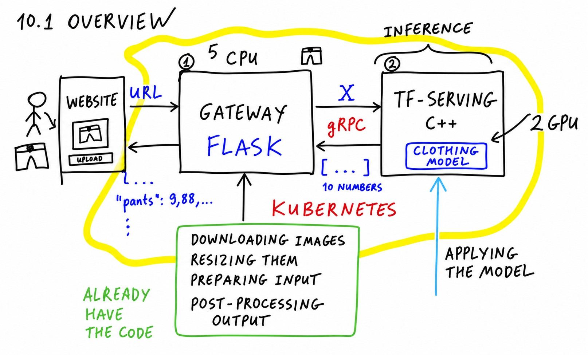

# Summary

Let's go over everything we covered in this session and look at where you
can go from here.

## What we did in this session

We took the clothes classification model we trained a few sessions ago and
deployed it with Kubernetes.

The architecture of our prediction service consists of two parts. The
first part is TensorFlow Serving: a tool from TensorFlow, written in C++,
optimized for serving TensorFlow models. It's super fast, it only focuses
on inference, and it communicates using gRPC - an optimized binary
protocol that is more performant than JSON, and the data it sends takes
less space.

Because TensorFlow Serving uses gRPC, we needed a second component - a
gateway that takes care of all the pre-processing, converts whatever the
user sends us into the protobuf format, and talks to TensorFlow Serving
over gRPC.

Having two components instead of one makes the system more complex, but
it also gives us benefits: we can split the inference part from the
pre-processing part and run them on different machines. The
pre-processing can run on less powerful CPU machines, while the
inference runs on GPU machines - and we can scale them independently.
For example, two GPU machines running inference and five CPU machines
running the gateway.

To implement all this, we first ran everything locally. We ran
TensorFlow Serving locally, we ran the gateway locally, and we used
Docker Compose - a convenient way of running multiple services and
linking them together so they work as one thing.

Then we talked about the main concepts of Kubernetes and set up
Kubernetes locally with kind - a lightweight Kubernetes that you can run
on your laptop. All it needs is Docker: it uses Docker to set up a small
one-node cluster on your computer, and we used it to experiment with
deploying our services locally.

Finally, we took everything we did locally and deployed it to EKS - the
Kubernetes service from AWS. Remember that EKS is not free: you pay
money for the cluster.

So in this session we learned about TensorFlow Serving, about protobuf,
and about using Kubernetes for deploying models: we specify a deployment
and a service for each of our components.

## Local alternatives to kind

kind is not the only option for running Kubernetes locally. Other options
include minikube, k3d, k3s, microk8s and EKS Anywhere. For example,
minikube uses VirtualBox for creating the nodes, so it's more isolated,
while kind is more lightweight. Try them and see what you like more.

There are also a couple of tools worth knowing that weren't in that list
from the beginning. One is
[Rancher Desktop](https://rancherdesktop.io/) - similar to Docker
Desktop, but for Kubernetes.

By the way, speaking of Docker Desktop: it also ships some sort of
Kubernetes cluster. If you use Windows, that may be easier than setting
up kind. And the other tool is
[Lens](https://k8slens.dev/) - an integrated environment for Kubernetes,
something like kubectl with a graphical interface. It's quite useful for
monitoring and for learning more about Kubernetes.

## Managed Kubernetes in the cloud

EKS is not the only managed Kubernetes. There's Kubernetes in Google
Cloud Platform, in Azure, and a bunch of others - for example
DigitalOcean, and I think Oracle Cloud and IBM Cloud. Probably any cloud
provider you can think of has Kubernetes as a service. Look up
"managed Kubernetes" and you will see many options - the one from
DigitalOcean, for example, starts at $10 per month.

The good thing about Kubernetes is that the configuration files we
created in this session work on any Kubernetes. You will only need to
change the image names - our images live in ECR, and other cloud
providers have their own way of hosting images. Everything else stays
the same.

## Ideas to practice

- Take the midterm project - or the models from other sessions, like the
  churn prediction or risk scoring models - and deploy them with
  Kubernetes. It doesn't have to be as complex as what we built here: we
  created a two-tier architecture because of TensorFlow Serving, but
  usually one service is enough. For example, you can take the code from
  the previous session - the TensorFlow Lite model deployed to Lambda -
  rewrite it with Flask and deploy it to Kubernetes as a single service.
- Learn about Kubernetes namespaces. We used the default namespace
  throughout the session - you saw it in the DNS names of our services.
  Namespaces are useful for organizing applications: one namespace per
  project, or per team - where I work, each team gets its own namespace
  on a cluster.

## What's next

For the homework, the plan is to deploy the churn prediction model with
Kubernetes - a bit simpler than what we did in this session.

And in the next session we will talk about Kubeflow. It's a simpler
alternative that sits on top of Kubernetes: we don't need to write so
much YAML, it takes care of some things for us and lets us develop and
deploy things to Kubernetes faster.
