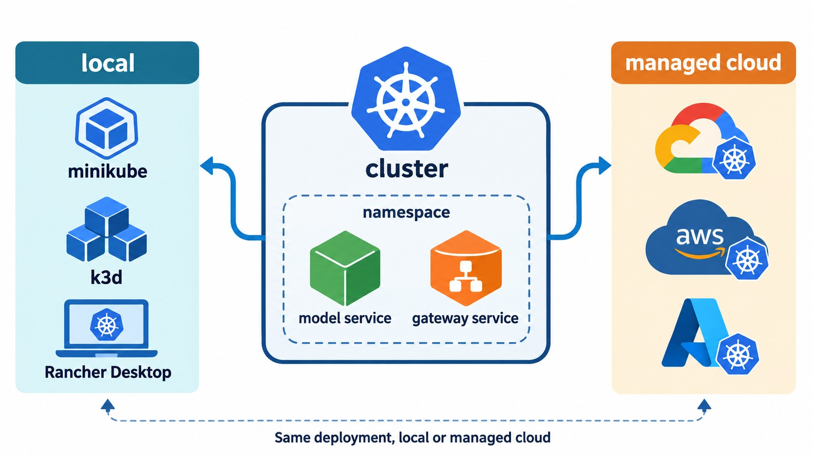

# Explore more

*Figure: Reuse the same service deployment pattern across local clusters and managed cloud Kubernetes.*

- Other local Kubernetes: minikube, k3d, k3s, microk8s, EKS Anywhere
- [Rancher desktop](https://rancherdesktop.io/)
- [Docker desktop](https://www.docker.com/products/docker-desktop/)
- [Lens](https://k8slens.dev/)
- Many cloud providers have Kubernetes: GCP, Azure, Digital ocean and others. Look for "Managed Kubernetes" in your favourite search engine
- Deploy the model from previous modules and from your project with Kubernetes
- Learn about Kubernetes namespaces. Here we used the default namespace

## Notes

Add notes from the video (PRs are welcome)
