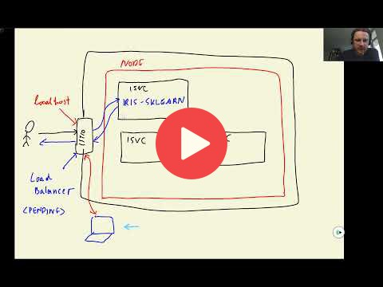

## 11.2 Running KServe locally

 

## Notes

Add notes from the video (PRs are welcome)

<table>
   <tr>
      <td>⚠️</td>
      <td>
         The notes are written by the community.  
         If you see an error here, please create a PR with a fix.
      </td>
   </tr>
</table>

### Updated Instructions (09 July, 2022)

In the `iris-example.yaml` file, instead of `"gs://kfserving-samples/models/sklearn/iris"`, use `"gs://kfserving-examples/models/sklearn/1.0/model"` as the URL in storageUri.  

Also make sure to use the following versions  
- kind: 0.11.1 (via https://kind.sigs.k8s.io/dl/v0.11.1/kind-linux-amd64)   
- kubectl: 1.21.1 (via https://dl.k8s.io/release/v1.21.1/bin/linux/amd64/kubectl)    
- kindest/node image: 1.21.1 (via `kind create cluster  --image kindest/node:v1.21.1`)       
- kserve=0.8 (via https://raw.githubusercontent.com/kserve/kserve/release-0.8/hack/quick_install.sh)     

## Navigation

* [Machine Learning Zoomcamp course](../)
* [Session 11: KServe](./)
* Previous: [Overview](01-overview.md)
* Next: [Deploying a Scikit-Learn model with KServe](03-kserve-sklearn.md)
